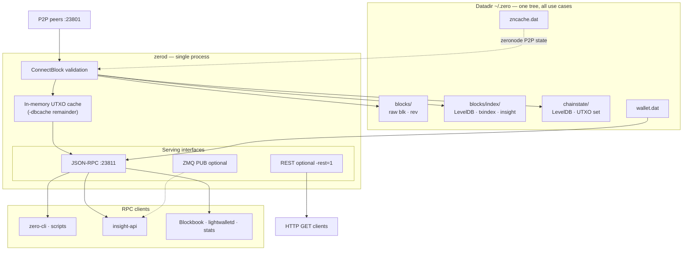
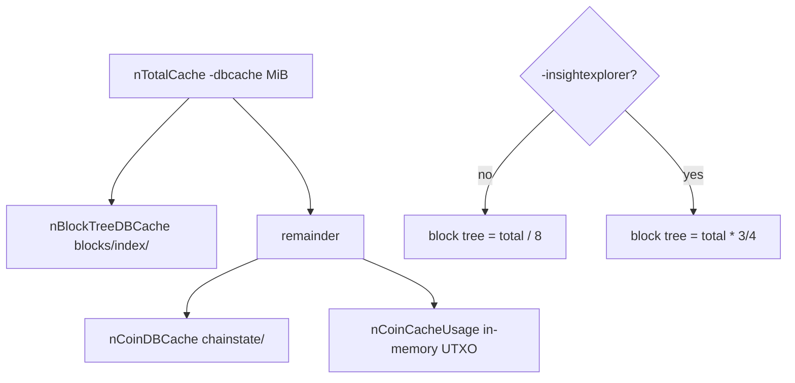
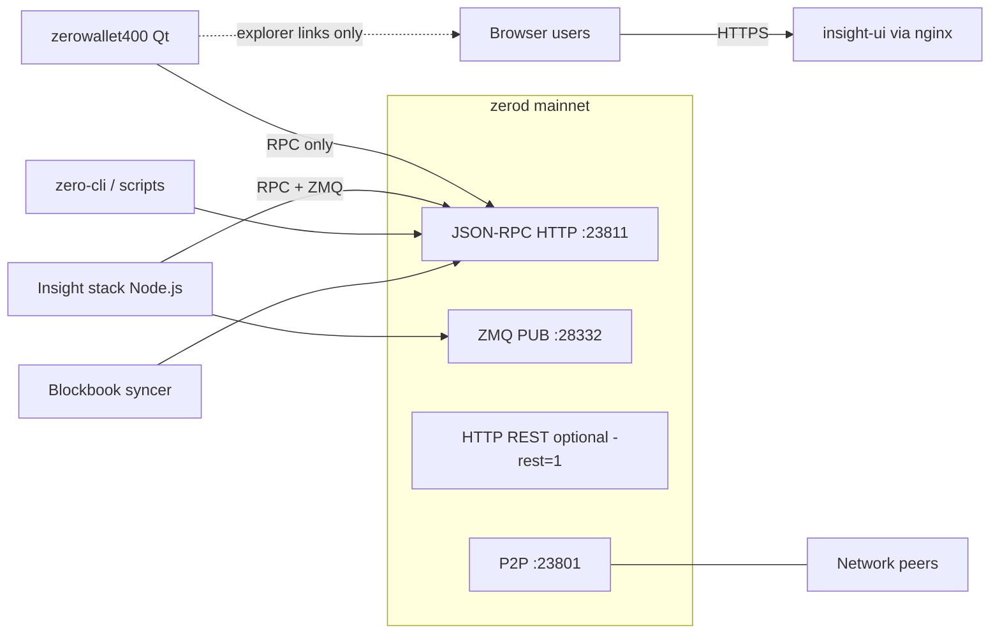

# Zero node structure

## 1. Purpose and role

**Audience:** **zerod** maintainers and contributors (node internals, flags, datadir, client requirements from the daemon's side). Block explorer host admins and Insight/bitcore developers use **`~/Work/ZK/insight/InsightBlock.md`** as their primary runbook; this file only states what **zerod** must expose.

**Purpose:** Explain **zerod** structure and runtime **options by use case** (validator+wallet, Insight backend, external indexer RPC feed, stats, lightwalletd, zeronode on one binary).

**Include:** Datadir and LevelDB keys; `-dbcache`; flags tied to workloads; `ConnectBlock` index path; wallet ops that hit the chain; RPC clients; **external client integration** (Insight stack, zerowallet, requirement matrices, cross-doc map); brief zeronode cache role. Occasional Zcash/Pirate notes **only** to orient on zerod today or likely direction.

**Exclude:** Ecosystem/indexer compare (**`Comparison.md`**); port/cherry-pick execution (**`UpdateZero.md`**); zeronode operator/dev detail (**`ZeroNodes.md`**, **`ZeroNodeDev.md`**); wallet Qt UI (**`zerowallet400/UpdateWallet.md`**); local clone paths (**`ZKRepos.md`**); **zerocurrencycoin** org repo audit (**`~/Work/ZK/Repos/ZeroC.md`**); Insight nginx/Cloudflare/bitcore install steps (**`InsightBlock.md`**).

**Set rule:** **`ZeroStruct` ⊆ zerod internals + per-client requirements from the node's perspective**. No Blockbook port plan (**UpdateZero** section **4**); no cross-fork indexer tables (**Comparison** section **12**); no GitHub org disposition (**Repos/ZeroC**). Integration concern IDs use prefix **INT-NN** (section **11.7**); do not reuse **C-NN** from **UpdateZero** section **8** Completed.

Developer documents in **UpdateZero.md** section **1**, **Documentation map**. Regtest harness: **`TEST_ZERO.md`**.

---

## 2. Use cases on one binary

| Use case | Typical deployment | zerod role |
|----------|-------------------|------------|
| **Validator + wallet** | Desktop or server with keys | Default flags; embedded wallet; P2P **23801**; RPC **23811** |
| **Insight explorer backend** | Dedicated node, often no keys | `-experimentalfeatures`, `-insightexplorer`, `-txindex`, large `-dbcache`; addressindex RPCs |
| **External indexer RPC feed** | Blockbook or custom syncer | Synced node with **`txindex`**; `-insightexplorer` **not** required on the node |
| **Emission / dev balance audit** | Workstation or CI | `chain_stats.py --cons` (consensus math); `--dev` needs insight on dev t-addrs |
| **lightwalletd backend** | Server pair | Synced node + **`txindex`**; separate lightwalletd process (not shipped by Zero org) |
| **Zeronode** | Collateral operator | Wallet-enabled node + `zeronode.conf`; **`zncache.dat`**; spork/P2P extensions |

All use cases share one datadir, one **`ConnectBlock`** path, and one UTXO set. Optional indexes and wallet state are additional layers, not separate daemons.

### Client checklist

| Client | Needs on zerod | Chain-wide shielded view? |
|--------|----------------|---------------------------|
| zero-cli / scripts | Varies | Wallet keys only |
| zerowallet | Default flags | Own keys only |
| Insight stack | insight + experimental + txindex | t-addresses only |
| Blockbook syncer | txindex, synced | t-addresses in its DB only |
| lightwalletd | txindex, synced | Client viewing keys only |
| `chain_stats.py --dev` | insight on listed t-addrs | Those addresses only |

Explorer nodes are often **watch-only** (no spending keys) but still hold full chain + indexes. Deployment topology, ports, and operator checklists: **section 11**; Insight ops runbooks: **`~/Work/ZK/insight/`**; wallet connect flow: **`~/Work/ZK/zerowallet400/UpdateWallet.md`**.



### Diagram roles (sections 2 and 11.1)

Two figures, different scope:

| Section | Question | Shows |
|---------|----------|-------|
| **2** (above) | How can one **`zerod`** serve every workload? | **Inside** the process: P2P, **`ConnectBlock`**, datadir, **`-dbcache`**, RPC/ZMQ/REST |
| **11.1** | How do production stacks wire in? | **Outside**: clients, ZMQ, bitcore **:3001**, browser via nginx |

The **Client checklist** table above is flags-only; **section 11** holds ports, matrices, and post-deploy smoke checks.

---

## 3. Datadir layout

Default: **`~/.zero/`** (mainnet). Testnet/regtest: subdirs or `-testnet` / `-regtest`.

| Path | Database | Contents |
|------|----------|----------|
| `blocks/blk*.dat`, `blocks/rev*.dat` | Raw files | Blocks and undo data |
| `blocks/index/` | LevelDB (`CBlockTreeDB`) | Block tree; optional txindex and insight keys |
| `chainstate/` | LevelDB (`CCoinsViewDB`) | UTXO set; Sprout/Sapling anchors; nullifiers |
| `wallet.dat` | Berkeley DB | Keys, transactions, note metadata |
| `zncache.dat` | Serialized | Zeronode broadcast cache |
| `debug.log` | Text | Log output |

### LevelDB key families in `blocks/index/`

From `src/txdb.cpp`:

| Prefix | Symbol | When present |
|--------|--------|--------------|
| `b` | `DB_BLOCK_INDEX` | Always |
| `t` | `DB_TXINDEX` | `-txindex` (default **on** in Zero: `fTxIndex = true`) |
| `d` | `DB_ADDRESSINDEX` | `-insightexplorer` |
| `u` | `DB_ADDRESSUNSPENTINDEX` | `-insightexplorer` |
| `p` | `DB_SPENTINDEX` | `-insightexplorer` |
| `T` | `DB_TIMESTAMPINDEX` | `-insightexplorer` |
| `h` | `DB_BLOCKHASHINDEX` | `-insightexplorer` |
| `F` | `DB_FLAG` | Persisted toggles (`txindex`, `insightexplorer`, `zindex`, ...) |

**vs Zcash lineage:** Same block-tree index layout as zcashd-era Insight hooks. Zero turns **`txindex` on by default** (`fTxIndex = true` in `init.cpp`), which suits Blockbook-style sync and `getrawtransaction` without an extra operator step. Upstream zcashd historically treated txindex as opt-in; verify before assuming defaults on other forks.

### Chainstate is not an address index

`chainstate/` maps **outpoint** `(txid, vout) -> scriptPubKey + amount`. No reverse map from t-address to balance.

For a **given t-address balance** on zerod you need one of:

- `-insightexplorer` indexes (written during block connect into `blocks/index/`), or
- An external indexer that scans blocks via RPC (`getblock`, `getrawtransaction`), or
- `gettxoutsetinfo` for **chain-wide transparent total only** (slow; not per-address).

Shielded value is never exposed chain-wide through addressindex RPCs (same privacy ceiling as zcashd Insight).

---

## 4. Memory: `-dbcache`

**`-dbcache=<n>`** sets total LevelDB + in-memory cache budget in **mebibytes (MiB)**. It does **not** cap wallet RAM, P2P buffers, or proof generation. Constants in `src/txdb.h`: **default 800**, **min 4**, **max 16384** (64-bit); clamped in `src/init.cpp` before split.

On startup, **`zerod` logs the split** (search `debug.log` for `Cache configuration:`):

```
* Using … MiB for block index database
* Using … MiB for chain state database
* Using … MiB for in-memory UTXO set
```

### 4.1 How the split works

Allocation order in `src/init.cpp` (~1514-1533):

1. **`nTotalCache`** = `-dbcache` (MiB) shifted to bytes, clamped to `[4, 16384]` MiB.
2. **`nBlockTreeDBCache`** (block tree LevelDB under `blocks/index/`):
   - Default: **`nTotalCache / 8`** (12.5%).
   - With **`-insightexplorer`**: **`nTotalCache * 3 / 4`** (75%) -- Bitpay/zcashd Insight hook; address-index keys live here.
3. **`nCoinDBCache`** (chainstate LevelDB under `chainstate/`): from remainder, **`min(remainder/2, remainder/4 + 8192 MiB)`** -- effectively 25-50% of what is left after the block-tree slice.
4. **`nCoinCacheUsage`**: everything left -- in-memory UTXO view cache during block connect.



| Slice | Database path | Holds |
|-------|---------------|-------|
| Block tree | `blocks/index/` | Block index; **`txindex`** keys (`t`); with insight: **`d`/`u`/`p`/`T`/`h`** address/spent/timestamp indexes (`src/txdb.cpp`) |
| Chainstate | `chainstate/` | UTXO set, anchors, nullifiers |
| In-memory UTXO | Process heap | Hot UTXO set during validation |

**`-insightexplorer` does not add a separate DB directory** -- it only changes how much of `-dbcache` is reserved for the block-tree LevelDB that already holds optional index keys.

### 4.2 Worked examples (MiB)

| `-dbcache` | `-insightexplorer` | Block tree | Chainstate DB | In-memory UTXO |
|------------|-------------------|------------|---------------|------------------|
| 800 | off | 100 | 350 | 350 |
| 800 | **on** | **600** | 100 | 100 |
| 2048 | off | 256 | 896 | 896 |
| 2048 | on | 1536 | 256 | 256 |
| **4096** | off | 512 | 1792 | 1792 |
| **4096** | **on** | **3072** | 512 | 512 |

With insight on **800 MiB**, most cache serves the block tree but chainstate and UTXO caches shrink to **100 MiB** each -- IBD and tip validation stay slow; address-index RPCs still miss RAM and hit disk on large t-address histories.

### 4.3 Recommendations by workload

| Workload | `-insightexplorer` | Suggested `-dbcache` (MiB) | Notes |
|----------|-------------------|----------------------------|-------|
| Validator + wallet (desktop) | off | **800** (default) | Raise toward **2048** only if IBD/rescan is cache-bound |
| Insight + bitcore on **4 GiB** VPS | on | **800** (generous but feasible) | Headroom for OS + Node; indexes stay partly disk-bound |
| Insight `zerod` alone on **8 GiB** | on | **2048** | Prefer validating via startup log + tip `cache=`; **4096** is often excessive |
| Blockbook / lightwalletd | off | **1024-2048** | `txindex` path; no 75% insight steal |
| Regtest / CI | either | **512-800** | Short chain |

**Units:** MiB (`<< 20`). Default **800**, min **4**, max **16384**.

**Runtime justification:** trust the startup `Cache configuration:` lines and tip `cache=N MiB(Mtx)` more than aspirational tables. If in-memory UTXO `cache=` stays well below the allocated UTXO slice while RSS is high, the bottleneck is elsewhere (wallet, mmap, OS page cache) -- raising `dbcache` further will not help.

**75% split (code reference):** inherited Bitpay/zcashd when address indexes share `blocks/index/`. Allocation in `src/init.cpp`:

```
nBlockTreeDBCache = nTotalCache / 8;                 // default
if (GetBoolArg("-insightexplorer", false))
    nBlockTreeDBCache = nTotalCache * 3 / 4;         // 75%
```

(~1584–1594). Not tunable without a code change. Changing `-dbcache` alone does **not** require reindex. Hit/miss counters are not implemented; optional metrics / tunable split remain deferred under **OPS-CACHE-METRICS**.

**Operator approach (no code change yet):**

1. Raise **`-dbcache`** when insight is on so the remaining 25% (chainstate + UTXO) stays usable (see table above: e.g. **2048** on 8 GiB insight host).
2. Prefer **dual-phase** sync on constrained hosts: IBD / reindex with insight **off** (or `-disablewallet`), then enable insight + **`-reindex`** (or index rebuild) with a large `dbcache`.
3. Do **not** treat the 75% constant as a bug by itself -- it matches Pirate/Bitcore intent; measure tip `cache=` and address-RPC latency before changing the ratio.

**`-reindex`:** operational only -- **section 13** and Insight ops docs. Not a build setting.

### 4.3.1 Measured utilization (insight on, default 800)

Startup with **`insightexplorer=1`**, **`dbcache=800`** (mainnet reindex, 2026-07):

```
* Using 600.0MiB for block index database   # 75%
* Using 58.0MiB for chain state database
* Using 142.0MiB for in-memory UTXO set
```

Tip **`cache=`** ~**77 MiB** (~218k coin entries) while process RSS was multi-GB (wallet + LevelDB mmap of ~4 GiB `blocks/index` + OS). So the UTXO slice was **not** saturated; wallet/`mapWallet` dominated.

### 4.3.2 Status UTXO and dbcache on a running Linux VPS

Zero has **no** `getmemoryinfo` RPC. Use logs + existing RPCs + OS (below). What `getmemoryinfo` is elsewhere is in **4.3.2a**.

```bash
# Allocated split (once per start)
grep -A3 'Cache configuration:' ~/.zero/debug.log | tail -4

# Live in-memory UTXO usage + entry count (each tip update)
grep 'UpdateTip:.*cache=' ~/.zero/debug.log | tail -3

# On-disk UTXO set stats (may take a while; flushes first)
zero-cli gettxoutsetinfo
# -> height, txouts, bytes_serialized, total_amount

# Process RSS / VSZ (MiB)
pid=$(pgrep -n zerod); ps -o rss=,vsz= -p "$pid" | awk '{printf "RSS=%.1fMiB VSZ=%.1fMiB\n",$1/1024,$2/1024}'

# Datadir sizes (disk, not cache)
du -sh ~/.zero/blocks/index ~/.zero/chainstate ~/.zero/blocks 2>/dev/null
```

| Signal | How to read |
|--------|-------------|
| Startup `Using … MiB for in-memory UTXO` | **Budget** from `-dbcache` after insight/txindex split |
| Tip `cache=XMiB(Ytx)` | **Current** coins-view usage and entry count |
| `gettxoutsetinfo.txouts` / `bytes_serialized` | **Full set** on disk (not the hot cache) |
| RSS >> UTXO budget, tip `cache=` low | Wallet / LevelDB mmap / OS -- do not raise `dbcache` blindly |
| Tip `cache=` near UTXO budget + frequent flushes | Raise `-dbcache` or reduce insight steal (code change) |

#### 4.3.2a `getmemoryinfo` (not UTXO / not dbcache)

**What it reports:** stats for the **locked (mlock) memory manager** used for keys and other sensitive material -- **not** process RSS, **not** `-dbcache`, **not** the UTXO coins cache. Operators often misread it as "total RAM used"; see [Stack Exchange](https://bitcoin.stackexchange.com/questions/101863/what-does-the-rpc-call-getmemoryinfo-show).

| Tree | RPC | What you get | Prerequisite |
|------|-----|--------------|--------------|
| **Bitcoin Core** | [`getmemoryinfo`](https://bitcoincore.org/en/doc/31.0.0/rpc/control/getmemoryinfo/) | `locked` object; optional `"mallocinfo"` (glibc heap XML) | [`LockedPool`](https://github.com/bitcoin/bitcoin/blob/master/src/support/lockedpool.h) + RPC ([added](https://github.com/bitcoin/bitcoin/commit/82a667591eb34bf8391b624658f252773ff0e949) 2016-09-18, Wladimir J. van der Laan); [`mallocinfo` mode](https://github.com/bitcoin/bitcoin/commit/e141aa4ba604ff22c68454112501c166d3e892c9) later |
| **Zcash (`zcashd`)** | `getmemoryinfo` in [`src/rpc/misc.cpp`](https://github.com/zcash/zcash/blob/master/src/rpc/misc.cpp) | `locked` only (no mallocinfo in the Zcash help text sampled) | Same LockedPool stack; shipped in [zcashd 4.1.0](https://github.com/zcash/zcash/blob/v4.1.0/doc/release-notes/release-notes-4.1.0.md) changelog (`rpc: Add getmemoryinfo call`) |
| **Pirate** | **Absent** | -- | -- |
| **Zero** | **Absent** | -- | Still on older [`LockedPageManager`](src/support/pagelocker.h) / `secure_allocator`; **no** `LockedPoolManager::stats()` API that the RPC reads |

**`LockedPool::Stats` vs what Zero already has:**

| `LockedPool::Stats` field | Meaning | Already in Zero? |
|---------------------------|---------|------------------|
| `used` | Bytes allocated from locked arenas | **No** |
| `free` | Bytes free in current arenas | **No** |
| `total` | Bytes managed by the pool | **No** |
| `locked` | Bytes that successfully `mlock`'d | **No** (partial: page lock yes/no, not byte tally) |
| `chunks_used` | Allocated chunk count | **No** |
| `chunks_free` | Free chunk count | **No** |

Zero's only related API is [`GetLockedPageCount()`](src/support/pagelocker.h) -- returns **how many OS pages** are currently locked (histogram size), not bytes/chunks/arenas. It is **not** exported over RPC. So **zero of the six `Stats` fields** exist as structured data in Zero today; page count is a different, coarser signal.

**Compatible implementation to port (if desired):** Zcash's small `getmemoryinfo` + `RPCLockedMemoryInfo()` is the closest match to Zero's zcashd-lineage tree, but it depends on **LockedPool** (Bitcoin/Zcash `support/`), which Zero has not taken. Drop-in RPC alone is insufficient. Even after a port, it would **not** replace the VPS status commands in **4.3.2** for dbcache/UTXO sizing.

### 4.3.3 UTXO cache accounting (Bitcoin / Zcash / clones)

| Project | Sizing knobs | What is counted | Reporting |
|---------|--------------|-----------------|-----------|
| **Bitcoin Core** | `-dbcache` split across block-tree / chainstate DB / coins cache; flush when `CoinsTip` usage exceeds budget | `DynamicMemoryUsage()` of in-memory coins map; entry count via `GetCacheSize()` | Flush logs often include coins count + KiB; **no** hit/miss rate RPC; `getmemoryinfo` is locked-pool only (see **4.3.2a**) |
| **Zcash / Zero / Ycash / …** | Same Bitcoin-era split; Zero/Zcash tip line `cache=%.1fMiB(%utx)` = UTXO-view **usage** and **entry count** | Same `CCoinsViewCache` model (+ shielded anchors/nullifiers in the same cache machinery on zcashd-lineage) | **Usage only** in `UpdateTip` / verify paths; **no** hit/miss counters |
| **Pirate** | Same 75% block-tree bump when address **or** spent on; plus LevelDB **DB-knobs** (see **13.3**) | Same coins cache | Same usage-style logging |

**Implication:** you cannot size "MiB per chain UTXO" from docs alone. Raise `-dbcache` when IBD flushes constantly or tip `cache=` rides the allocated ceiling; do not raise it when RSS is high but tip `cache=` is low (wallet/mmap bound).

**OPS-CACHE (done for ops status):** section **4.3.1**–**4.3.2** + Pirate DB-knobs in **13.3**. Tunable 75% split and hit/miss metrics = **OPS-CACHE-METRICS** (postponed).

### 4.4 Symptoms and tuning

| Symptom | Likely cause | Action |
|---------|--------------|--------|
| Slow **`getaddress*`** on busy t-addrs | Cold block-tree LevelDB | Raise `dbcache` toward **2048** on 8 GiB; on 4 GiB accept disk or split hosts |
| Slow IBD with insight on | UTXO/chainstate starved by 75% | Expected tradeoff; or insight-off for pure sync then enable+reindex once |
| OOM / swap | `dbcache` + bitcore + wallet > RAM | Drop to **800**; `-disablewallet` on explorer |
| High RSS, low tip `cache=` | Wallet or mmap | Do not raise `dbcache` blindly |

Cross-refs: **InsightBlock.md** **2.2**; Linux ABI **UpdateZero.md** **3.6**.

---

## 5. Options by use case

### Validator + wallet (default)

| Item | zerod behavior |
|------|----------------|
| Block index | Always on |
| `txindex` | **On** by default |
| `-insightexplorer` | Off |
| `-experimentalfeatures` | Off |
| Wallet | `wallet.dat`; Sapling witnesses built on `ChainTip` |
| Zeronode | Off unless configured |

Desktop **zerowallet** embeds `zerod` and uses local RPC; it does **not** enable address indexes by default.

### Insight explorer backend

**Specialty ops (tiny audience):** prod **`zero.conf`** / bitcore / host runbook -- **`~/Work/ZK/insight/InsightBlock.md`** section **2.2** and **`config/`**. This section only states what **`zerod`** must expose for that client.

Zero repo **`contrib/zero.conf`** is a **wallet** sample -- not Insight.

| Mechanism | Detail |
|-----------|--------|
| Index bundle | `-insightexplorer` sets `fAddressIndex`, `fSpentIndex`, `fTimestampIndex`, blockhash index together (`src/main.cpp`) -- same bundled flag as zcashd Insight |
| RPC gate | Addressindex RPCs need **`fExperimentalMode && fInsightExplorer`** (`src/rpc/misc.cpp`) |
| RPC category `addressindex` | `getaddressbalance`, `getaddresstxids`, `getaddressdeltas`, `getaddressutxos`, `getaddressmempool` |
| Related RPCs | `getspentinfo`, `getblockdeltas`, `getblockhashes`; richer `getrawtransaction` when spent index active |
| Limits | Transparent **P2PKH / P2SH** only; no chain-wide z-addr search (protocol; index walks `vout` only) |
| `-dbcache` | **section 4**; **800** on 4 GiB shared hosts; **2048** on 8 GiB `zerod`-heavy -- validate via log |
| `-reindex` | **Operational** -- CLI one-shot; never permanent conf (**section 13**) |
| Wallet on explorer host | Prefer **`-disablewallet`** (no `wallet.zero`, no keypool) |
| Client | **insight-api-zero** (Node.js) calls RPC; mainnet UI [insight.zeromachine.io](https://insight.zeromachine.io/) |

**vs Pirate `pirated`:** Pirate docs often list separate `addressindex=1`, `spentindex=1`, `timestampindex=1` in config. RPC names match; zerod uses the single **`-insightexplorer`** switch.

### External indexer RPC feed (Blockbook-style)

| On zerod | Notes |
|----------|-------|
| Synced full node | Required |
| `txindex` | Required for `getrawtransaction` by txid; default **on** in Zero |
| `-insightexplorer` | **Not** required -- indexer builds its own DB |
| RPC pattern | `getblock` (verbosity 2), `getrawtransaction`, block hash walk |

Zero org Blockbook port status: **`UpdateZero.md` section 4**. How other coins attach Blockbook: **`Comparison.md`** section **12**.

### Emission and supply audit

| Tool | Node need |
|------|-----------|
| `contrib/stats/chain_stats.py --cons` | None for math; optional RPC for `--thru` tip height |
| `contrib/stats/chain_stats.py --dev` | `-insightexplorer` + experimental for `getaddressbalance` on dev t-addresses |
| `contrib/stats/decode_coinbase.py` | Synced node; `getblock` verbosity 2 |
| `gettxoutsetinfo` | Synced node; aggregate transparent total only |

`--cons` sums **consensus subsidy rules**, not the live UTXO set. See **`ZERO_COIN.md`**.

### lightwalletd backend

| On zerod | Notes |
|----------|-------|
| Fully synced chain | Required |
| `txindex` | Required for tx lookup delegated from gRPC server |
| `-insightexplorer` | Not required for standard compact-block path |
| Wallet keys on node | Not required on server if clients hold keys |

Zero does not ship lightwalletd; pairing is operator choice. Ecosystem compare: **`Comparison.md`** section **12**. Zero org repos and mobile stack: **`~/Work/ZK/Repos/ZeroC.md`**.

### Zeronode operator

Uses wallet + P2P extensions; **`zncache.dat`** persists broadcast state. Not an address index. Operator workflow: **`ZeroNodes.md`**; wallet boundary: **`ZeroNodeDev.md`**.

### Other flags (when relevant)

| Flag | Reindex? | Use |
|------|----------|-----|
| `-zindex` | Yes | Richer shielded stats on `CBlockIndex`; not t-address search |
| `-rest=1` | No | Bitcoin-Core-heritage GET on RPC port (`src/rest.cpp`); not Insight REST |
| `-zmqpub*` | No | Block/tx notifications for custom indexers |
| `-experimentalfeatures` + `-zmergetoaddress` | No | Manual merge RPC (real on-chain txs) |
| `-consolidation=1` | No | Auto Sapling note merge on `ChainTip` |

**Obsolete in tree:** optional Qpid Proton AMQP (`src/amqp/`) -- build default **`NO_PROTON=1`**. Prefer **ZMQ** for new work.

**Experimental without insight:**

| Feature | Flags |
|---------|-------|
| `-developerencryptwallet` | `-experimentalfeatures` |
| `-developersetpoolsizezero` | `-experimentalfeatures` |
| `-paymentdisclosure` | `-experimentalfeatures` |
| `-zmergetoaddress` | `-experimentalfeatures` + `-zmergetoaddress` |

---

## 6. RPC inventory

Default mainnet RPC port **23811**. Authoritative name matrix: **`RPCs.csv`**, **`RPCs_extended.csv`** (column `zero_missing_sources`: Z=Zcash-only in Zero, P=Pirate-only, B=not in Zero).

### 6.1 CSV summary

| Metric | Count | Source |
|--------|------:|--------|
| RPC rows | **278** | **`RPCs.csv`** |
| Implemented in Zero (`zero=y`) | **172** | same |
| `addressindex` category | **5** | `getaddresstxids`, `getaddressbalance`, `getaddressdeltas`, `getaddressutxos`, `getaddressmempool` |
| `zero_exclusive` category | **7** | `zs_listtransactions`, `zs_gettransaction`, `zs_listspentbyaddress`, `zs_listreceivedbyaddress`, `zs_listsentbyaddress`, **`getalldata`**, **`getsupply`** |

### 6.2 Client-critical RPCs vs harness

Sample sets derived from **section 11** (zerowallet and Insight). "Harness" = mention in **`src/test/`** or **`qa/rpc-tests/`** (not scenario depth).

| Client sample | Listed | Harness mention | Gap |
|---------------|-------:|-----------------|-----|
| zerowallet-critical | 18 | 17 | **`zeronodestats`** -- no test file hit |
| insight-critical | 19 | 18 | **`zeronodestats`** -- no test file hit |

| Category | Harness | Depth |
|----------|---------|-------|
| **`addressindex`** (5 RPCs) | **`qa/rpc-tests/addressindex.py`** + param checks in **`src/test/rpc_tests.cpp`** | Functional index build/fetch on regtest with insight flags |
| **`zero_exclusive`** (7 RPCs) | **`src/test/rpc_zero_exclusive_tests.cpp`** + scenario for getalldata | Param + soft gates; populated-wallet History via **`getalldata_scenario.py`** (Ext) |
| **`getalldata`** | exclusive + Ext scenario | Gates on empty wallet; nCount/datatype on mined/sent txs in scenario |

#### `getalldata` -- structure and algorithms

**Role:** Kitchen-sink wallet refresh RPC used by Zerowallet tip/history. Not a consensus path.

**Param shape**

| Arg | Meaning | Implementation notes |
|-----|---------|----------------------|
| 1 datatype | 0 = balances+txs, 1 = balances, 2 = txs (+ chain fields) | Section gates on `params[0]` |
| 2 transactiontype | 0=all, 1=1d, 2=7d, 3=30d, 4=90d, 5=365d, other=all | Day window for History; omitted today -> `365*30` days (product default undecided -- TODO ARG2) |
| 3 transactioncount | max History rows | `params.size() >= 3`; `<= 0` -> 200 |
| 4 watchonly | bool | only when `params.size() == 4` |

**Data / indexes touched**

| Structure | Use in `getalldata` |
|-----------|---------------------|
| `mapWallet` / ordered wallet view | Balance walk; History membership; unconfirmed |
| `mapArcTxs` | Archived tx points merged into sort key `(height, nIndex)` |
| `mapBlockIndex` / `chainActive` | Day cutoff, depth, tip fields |
| Sapling IVK/OVK vectors | Decrypt for arc-tx JSON |
| Soft coalesce state | In-flight + last-success time (`-rpcdatacontinue`) |

**Algorithm outline (History path)**

1. Optional soft gate (**-34**) before heavy work.
2. Build address balances when datatype in {0,1}.
3. When datatype in {0,2}: day cutoff -> filter archive + wallet txs **before** sort-map insert (W3); detect sort-key collisions (W2); decrypt/emit newest-first until `nCount`; reverse to oldest-first for JSON field `listtransactions`.

**Problem statements / solution outline (pro-con owned in TODO)**

| Concern | Structure impact | Direction |
|---------|------------------|-----------|
| Tip poll CPU on large `mapWallet` | Full History decrypt + JSON each tick | Datatype split / cache (W5/W6); day default; helpers -- **TODO** |
| Omitted arg2 ~30y window | Near-unbounded filter before nCount | ARG2-DEFAULT -- **TODO** |
| Duplicate day / count parsing | Drift between emit and early filter | Shared helpers -- **TODO** |
| `wtxOrdered` vs getalldata | Orthogonal: insert-time order vs RPC sort map | §13.4 |

**Dispatch gates (server):** warmup; witness rebuild; `initWitnessesBuilt` for `getalldata`/`z_sendmany`; HTTP work-queue full -> 503. Test commands: **TEST_ZERO**. Task IDs S4--S8 / W*: **TODO**.

**Impl refs:** `src/wallet/rpczerowallet.cpp`; client convert `src/rpc/client.cpp`; shared emit helpers `getRpcArcTx*` (also `zs_*`).

### 6.3 Cross-reference RPCs vs tests vs clients

**Goal:** For each registered CRPCCommand (and **`RPCs.csv`** `zero=y`), know (a) whether a harness invokes it, (b) how deep the test goes, and (c) which shipped clients call it.

**Step 1 -- RPC name list.** Prefer CRPCCommand tables under **`src/rpc/`**, **`src/wallet/`** (**173** names as of 2026-07-24). Cross-check **`RPCs.csv`** (`zero=y`, **172** rows -- expect drift of 1). Also **`src/rpc/client.cpp`** (`vRPCConvertParams`).

**Step 2 -- Test invocation scan.** For each RPC name, search:

```bash
rg -l '<rpcname>' src/test qa/rpc-tests src/wallet/gtest src/gtest --glob '*.{cpp,py}'
```

Classify hits:

| Depth | Meaning | Examples |
|-------|---------|----------|
| **none** | No harness file mentions the string | ~32 names (see probe list below) |
| **param-only** | Arg-count / type skeleton only | **`rpc_zero_exclusive_tests.cpp`**, **`rpc_zero_experimental_tests.cpp`** |
| **functional** | Regtest or GTest builds chain/wallet state and asserts fields | **`addressindex.py`**, many **`wallet*.py`**, **`rpc_wallet_tests.cpp`** |

**Caveat:** String match over-counts (comments, help text). Tier pass scripts may mention an RPC without asserting it.

**Uncovered-name probe (2026-07-24):** **`qa/rpc-tests/rpc_coverage_probe.py`** (Ext pass). String-scan: **141** covered / **32** uncovered of **173** registered. Empty-arg (or `help` for destructive) invoke: **32/32 recognize, 32/32 respond, 0 crash**. Run: `./qa/pull-tester/rpc-tests.sh rpc_coverage_probe`. Optional: `ZERO_RPC_PROBE_ALL=1` probes every registered name.

Uncovered set at probe authoring: `checkbudgets`, `createmultisig`, `createsporkkeys`, `estimatepriority`, `getaddednodeinfo`, `getbudgetvotes`, `getchaintxstats`, `getconnectioncount`, `getdeprecationinfo`, `getdifficulty`, `getgenerate`, `getlocalsolps`, `getmininginfo`, `getnettotals`, `getnetworkhashps`, `getunconfirmedbalance`, `getzeronodeoutputs`, `getzeronodescores`, `getzeronodewinners`, `lockunspent`, `ping`, `setgenerate`, `startzeronode`, `verifychain`, `walletpassphrasechange`, `zcbenchmark`, `zcsamplejoinsplit`, `zeronodecurrent`, `zeronodedebug`, `zeronodestats`, `znbudgetrawvote`, `znfinalbudget`.

**What `--all` is not:** `./contrib/run-tests.sh --all` = pass-only C++ filters + **`rpc-tests.sh -all`** (Tier **A + B pass + E pass**). It does **not** run Bfail/Efail, does **not** fuzz args, and does **not** guarantee every RPC was called -- only that those scripts passed. The coverage probe closes the "never mentioned" gap for recognize/respond/crash only.

**Step 3 -- Client usage scan** (for RPCs at **none** or **param-only**):

| Client | Where to grep | Pattern |
|--------|---------------|---------|
| **zerowallet400** | `src/rpc.cpp` | `{"method", "<rpcname>"}` |
| **Insight stack** | `~/Work/ZK/insight/error/bitcore-node-zero/` (e.g. `bitcoind.js`) | Method table ~line 175; `this.client.<camelCase>` |
| **Insight HTTP routes** | `error/index.js` | `/supply`, `/zeronodestats`, `/saplingblocks/...` |
| **Stats scripts** | `contrib/stats/chain_stats.py` | `rpc(cli, "<rpcname>", ...)` |
| **Blockbook / lightwalletd** | **`UpdateZero.md` section 4**, **`Comparison.md`** section **12** | Separate infra; not in Zero org tree |

**Step 4 -- Prioritize new tests.** Sort by: client-critical (**section 11.5**, **11.4**) AND (**none** OR **param-only**). Current top gaps:

| RPC | Test depth | Client(s) |
|-----|------------|-----------|
| **`getalldata`** | param-only | zerowallet (primary UI refresh) |
| **`getsupply`** | param-only (+ field exists) | zerowallet, Insight `/supply` |
| **`getsaplingblocks`**, **`getsaplingwitness`**, **`getsaplingwitnessatheight`** | param-only | Insight `/saplingblocks`, bitcoind.js |
| **`zeronodestats`** | **none** | zerowallet, Insight `/zeronodestats` |
| **`zs_*` exclusive (5 RPCs)** | param-only | Wallet/hidden category; lower traffic than **`getalldata`** |
| Zeronode/budget RPCs (**`startzeronode`**, **`zeronodecurrent`**, **`znbudget*`, ...**) | mostly **none** | zerowallet zeronode UI; **`UpdateZero.md`** TST-03 |

**Step 5 -- Track output.** Maintainer task: add **`tests`** and **`clients`** columns to **`RPCs_extended.csv`** (or a generated **`RPC_coverage.csv`**) via a small audit script under **`contrib/`** -- see **`TODO.md`**. Re-run when RPCs or clients change.

Test commands and scenarios: **TEST_ZERO**. Task status: **TODO** (TST-01, TST-03).

---

## 7. Block connect and index maintenance

On `ConnectBlock` with `-insightexplorer`:

1. Validate consensus (UTXO, shielded proofs, Zero coinbase split).
2. Update `chainstate/`.
3. Write address/spent keys to `blocks/index/` when `fAddressIndex` / `fSpentIndex`.
4. Record tx location when `fTxIndex`.
5. Wallet: `ChainTip`, witness cache, optional consolidation async op (**section 8**).
6. Update mempool address index for unconfirmed txs when `fAddressIndex`.

On reorg, insight code disconnects blocks and reverses index entries (covered by **`addressindex.py`** / **`TEST_ZERO.md`**).

Same connect-order heritage as zcashd; Zero adds coinbase split and zeronode hooks in validation.

---

## 8. Wallet operations that touch the chain

These run during or from **`ConnectBlock`** / wallet **`ChainTip`** handling (**section 7**), not as separate daemons.

### `z_mergetoaddress`

Experimental manual merge of transparent UTXOs and/or shielded notes. **Real signed transactions:** `AsyncRPCOperation_mergetoaddress` -> `SendTransaction` -> `CommitTransaction` -> mempool and relay (unless test mode). Flags: `-experimentalfeatures`, `-zmergetoaddress`.

### Auto Sapling consolidation

`-consolidation=1`: wallet `ChainTip` queues `AsyncRPCOperation_saplingconsolidation` (10-45 notes per address -> one self-send via `CommitConsolidationTx`). Related: `-consolidatesaplingaddress=`, `-consolidationtxfee`. zerowallet sets **`consolidation=1`** on first-run **`zero.conf`**; Insight does not use this path.

**vs Pirate:** Pirate ships manual **`consolidateaddress`** RPC and dust/cleanup modes; Zero has auto consolidation and experimental **`z_mergetoaddress`** instead. Port review: **`UpdateZero.md`** section **5**.

No automated tests in **`qa/rpc-tests/`** cover **`-consolidation`** today.

---

## 9. Zeronode and Zero-specific caches

| Component | File / flag | Role |
|-----------|-------------|------|
| Zeronode manager | `zncache.dat` | Persisted broadcast state |
| Spork | Chain + P2P | Network-wide toggles |
| Budget | Memory + disk | Proposal/finalization |
| Transaction archive | `archiverule` in block tree | Optional; toggle triggers reindex |

No Zcash mainnet equivalent; ported from TENT masternode layer. Operator workflow: **`ZeroNodes.md`**.

---

## 10. Regtest and tests

Harness tiers, **`contrib/run-tests.sh --all`** / `rpc-tests.sh -all` (**47** pass-tier invocations: A10+B29+E8; lists in **TEST_ZERO** §3); insight scripts (**B pass**); pure `txindex.py` = **Bfail Debug**; regtest maturity **720**: **`TEST_ZERO.md`**. Resume/short-snap ops: **AtHeight.md** §4.1.

---

## 11. External clients and integration

Operator contract: ports, matrices, concerns, post-deploy smoke. Client **flags** summary is in **section 2**; Insight ops detail stays in **`~/Work/ZK/insight/`**.

### 11.1 Client architecture



| Client | Talks to zerod? | Own HTTP API? |
|--------|-----------------|---------------|
| **zerowallet** | Yes -- embedded or external | Mobile WS **8237** (desktop only) |
| **Insight stack** | Yes -- connect mode | `/insight-api-zero/` on bitcore **3001** |
| **zero-cli** | Yes | No |
| **Blockbook** | Yes -- RPC only | Blockbook Go API (**UpdateZero.md** section **4**) |
| **Public explorer UI** | No direct | Via Insight stack |

### 11.2 Ports and paths

Datadir layout: **section 3**; implementation **`src/util.cpp`** (`GetDefaultDataDir`). Public port/datadir table: **`ZERO_COIN.md`**, **`BUILD_ZERO.md` section 3**.

| Service | Port | Set in |
|---------|------|--------|
| P2P | **23801** | `zero.conf` `port=` |
| RPC | **23811** | `zero.conf` `rpcport=` |
| ZMQ (Insight prod) | **28332** | `zmqpubrawtx` / `zmqpubhashblock` |
| bitcore-node HTTP | **3001** | `bitcore-node.json` |
| zerowallet mobile WS | **8237** | Qt settings |

macOS path mismatch: **INT-01** (section **11.7**).

### 11.3 Requirement matrix

| Capability | Validator / zerowallet | Insight backend | Blockbook-style |
|------------|------------------------|-----------------|-----------------|
| Synced chain | Yes | Yes | Yes |
| Wallet (`wallet.dat`) | **Yes** | Usually **no** | No |
| `server=1` + RPC auth | Yes | Yes | Yes |
| `txindex=1` | Yes | Yes | Yes |
| `-experimentalfeatures` | Sometimes | **Yes** | No |
| `-insightexplorer` | **No** | **Yes** | **No** |
| `-dbcache` | Optional | **2048** on 4 GiB VPS; **4096+** on 8+ GiB hosts | Moderate (**section 4**) |
| Address-index RPCs | No | **Yes** (t-address only) | No |
| `getalldata` | **Yes** | No | No |
| ZMQ | No | **Yes** | Optional |

### 11.4 Insight stack

Transparent block explorer for mainnet ([insight.zeromachine.io](https://insight.zeromachine.io/)). Node flags: **section 5**; prod configs **`~/Work/ZK/insight/config/`**; nginx/systemd **`InsightBlock.md`**.

Representative zerod RPC groups: chain/blocks, **`getrawtransaction`**, address-index methods (**section 6.2**), `getsupply`, `zeronodestats`, `getsaplingblocks`, `estimatefee`. Insight HTTP API catalog: **`~/Work/ZK/insight/error/insight-api-zero/README.md`**. Prod **`zero.conf`**: **`~/Work/ZK/insight/config/zero.conf`**.

### 11.5 zerowallet

Repo **`~/Work/ZK/zerowallet400`**; connect flow **`UpdateWallet.md`**. JSON-RPC only; no zerod REST; no local Insight.

Wallet-critical RPCs include **`getalldata`** (primary UI refresh), chain info RPCs, `getsupply`, send/status RPCs, **`getaddressesbyaccount [""]`** (empty account string required on Zero), zeronode RPCs. Structure notes: **section 6.2**. Open poll/cache tasks: **TODO** WAL-GETALLDATA-*. PirateOcean does not use this RPC (in-process wallet models).

Release couples embedded **`zerod`** binary to wallet tag; exercise **`getalldata`** on release smoke.

### 11.6 RPC / REST / ZMQ

| Surface | Enabled by | Insight | zerowallet |
|---------|------------|---------|------------|
| JSON-RPC | `server=1` | Yes | Yes |
| zerod REST | `-rest=1` | No | No |
| Insight REST/WS | bitcore-node | Yes | Browser links only |
| ZMQ | `-zmqpub*` | Yes (block/tx events) | No |

Insight must use **ZMQ** or RPC polling, not **`-blocknotify`** / **`-walletnotify`** (inert in distributed builds; **OPS-SHELL** -> **BUILD_ZERO.md** section **4.6.1**).

### 11.7 Integration concerns (INT-NN)

| ID | Area | Determination | Severity | Recommendation |
|----|------|---------------|----------|----------------|
| INT-01 | macOS paths | **Canonical: lowercase `zero`.** **`zerod`**: `GetDefaultDataDir()` -> `~/Library/Application Support/zero/` (`src/util.cpp` lines 471-492). Public docs (**`ZERO_COIN.md`**, **`BUILD_ZERO.md`**) match. **zerowallet400 bug**: `Library/Application Support/Zero/zero.conf` (`connection.cpp` lines 539-556). Params dir is separate: `ZcashParams` (both agree). APFS often masks the case mismatch. | **Medium** | Fix wallet to use `zero/`; until then symlink or single tree on case-sensitive volumes |
| INT-02 | Conf reuse | Wallet `zero.conf` lacks insight flags; **`reindex=1` left in conf** wipes indexes every restart | **High** | Separate explorer conf; one-shot CLI `-reindex` only (**section 13**) |
| INT-03 | Shielded explorer | Addressindex RPCs index **transparent P2PKH/P2SH (t-addresses) only**; **no chain-wide z-addr search** | Info | Match peer explorer wording (see below) |
| INT-04 | Insight stack EOL | Node 8 / Ubuntu 18.04 in prod survey | **Medium** | Plan upgrade per **`InsightPort.md`** |
| INT-05 | Wallet / node version | Embedded `zerod` must match RPC API | **High** on release | Same release tag; smoke **`getalldata`** (harness gap **section 6.2**) |
| INT-06 | REST on zerod | Optional; weak harness | **Low** | Not required for Insight or wallet |
| INT-07 | `getrawtransaction` fees | Issue #70 | **Low** | **`UpdateZero.md`** issue notes |
| INT-08 | Insight ops | No liveness watchdog | **Medium** | **`InsightBlock.md`** or external monitor |

**INT-03 peer wording (transparent-only indexing):**

| Project | How they state the limit |
|---------|--------------------------|
| Zero Insight README | "Transparent **t-address** search via daemon addressindex RPCs; shielded z-addrs **not indexed chain-wide**" |
| **`BUILD_ZERO.md`** section **4.6.2** | "Transparent P2PKH/P2SH addresses only; shielded payment addresses **not indexed chain-wide** (privacy design)" |
| **`Comparison.md`** section **12** | "No strategy exposes **chain-wide shielded z-address balances**; transparent P2PKH/P2SH only for addressindex-style APIs" |
| Zcash / Blockbook ecosystem | Indexers sync **transparent** UTXOs and outputs; shielded value visible only to wallets with viewing keys or in per-tx parsed fields, not as z-addr search |
| Modern explorer UIs (e.g. zcashexplorer-style) | Label txs shielded vs transparent; pool-level shielded **aggregates** -- not per-z-addr balance lookup |

Node-repo validation: **`TEST_ZERO.md`** -- **`--strict`** strongly recommended (maintainer decides); **`--all`** not a merge gate. Insight/wallet smoke: **`InsightBlock.md`** / zerowallet release notes.

### 11.8 Post-deploy smoke checklist

**Purpose:** Manual operator checks after deploy or release -- **not** a test specification, not a list of new GTest/`rpc-tests` to write, and not a feature backlog. Automated gates live in **`TEST_ZERO.md`**; this catches wiring (ZMQ, nginx, sync) that CI skips.

| Check | Action | Pass |
|-------|--------|------|
| RPC alive | `zero-cli getblockchaininfo` | JSON; mainnet `verificationprogress` near 1 |
| Address index | `getaddresstxids` on a known t-address | Requires insight flags |
| ZMQ | Port **28332** listening or subscribe test | Events after block/tx |
| Insight API | `curl .../insight-api-zero/sync` | `status` synced |
| Wallet RPC | `getalldata` via wallet or CLI | Non-error JSON object |
| Testnet | `-testnet`, RPC **23812** | P2P + RPC up |

Optional: zerod REST (`-rest=1`) -- not used by Insight or zerowallet.

---

## 12. Document ownership

One owner per topic; elsewhere use a one-line pointer only (**UpdateZero.md** section **1**, topic registry).

| Topic | Owner |
|-------|-------|
| zerod flags / `-dbcache` / client matrix / reindex ops | **ZeroStruct.md** (this file), **section 13** |
| Integration concerns **INT-NN** | **ZeroStruct.md** section **11.7** |
| Build / depends / **OPS-SHELL** / **OPS-EXPLORER** | **BUILD_ZERO.md** sections **4.6.1**, **4.6.2** |
| Insight specialty ops (conf / bitcore / host) | **`~/Work/ZK/insight/`** -- not a public Zero reader track |
| Public datadir / ports / economics | **ZERO_COIN.md** |
| Insight prod ops | **`~/Work/ZK/insight/`** |
| Wallet Qt / connect | **zerowallet400/UpdateWallet.md** |
| Cherry-picks / Blockbook port / maintainer audit **C-NN** | **UpdateZero.md** |
| Clone source diffs / cross-chain fork history | **`ZKs/Comparison.md`** |
| Ecosystem compare (indexers, validators) | **`ZKs/Comparison.md`** section **12** |
| RPC name matrix | **RPCs.csv** |
| Test harness / **TST-NN** | **TEST_ZERO.md** |

---

## 13. Operator paths: indexes, reindex, UTXO discovery

Two audiences (do not conflate):

| Audience | Needs | Doc home |
|----------|-------|----------|
| **Block explorer admin** | Insight flags, `-reindex` CLI, `-disablewallet`, `dbcache`, Cloudflare/nginx, bitcore | This section + **`InsightBlock.md`** |
| **Desktop / end-user** | Synced node or embedded zerod, wallet keys, no insight | **BUILD_ZERO** / wallet docs; insight **off** |

| Role | Host | Wallet | Indexes | Goal |
|------|------|--------|---------|------|
| **A. Explorer** | VPS | **`-disablewallet`** | insight + txindex | Address RPCs / Insight UI |
| **B. Spend wallet** | Desktop / private | Keys | insight usually off | Send / shield |
| **C. Discovery** | A or public Insight HTTPS | None | insight on A | UTXO lists for B (`rescan=false`) |

### 13.1 Flags (including operational `-reindex`)

**Doc split:** `DB_FLAG` keys, mismatch rules, and reindex-resume marker semantics live **only here**. Insight specialty docs (`InsightBlock.md`) cover host conf, CLI one-shots, and “do / don’t” -- not LevelDB key layout.

```text
experimentalfeatures=1   # RPC gate for insight address RPCs (NOT a DB_FLAG)
insightexplorer=1        # address+spent+timestamp indexes in blocks/index/
txindex=1                # txid -> file position (Zero default ON -- keep stable)
# reindex -- OPERATIONAL, CLI only:  zerod -reindex
# NEVER: reindex=1 in zero.conf
```

| Flag | Role | Toggle cost |
|------|------|-------------|
| `experimentalfeatures` | Unlock experimental RPCs | Restart only (not persisted in `DB_FLAG`) |
| `insightexplorer` | Build insight LevelDB keys | **Reindex** if conf ≠ stored `DB_FLAG` |
| `txindex` | Full tx lookup | **Reindex** if conf ≠ stored `DB_FLAG` |
| **`-reindex` (CLI)** | One-shot wipe + rebuild | This process only |
| **`reindex=1` (conf)** | Same wipe every startup while present | **Footgun** -- see below |

#### Why CLI `-reindex`, not `reindex=1` in conf

Both set the same `GetBoolArg("-reindex")` / `fReindex` path. Prefer **CLI**:

| | `zerod -reindex` | `reindex=1` in `zero.conf` |
|--|------------------|----------------------------|
| Lifetime | One process | Sticky until edited out |
| After `Reindexing finished` | Next start is normal | **Wipes again** on every restart |
| Intent | Explicit operator action | Easy to forget after first enable |
| Automation | systemd `ExecStart` one-shot or manual | Conf drift across hosts |

There is **no** good reason to prefer conf for a finished insight host. Conf is only accidentally useful as a “stuck on” hammer -- and that is exactly the leftover-wipe bug **OPS-REINDEX-CONF** should block (warn / refuse unless `-reindexforce`, or one-shot then ignore).

#### `DB_FLAG` (persisted index mode)

Stored in `blocks/index/` as LevelDB key `('F', name)` → `'1'` / `'0'` (`CBlockTreeDB::WriteFlag` / `ReadFlag` in `txdb.cpp`). Compared at startup in `init.cpp` **only when `fReindex` is not already set**.

| `name` | Runtime source | Typical insight host |
|--------|----------------|----------------------|
| `txindex` | `fTxIndex` (Zero default **true**) | true |
| `insightexplorer` | `-insightexplorer` / conf | true |
| `zindex` | `-zindex` | false unless set |
| `prunedblockfiles` | prune mode | false |
| `archiverule` | archive setting | match runtime |

**Not a `DB_FLAG`:** `experimentalfeatures` -- RPC gate only.

#### `DB_FLAG` mismatch handling (today vs target)

**Today (`init.cpp`) -- coupled steps:**

1. `desired =` runtime (conf / hardcoded defaults).  
2. `stored = ReadFlag(name)`.  
3. If `stored != desired`: **`WriteFlag(name, desired)` immediately**, log `Reindex source: DB_FLAG mismatch (...)`, set `fReindex = true`.  
4. Open block-tree + chainstate **with wipe** → destroy indexes/UTXO set, set `'R'`, replay `blk*.dat` (resume uses `L`/`H` if an interrupted rebuild left `'R'` without wiping again).

So mismatch always **updates the flag to match conf first**, then rebuilds so on-disk indexes match the new mode. Commenting `insightexplorer` off → desired false, stored true → wipe to a **non-insight** index. Turning it back on → another wipe to rebuild insight keys.

**How to decouple (future OPS-REINDEX-CONF -- not in this change):** treat the steps as independent gates:

| Step | Coupled today | Decoupled target |
|------|---------------|------------------|
| **Detect** | Same `if` as write+wipe | Compare only; log stored vs desired |
| **Decide** | Always wipe | Require operator intent (`-reindexforce` or confirm); else **abort start** or keep old flags |
| **Persist flag** | Write before wipe | Write only when wipe is accepted (or write-after-rebuild) |
| **Wipe + rebuild** | Automatic | Only after decide=yes |

Until decoupled, **leave insight/`txindex` flags stable** after a good build. Telemetry already names the mismatch source so logs show why a wipe started.

**`txindex` default (history):** Bitcoin/Zcash-era default was **off** (`fTxIndex = false`). On **2020-11-19**, Cryptoforge **`require txindex on all full nodes`** (`f66a8a485` Zero; same-day `e17eeceb4` Pirate) forced **`fTxIndex = true`**, hid `-txindex` from help. **No extended commit rationale.** Zcash remains opt-in. **OPS-TXINDEX-DEFAULT (postponed):** whether reverting to ecosystem opt-in is safe/warranted after ~6 years of Zero+Pirate default-on; needs disk/ops evidence and client impact review -- not a drive-by flip.

**`txindex` impact:** extra LevelDB keys on connect; enables arbitrary `getrawtransaction`. Keep **on** unless a documented disk-constrained validator policy says otherwise.

### 13.2 `-reindex` procedure (ops; host checklists in InsightBlock)

```bash
# Conf: insight flags set and stable, NO reindex=
zerod -reindex -daemon
# Optional: -disablewallet on explorer / fat-wallet hosts
# Wait for "Reindexing finished"; never add reindex= to conf
```

| Event | Indexes/chainstate | Wallet |
|-------|--------------------|--------|
| CLI `-reindex` (one start) | **Wiped**, rebuild from `blk*` | Kept |
| `reindex=1` left in conf | Wipe **every** restart | Kept |
| `DB_FLAG` mismatch (today) | Same wipe as `-reindex` | Kept |
| Interrupt mid-reindex | `'R'` set; `L`/`H` progress markers written; **resume not consumed yet** | Kept |
| Clean finish | `'R'` erased; `L`/`H` left as last completed file/tip | Kept |

**OPS-REINDEX-CONF:** sticky conf `reindex=` logs a **loud** `InitWarning` + `LogPrintf` (**shipped**); prefer one-shot CLI `-reindex` (typically `-disablewallet`). **Refuse** / `-reindexforce` for sticky conf and unforced `DB_FLAG` mismatch **postponed** (warn only for now).

#### Progress markers and resume (OPS-REINDEX-RESUME)

**Write path:** after each `blk#####.dat` in `ThreadImport`:

| Key | Char | Value |
|-----|------|--------|
| `DB_REINDEX_FLAG` | `'R'` | Present while reindex in progress; erased at `Reindexing finished` |
| `DB_REINDEX_LASTFILE` | `'L'` | Last **completed** blk file number |
| `DB_REINDEX_LASTBLOCK` | `'H'` | `chainActive.Height()` after that file |

Log: `Reindex progress: lastfile=… lastblock=…`. Tests: `src/test/reindex_tests.cpp` (markers, `'R'`, `ReindexResumeStartFile`, DB_FLAG insight/txindex). Do **not** clear `L`/`H` at finish -- they mean “caught up to blocks present then,” not a permanent tip claim.

**Consume path (shipped):** on startup, if `'R'` is set (DBs not wiped), `ThreadImport` starts at `ReindexResumeStartFile(L, blk_count)` (= `L+1` when valid). Fresh `-reindex` / `DB_FLAG` wipe clears `blocks/index/`, so `L` is absent and import starts at file 0.

**Ops recipe (short/tiny snaps + resume interrupt):** step-by-step in **AtHeight.md** §4.1.

**Telemetry (shipped):** `Reindex source:` lines for `-reindex argument`, `DB_FLAG mismatch (...)`, `resume (DB_REINDEX_FLAG present)`, `legacy blk hardlink upgrade`. Conf `reindex=` logs a **Warning** preferring one-shot CLI `-reindex` (and typically `-disablewallet`); does not refuse yet (no `-reindexforce`).

**`L` / `H` absent or out of range:**

| Condition | Response |
|-----------|----------|
| `'R'` set, **`L` missing** | Start at file **0** |
| `'R'` set, **`H` missing** | File-based resume from `L`; log tip when `H` present |
| **`L` ≥** blk file count or **`L` < 0** | Start at **0** (out of range) |
| **`H` vs tip disagree** | Log; continue from file cursor (`L`) |
| **`'R'` clear** but `L`/`H` present | Historical only -- do not resume |
| **No `'R'`**, operator passes `-reindex` | Wipe + full rebuild; markers rewritten as rebuild proceeds |

#### 13.2.1 Skip wallet vs skip chain (postponed)

| Feature | Skips | Builds insight/txindex? | Notes |
|---------|-------|-------------------------|-------|
| **Skip wallet below H** | `SyncTransaction` / `AddToWallet` / `IsMine` for blocks `< H` | Yes | Fat wallet reindex CPU; explorer hosts prefer `-disablewallet` instead |
| **Skip chain connect below H** | Validation / UTXO below H | No for those heights | Needs chainstate already at H (snapshot/bootstrap); out of scope |

**OPS-REINDEX-SKIP (todo, postponed):** implement **skip-wallet** only; skip-chain out of scope until snapshot story is solid.

### 13.3 Pirate index and DB options

Compare **Pirate-specific** knobs here; ecosystem-wide index/txindex tables live in **`~/Work/ZK/ZKs/Comparison.md`**.

| Option | Pirate | Zero today | Notes |
|--------|--------|------------|-------|
| Index enable | Separate `-addressindex` / `-spentindex` / `-timestampindex` | Bundled `-insightexplorer` (+ experimental gate) | Flag surface differs; both fill `blocks/index/` keys |
| Cache bump | **75%** of `-dbcache` if address **or** spent on | **75%** if insight on | Same Bitpay-style idea |
| `-txindex` | Forced on (Cryptoforge 2020) | Forced on (same-day Zero) | See **OPS-TXINDEX-DEFAULT** |
| **DB-knobs** | `-dbmaxopenfiles` (default **1000**), `-dbcompression` (default **true**) | Hardcoded in [`src/dbwrapper.cpp`](src/dbwrapper.cpp): `max_open_files = 256` (was 64), `compression = kNoCompression` | Pirate knobs apply to **`CBlockTreeDB` only**; Zero bump is all `CDBWrapper` DBs |
| Wallet `nTimeSmart` | Pirate: `= blocktime` ([`5f0cab6ba`](https://github.com/PirateNetwork/pirate/commit/5f0cab6bad6e61bcc751c4c44dd98c1f3a286709), Cryptoforge, 2021-11-17) | Full `OrderedTxItems` rebuild | Wallet CPU; not a DB option -- **13.4.1** |

#### What the DB-knobs regulate

Both map to LevelDB `Options` on the **block-tree** DB (`blocks/index/`), wired in Pirate [`dbwrapper.cpp`](https://github.com/PirateNetwork/pirate/blob/master/src/dbwrapper.cpp) / [`init.cpp`](https://github.com/PirateNetwork/pirate/blob/master/src/init.cpp) (`AttemptDatabaseOpen` comments: compression and max open files for **block tree db**).

| Knob | LevelDB field | Effect |
|------|---------------|--------|
| `-dbmaxopenfiles` | `options.max_open_files` | Cap on SST / table files kept open (FDs). Higher reduces open/close churn on a **large** `blocks/index/` (insight/addressindex). Too high pressures `ulimit -n`. Bitcoin-era wrapper default was **64**; Zero now **256** (all `CDBWrapper` DBs, 2026-07); Pirate default **1000** on block-tree only. |
| `-dbcompression` | `options.compression` | **true** → Snappy (`kSnappyCompression`); **false** → `kNoCompression`. Compresses on-disk blocks: less disk / more CPU on read-write. |

They do **not** change which indexes exist, the 75% `dbcache` split, or in-memory UTXO size.

#### History (who / when)

| When | Who | What |
|------|-----|------|
| **2018-03-27** | TheTrunk | [`8b78a8199`](https://github.com/PirateNetwork/pirate/commit/8b78a8199e185165af3609028ee36211514b22d5) "Bitcore port" -- introduces address/spent/timestamp indexes **and** `-dbmaxopenfiles` / `-dbcompression` (defaults 1000 / true) into the Komodo/Pirate tree |
| **2020-12-07** | Cryptoforge | QT merge commits touch the same symbols in churn; **not** the feature introduction |
| **2021-11-17** | Cryptoforge | [`5f0cab6ba`](https://github.com/PirateNetwork/pirate/commit/5f0cab6bad6e61bcc751c4c44dd98c1f3a286709) `nTimeSmart = blocktime` (wallet), unrelated to LevelDB knobs |

#### Useful vs complementary (undecided)

| Lens | Reading |
|------|---------|
| **Complementary to insight** | Yes in intent: Bitcore-era large address indexes stress LevelDB FD count and disk; knobs tune that store. Same problem class as Zero `blocks/index/` under `-insightexplorer`. |
| **Useful for Zero today** | **Partial.** `max_open_files=256` shipped; compression still off. Re-measure FD use (`lsof` / lab `fd_count`), `iostat`, address-RPC latency on insight hosts before raising further. |
| **64 → 256 (modest bump)** | **Shipped 2026-07** in [`dbwrapper.cpp`](src/dbwrapper.cpp) (all LevelDB wrappers). Pirate's **1000** and `-dbcompression` still optional follow-ups. Needs adequate `ulimit -n`. |
| **Leak?** | LevelDB **reuses** FDs within `max_open_files`; a low cap causes **thrashing** (open/close cost), not an FD leak. True leaks (unclosed sockets, ZMQ, peers) are a different class -- diagnose with `lsof` growth over time while idle. |
| **Decision** | **OPS-PIRATE-DB done:** `max_open_files` **256 shipped**; compression / per-DB Pirate knobs / 1000 still **optional** after measure. |

### 13.3a Performance lab tree (decided)

**Decision (2026-07-22):** Keep **ZeroPerf** (`~/Work/ZK/ZeroPerf`, branch `perf-401`, hub `Perf.md`) as a **separate** experiment tree from canonical **Zero400**.

| Keep in ZeroPerf | Land in Zero400 only after |
|------------------|----------------------------|
| Groth16 batch experiments (hand-port vs `sapling-crypto` BatchValidator -- still open) | Linux + Windows A/B shows a real tip throughput win |
| FD-cache / root-latch probes (correct; no measured macOS SSD win) | Same evidence bar |
| Blake2/NEON and other coding candidates | Measure on Zero400 tip, not only mid-chain lab |

**Ops reuse (not a merge):** reindex resume, short snaps, rich monitors developed under Zero400 labs may be copied into the perf lab when needed; they are not a reason to flatten the trees.

Canonical node work, consensus, and release gates stay in **Zero400**.

### 13.4 `mapWallet` vs address index

| | `mapWallet` | Insight index |
|--|-------------|---------------|
| Store | BDB `wallet.zero` | LevelDB `blocks/index/` |
| Filled by | `IsMine` | Every transparent output |
| Pain | `OrderedTxItems` O(n) | Large address RPC / cold cache |

#### 13.4.1 `nTimeSmart` -- where, how set, how read

**Field:** `CWalletTx::nTimeSmart` ([`src/wallet/wallet.h`](src/wallet/wallet.h) ~449). Persisted in wallet BDB as mapValue key **`timesmart`** on serialize; loaded back into the field ([`wallet.h`](src/wallet/wallet.h) ~565–590).

**Set (Zero, new insert path):** in [`AddToWallet`](src/wallet/wallet.cpp) (~2034–2072):

1. Default `nTimeSmart = nTimeReceived` (wall clock when first seen).
2. If the tx has a known `hashBlock`, walk **`OrderedTxItems()`** (full `mapWallet` rebuild) newest-first; take latest prior smart/received time within +5 minutes of now; then  
   `nTimeSmart = max(latestEntry, min(blocktime, latestNow))`.

**Pirate shortcut:** skip the OrderedTxItems walk; set `nTimeSmart` (and often `nTimeReceived`) to **block time** only ([`pirate/.../wallet.cpp`](https://github.com/PirateNetwork/pirate/blob/master/src/wallet/wallet.cpp) ~3464; commit above).

**Zcash / Bitcoin incremental path:** same clamp formula, but walk persistent [`wtxOrdered`](https://github.com/zcash/zcash/blob/master/src/wallet/wallet.cpp) instead of rebuilding ([insert ~3329](https://github.com/zcash/zcash/blob/master/src/wallet/wallet.cpp), smart-time ~3341).

**Retrieved:**

| API | Behavior |
|-----|----------|
| `CWalletTx::GetTxTime()` | [`wallet.cpp`](src/wallet/wallet.cpp) ~2999: return `nTimeSmart` if non-zero, else `nTimeReceived` |
| Wallet JSON (`listtransactions`, etc.) | `"time"` ← `GetTxTime()`; `"timereceived"` ← `nTimeReceived` ([`rpcwallet.cpp`](src/wallet/rpcwallet.cpp) ~104–105) |
| Direct | No separate RPC field named `timesmart` in normal list output (value is folded into `"time"`) |

So UI/RPC "transaction time" is the smart time when present; the expensive Zero path exists only to compute that field on insert.

#### 13.4.2 `wtxOrdered` evolution (Bitcoin / Zcash) and Zero delta

| When | Tree | Change | Refs |
|------|------|--------|------|
| **~2015 / Bitcoin Core 0.12 era** | Bitcoin | Keep ordered list in memory (`wtxOrdered`) instead of rebuilding on every need; accounts still merged via `TxPair` | Luke Dashjr optimisation ("Store transaction list order in memory…"); Bitcoin lineage also [#6851](https://github.com/bitcoin/bitcoin/pull/6851)-era wallet ordering work |
| **2015-10-19** | Zcash tree | Same optimisation lands early: [`31d49b09b`](https://github.com/zcash/zcash/commit/31d49b09b756e73958350ae12a976e072377347f) (wallet.h/cpp, rpcwallet, walletdb, accounting_tests) | Present long before NU5/4.x |
| **2018-07-31** | Bitcoin | Kill accounts: remove `CAccountingEntry` / account RPCs; `TxItems` becomes `CWalletTx*` only | [bitcoin#13825](https://github.com/bitcoin/bitcoin/pull/13825) lineage (`[wallet] Kill accounts`) |
| **2021-08 (zcashd 4.5.0)** | Zcash | Backport kill-accounts ([`8af7e138a`](https://github.com/zcash/zcash/commit/8af7e138ac2e06ebe148c4be6f0b9a2d366e3f2e), merge [`5b194067e`](https://github.com/zcash/zcash/commit/5b194067eab3f5f343d4696897fd0e4deca892f6) / [#5271](https://github.com/zcash/zcash/pull/5271)); release [v4.5.0](https://github.com/zcash/zcash/releases/tag/v4.5.0) | `wtxOrdered` **kept**; accounts removed |
| **Zero today** | Zero | Incremental **`wtxOrdered`** with **`TxPair`** (accounts kept); `OrderedTxItems` merges lacentries | WAL-WTXORDERED done; RPC removal still **WAL-RPC-ACCOUNTS** |
| **2021-11-17** | Pirate daemon | Skip smart-time walk: both times = **blocktime** | [`5f0cab6ba`](https://github.com/PirateNetwork/pirate/commit/5f0cab6bad6e61bcc751c4c44dd98c1f3a286709) |
| **PirateOcean** | Qt desktop tree | Still full OrderedTxItems + delete/reorder | Not the daemon shortcut |

**Obsolete account RPCs -- two layers (not part of `wtxOrdered`):**

| Layer | Question | Track |
|-------|----------|-------|
| **Business** | Deprecate / disable / delete `getaccount`, `listaccounts`, `move`, `sendfrom`, …? | Product (clients, docs, Zerowallet) |
| **Code risk** | Blast radius if removed: BDB `acentry`, account filters, reorder rewrite, RPC table/help, callers | Engineering analysis -- **WAL-RPC-ACCOUNTS** |

Kill-accounts (Bitcoin [#13825](https://github.com/bitcoin/bitcoin/pull/13825) / Zcash 4.5) drops that layer because accounts are non-consensus and confusing. Zero may keep RPCs until business decides; port **`wtxOrdered` with `TxPair` + `laccentries`**.

**Delete / reorder (also TENT, Pirate, PirateOcean):** `EraseFromWallet` everywhere; Delete+Reorder on Zero/TENT/Pirate/Ocean; Zcash erase only. Sync `wtxOrdered` on all erase/reorder sites.

**Pirate faster insert:** skips **`OrderedTxItems()`** (O(n) rebuild of all `mapWallet`) on each new blocked tx; O(1) assign of blocktime. Not the same as shipping `wtxOrdered`. `listtransactions` may still rebuild.

**PirateOcean** ([repo](https://github.com/PirateNetwork/PirateOcean)): pirate-qt; still O(n) smart-time; has delete/reorder. Distinct from main `pirate` daemon.

#### What `wtxOrdered` regulates (WAL-WTXORDERED)

| Piece | Role |
|-------|------|
| **`wtxOrdered`** | In-memory multimap / ordered view of wallet txs (+ accounting entries via `TxPair`), kept incremental on insert/erase/reorder |
| **`OrderedTxItems()`** | Zero today: rebuilds that view from all of `mapWallet` (O(n) per call). After port: returns the incremental structure (O(1) / O(k) walk) |
| **Call sites** | Smart-time on `AddToWallet`; `listtransactions` / account filters; delete and reorder helpers |

It does **not** change which txs are in the wallet, consensus validation, LevelDB indexes, or `GetTxTime` clamp formula (only how prior entries are found for the clamp).

#### History (who / when) -- incremental order vs Pirate shortcut

| When | Who / tree | What |
|------|------------|------|
| **~2015** | Bitcoin / Luke Dashjr lineage | Keep order in memory (`wtxOrdered`) instead of rebuilding |
| **2015-10-19** | Zcash [`31d49b09b`](https://github.com/zcash/zcash/commit/31d49b09b756e73958350ae12a976e072377347f) | Same optimisation early in zcashd |
| **2018 / 2021** | Bitcoin kill-accounts; Zcash 4.5 | Accounts removed; **`wtxOrdered` kept** (pointer-only items) |
| **2021-11-17** | Cryptoforge Pirate [`5f0cab6ba`](https://github.com/PirateNetwork/pirate/commit/5f0cab6bad6e61bcc751c4c44dd98c1f3a286709) | **Different fix:** skip walk; `nTimeSmart = nTimeReceived = blocktime` -- no `wtxOrdered` |
| **Zero today** | Zero | Incremental `wtxOrdered` with **`TxPair`** (accounts kept); smart-time walk uses `wtxOrdered` const reverse (tx pointer / `.first`); exact Zcash pointer-only type needs accounts kill |

#### Useful vs complementary (alternate only)

| Lens | Reading |
|------|---------|
| **Useful for large `mapWallet`** | Incremental `wtxOrdered` avoids O(n) `OrderedTxItems` rebuild on each insert; mid-reindex with wallet loaded is wall-clock bound by insert CPU, not Equihash. |
| **Complementary to Pirate shortcut** | Same pain class. Pirate O(1) blocktime assign loses arrival-time semantics; `wtxOrdered` keeps Bitcoin/Zcash clamp. Prefer incremental map; timesmart only as emergency alternate. |
| **Complementary to insight / txindex?** | **Orthogonal stores.** Indexes off does not fix wallet insert CPU; `wtxOrdered` does not shrink `blocks/index/`. |
| **Remaining type gap** | Zcash `multimap<int64_t, CWalletTx*>` vs Zero `TxPair` -- business/RPC accounts decision, not another insert algorithm. |

#### Relation to `txindex` (and insight)

`txindex` is a **block-tree LevelDB** feature (`DB_TXINDEX` / key prefix `t` in `blocks/index/`): txid → disk position for arbitrary `getrawtransaction`. Zero (and Pirate) force **`fTxIndex = true`** since Cryptoforge 2020-11-19 (**OPS-TXINDEX-DEFAULT**). Insight address/spent indexes are **additional** keys in the same DB, gated by `-insightexplorer`.

| | `txindex` / insight | `wtxOrdered` / `OrderedTxItems` |
|--|---------------------|----------------------------------|
| Store | LevelDB `blocks/index/` | BDB `wallet.zero` + RAM over `mapWallet` |
| Filled by | Every connected tx (txid index); every transparent output (insight) | Wallet `IsMine` / accounting only |
| Cost class | Disk + ConnectBlock index writes; large explorer reindex | CPU on wallet insert/list when `mapWallet` is huge |
| Ops lever | Conf flags + reindex; **OPS-TXINDEX-DEFAULT** / **OPS-PIRATE-DB** | Code port; no conf flag |
| Fixes fat-wallet insert CPU? | **No** | **Yes** (incremental) or Pirate shortcut |
| Needed for transparent UTXO-by-address extract? | Insight `getaddressutxos` / addressindex (txindex usually co-required on explorers) | **No** -- prefer `-disablewallet` on explorers |

**Value of default-on `txindex`:** cheap arbitrary tx lookup for Blockbook, lightwalletd, explorers, and fee-display paths that resolve inputs. **Do not** conflate "reindex is slow" with "wallet OrderedTxItems is slow": isolate by measuring with wallet empty / `-disablewallet` vs large wallet + indexes off.

**WAL-WTXORDERED** does not change the case for keeping or reverting default `txindex`. **OPS-TXINDEX-DEFAULT** stays a separate disk/ops product decision.

#### 13.4.3 Validating `wtxOrdered` (no full insight reindex)

1. Correctness: insert N / `GetTxTime` / accounting / `listtransactions`.
2. Microbench: 10k–50k owned txs before/after.
3. ZeroPerf retarget: `Perf.md` is **ConnectBlock-scoped (not wallet)**; bucket `OrderedTxItems`/`AddToWallet` on a short fat-wallet window.
4. Optional `#ifdef` counters.

**Assure (in WAL-WTXORDERED):** steps 1–3 review erase sites; **Assure-4** = Boost/gtest after deletes that `wtxOrdered` ≡ `mapWallet` -- **depends on** index existing (ship with the port).

#### 13.4.4 `GetTxTime` / times

| Tree | Insert | Notes |
|------|--------|-------|
| Bitcoin / Zcash | Clamp via `wtxOrdered`; received = first seen | `"time"` vs `"timereceived"` |
| Zero / TENT / PirateOcean | Same clamp, O(n) rebuild | High CPU on fat wallets |
| Pirate daemon | Both ← blocktime | Fast insert; loses arrival-time meaning |

Consensus-neutral. CPU save from Pirate shortcut = skipping OrderedTxItems, not the integer write.

### 13.5 Empty wallet vs `-disablewallet`

Prefer **`-disablewallet`** on explorer hosts; dedicated datadir (desktop wallet must not share it).

### 13.6 UTXO discovery

1. Explorer node RPCs / SSH (`getaddressutxos` with `-insightexplorer`; prefer `-disablewallet`).
2. Public Insight HTTPS (CF -> nginx -> Node) -- expected public API; **not** public **zerod RPC**. Large `/addrs/.../utxo` may **413**; use local RPC for full dumps.
3. Slim wallet + `importprivkey … false`.
4. Height walk + `gettxout`.
5. REST `/rest/getutxos`.

Founders slots 1–3 full lists extracted 2026-07-22 via (1); see **TODO** Completed **OPS-DEV-UTXO**.

### 13.7 Bootstrap and state snapshots -- generate / install

**Audience:** zerod maintainer / ops with a trusted peer. Not an unsigned public end-user product.

#### A. `bootstrap.dat` (validated block stream)

**Generate** (synced node with RPC):

```bash
cd contrib/linearize
cp example-linearize.cfg linearize.cfg
# Edit: rpcuser/rpcpassword/host/port, input=<datadir>/blocks, output=bootstrap.dat,
#       max_height (optional), netmagic / genesis from chainparams
./linearize-hashes.py linearize.cfg > hashlist.txt
./linearize-data.py linearize.cfg
# Produces bootstrap.dat (+ optional bootstrap.dat.rev for some configs)
```

**Install:**

```bash
# Stop zerod. Empty or new datadir preferred for first import.
cp bootstrap.dat "$DATADIR/"
# Start zerod (no -reindex). ThreadImport loads bootstrap.dat then renames to bootstrap.dat.old
zerod -daemon
# Confirm tip height; keep bootstrap.dat.old until validated
```

**Bounds:** Rebuilds chainstate by connecting blocks (CPU). Does **not** copy insight indexes. Wallet still rescans unless `-disablewallet` / empty wallet.

#### B. Trusted LevelDB / blocks copy (ops only)

Stop source and destination nodes. Copy only what you intend to skip rebuilding:

| Copy into `$DATADIR/` | Skips | Risk |
|----------------------|-------|------|
| `blocks/blk*` (+ `rev*`) | Re-download | Must match network magic |
| `chainstate/` | UTXO rebuild | Tip hash must match blocks; same binary major |
| `blocks/index/` | Block tree + txindex + insight rebuild | Same index flags (`insightexplorer`/`txindex`) as source |

```bash
# Example: full state transplant (same Zero version, same insight/txindex flags)
rsync -aH --delete "$SRC/blocks/" "$DST/blocks/"
rsync -aH --delete "$SRC/chainstate/" "$DST/chainstate/"
# Do NOT copy wallet.zero unless intentional
```

Start destination **without** `-reindex`. Verify `getblockchaininfo` / `gettxoutsetinfo` against source tip. No unsigned public snapshots for end users.

**OPS-BOOTSTRAP-DOC (done):** this section + `contrib/linearize` README.

**Height bounds / stop-at-height:** Zero has no `-stopatheight`. Lab short-snap, linearize `max_height`, ecosystem comparison, and postponed track **OPS-AT-HEIGHT** -- see **AtHeight.md**.
### 13.8 Founders designs A / B / Z

**Status today (mainnet):** Coinbase founders output is **7.5%** of `GetBlockSubsidy` from **fee-start** through last founders height. Payee is selected by height from **`vFoundersRewardAddress`** (10 slots). Script path **`GetFoundersRewardScriptAtHeight`** requires a **P2SH** destination (`CScriptID`); mainnet entries are **2-of-3 multisig** P2SH (`t3...`). Rotation interval is roughly `lastFRHeight / N` blocks per slot (`GetFoundersRewardAddressAtHeight`). RPC surface today: **`zeronodestats.chainStats.developmentfee`**; mining RPCs use **founders** / **foundersreward** (see **DOC-FR-NAMING**). Explorer nodes should use `-disablewallet` when only address-index UTXO RPCs are needed.

Changing **updates** (how often / which slot receives) vs **type** (what script/key scheme is paid) are separate consensus decisions:

| Id | Change | What moves | Why consider | Cost / risk |
|----|--------|------------|--------------|-------------|
| **FR-ROTATE** (A) | More frequent rotation among existing (or more) P2SH slots | `addressChangeInterval` / list length in `chainparams`; still P2SH 2-of-3 | Smaller per-address UTXO piles; key ceremony reuse; ops can empty a slot before next window | Soft consensus if addresses stay valid; large UTXO count still accumulates inside a window unless spend policy changes |
| **FR-TADDR** (B) | Pay a **plain t-addr** (P2PKH) instead of 2-of-3 P2SH | Replace `assert(CScriptID)` + script build; new addresses; custody model | Simpler single-key spend / lower signing friction; easier wallet tooling | **Hard consensus** + key migration; loses multisig quorum; anyone with that key spends all future coinbases to that addr |
| **FR-Z** (Z) | Coinbase founders output to a **Sapling z-addr** (shielded) | Coinbase rules, miners, Insight (transparent-only indexes), wallet, proving | Privacy for development fee; no transparent UTXO dust on explorers | **Hard consensus**; miner/template + validation; Insight addressindex does not cover z; ops extraction path changes entirely |

**Not the same as wallet "accounts":** Obsolete RPC account labels (**WAL-RPC-ACCOUNTS**) are unrelated to founders **type**. Changing founders type does not require dropping account RPCs.

**Product order if pursued:** decide custody (2-of-3 vs single t vs z) first, then rotation cadence, then implementation + activation height. Not scheduled; needs consensus review before code.

### 13.9 Checklists

**Insight host admin** (primary: **InsightBlock.md**): `-disablewallet`, insight flags, no conf `reindex`, CF/nginx, smoke `getaddressbalance`.

**zerod maintainer / contributor** (this file): flag semantics, datadir, `dbcache`, wallet vs index, tests.

**Desktop wallet user:** no insight; sync; backup keys; ignore explorer runbooks.

---

## 14. Related documents

| Doc | Role |
|-----|------|
| **`UpdateZero.md`** | Maintainer map, port execution, RPC coverage gaps |
| **`BUILD_ZERO.md`** | Build, **OPS-SHELL**, **OPS-EXPLORER** |
| **`ZERO_COIN.md`** | Chain reference, public ports/datadir |
| **`TEST_ZERO.md`** | Harness tiers and `--all` matrix |
| **`~/Work/ZK/insight/`** | Insight ops and API catalog |
| **`~/Work/ZK/zerowallet400/`** | Wallet RPC and embed flow |
| **`ZeroNodes.md`**, **`ZeroNodeDev.md`** | Zeronode operator vs developer |

Public docs do not link here until **`UpdateZero.md` section 7** drafts are approved.
