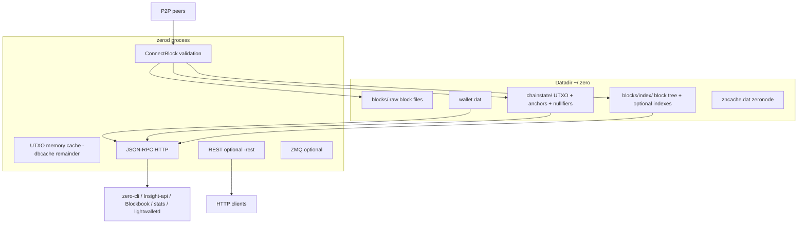
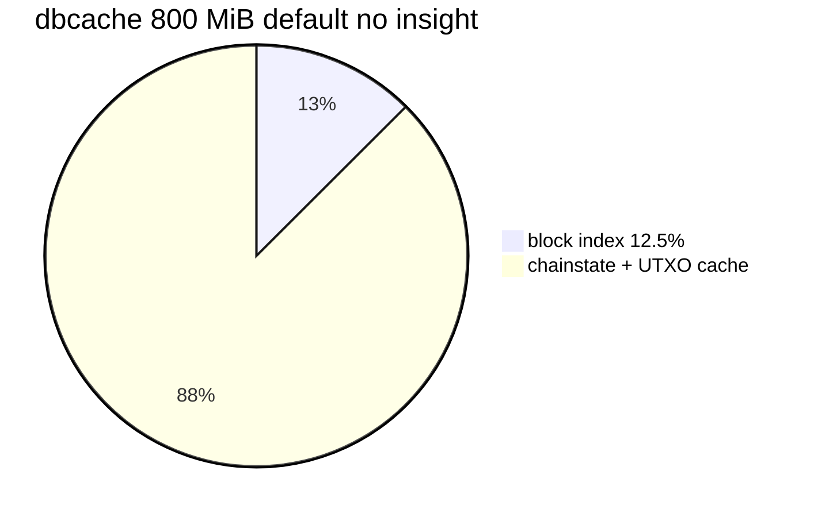
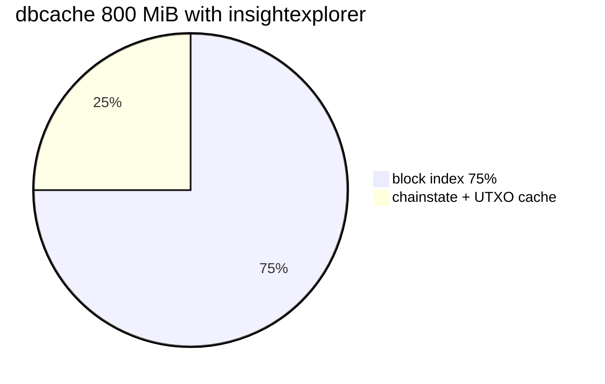
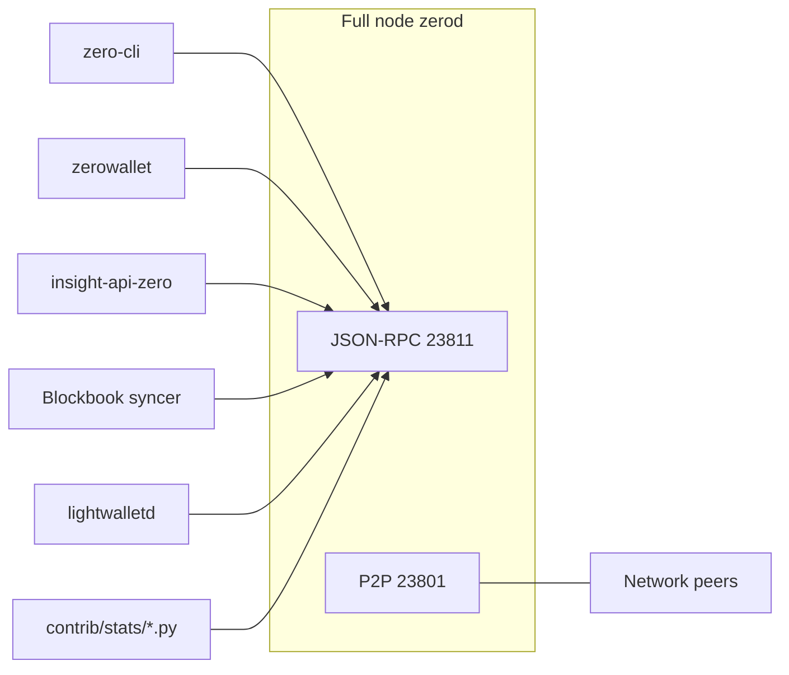

# Zero node structure

## 1. Purpose and role

**Purpose:** Explain **zerod** structure and runtime **options by use case** (validator+wallet, Insight backend, external indexer RPC feed, stats, lightwalletd, zeronode on one binary).

**Include:** Datadir and LevelDB keys; `-dbcache`; flags tied to workloads; `ConnectBlock` index path; wallet ops that hit the chain; RPC clients; brief zeronode cache role. Occasional Zcash/Pirate notes **only** to orient on zerod today or likely direction.

**Exclude:** Ecosystem compare (**`ZKNodes.md`**); port/cherry-pick execution (**`UpdateZero.md`**); zeronode operator workflow (**`ZeroNodes.md`**); wallet interface (**`ZeroNodeDev.md`**); clone source survey (**`Comparison.md`**).

Developer documents in **UpdateZero.md** section **1**, **Documentation map**. Regtest harness: **`TEST_ZERO.md`**.

---

## 2. Use cases on one binary

| Use case | Typical deployment | zerod role |
|----------|-------------------|------------|
| **Validator + wallet** | Desktop or server with keys | Default flags; embedded wallet; P2P **23801**; RPC **23811** |
| **Insight explorer backend** | Dedicated node, often no keys | `-experimentalfeatures`, `-insightexplorer`, `-txindex`, large `-dbcache`; addressindex RPCs |
| **External indexer RPC feed** | Blockbook or custom syncer | Synced node with **`txindex`**; `-insightexplorer` **not** required on the node |
| **Emission / dev balance audit** | Workstation or CI | `chain_stats.py --cons` (consensus math); `--dev` needs insight on dev t-addrs |
| **lightwalletd backend** | Server pair | Synced node + **`txindex`**; separate lightwalletd process (not shipped by Zero org) |
| **Zeronode** | Collateral operator | Wallet-enabled node + `zeronode.conf`; **`zncache.dat`**; spork/P2P extensions |

All use cases share one datadir, one **`ConnectBlock`** path, and one UTXO set. Optional indexes and wallet state are additional layers, not separate daemons.



---

## 3. Datadir layout

Default: **`~/.zero/`** (mainnet). Testnet/regtest: subdirs or `-testnet` / `-regtest`.

| Path | Database | Contents |
|------|----------|----------|
| `blocks/blk*.dat`, `blocks/rev*.dat` | Raw files | Blocks and undo data |
| `blocks/index/` | LevelDB (`CBlockTreeDB`) | Block tree; optional txindex and insight keys |
| `chainstate/` | LevelDB (`CCoinsViewDB`) | UTXO set; Sprout/Sapling anchors; nullifiers |
| `wallet.dat` | Berkeley DB | Keys, transactions, note metadata |
| `zncache.dat` | Serialized | Zeronode broadcast cache |
| `debug.log` | Text | Log output |

### LevelDB key families in `blocks/index/`

From `src/txdb.cpp`:

| Prefix | Symbol | When present |
|--------|--------|--------------|
| `b` | `DB_BLOCK_INDEX` | Always |
| `t` | `DB_TXINDEX` | `-txindex` (default **on** in Zero: `fTxIndex = true`) |
| `d` | `DB_ADDRESSINDEX` | `-insightexplorer` |
| `u` | `DB_ADDRESSUNSPENTINDEX` | `-insightexplorer` |
| `p` | `DB_SPENTINDEX` | `-insightexplorer` |
| `T` | `DB_TIMESTAMPINDEX` | `-insightexplorer` |
| `h` | `DB_BLOCKHASHINDEX` | `-insightexplorer` |
| `F` | `DB_FLAG` | Persisted toggles (`txindex`, `insightexplorer`, `zindex`, ...) |

**vs Zcash lineage:** Same block-tree index layout as zcashd-era Insight hooks. Zero turns **`txindex` on by default** (`fTxIndex = true` in `init.cpp`), which suits Blockbook-style sync and `getrawtransaction` without an extra operator step. Upstream zcashd historically treated txindex as opt-in; verify before assuming defaults on other forks.

### Chainstate is not an address index

`chainstate/` maps **outpoint** `(txid, vout) -> scriptPubKey + amount`. No reverse map from t-address to balance.

For a **given t-address balance** on zerod you need one of:

- `-insightexplorer` indexes (written during block connect into `blocks/index/`), or
- An external indexer that scans blocks via RPC (`getblock`, `getrawtransaction`), or
- `gettxoutsetinfo` for **chain-wide transparent total only** (slow; not per-address).

Shielded value is never exposed chain-wide through addressindex RPCs (same privacy ceiling as zcashd Insight).

---

## 4. Memory: `-dbcache`

Total `-dbcache` (default 800 MiB) is split in `src/init.cpp`:

| Slice | Default share | With `-insightexplorer` |
|-------|---------------|-------------------------|
| Block tree DB cache | 12.5% (1/8) | **75% (3/4)** |
| Chainstate DB cache | ~25-50% of remainder | Smaller |
| In-memory UTXO cache | Rest | Smaller |

Insight keys live in **block tree DB**, so an explorer node should run **4096+** MiB `-dbcache` on mainnet. First enable of `-insightexplorer` requires **`-reindex`**.





---

## 5. Options by use case

### Validator + wallet (default)

| Item | zerod behavior |
|------|----------------|
| Block index | Always on |
| `txindex` | **On** by default |
| `-insightexplorer` | Off |
| `-experimentalfeatures` | Off |
| Wallet | `wallet.dat`; Sapling witnesses built on `ChainTip` |
| Zeronode | Off unless configured |

Desktop **zerowallet** embeds `zerod` and uses local RPC; it does **not** enable address indexes by default.

### Insight explorer backend

Required config:

```ini
experimentalfeatures=1
insightexplorer=1
txindex=1
dbcache=4096
```

| Mechanism | Detail |
|-----------|--------|
| Index bundle | `-insightexplorer` sets `fAddressIndex`, `fSpentIndex`, `fTimestampIndex`, blockhash index together (`src/main.cpp`) -- same bundled flag as zcashd Insight |
| RPC gate | Addressindex RPCs need **`fExperimentalMode && fInsightExplorer`** (`src/rpc/misc.cpp`) |
| RPC category `addressindex` | `getaddressbalance`, `getaddresstxids`, `getaddressdeltas`, `getaddressutxos`, `getaddressmempool` |
| Related RPCs | `getspentinfo`, `getblockdeltas`, `getblockhashes`; richer `getrawtransaction` when spent index active |
| Limits | Transparent **P2PKH / P2SH** only; no chain-wide z-addr search (protocol; index walks `vout` only) |
| Client | **insight-api-zero** (Node.js) calls RPC; mainnet UI [insight.zeromachine.io](https://insight.zeromachine.io/) |

**vs Pirate `pirated`:** Pirate docs often list separate `addressindex=1`, `spentindex=1`, `timestampindex=1` in config. RPC names match; zerod uses the single **`-insightexplorer`** switch.

### External indexer RPC feed (Blockbook-style)

| On zerod | Notes |
|----------|-------|
| Synced full node | Required |
| `txindex` | Required for `getrawtransaction` by txid; default **on** in Zero |
| `-insightexplorer` | **Not** required -- indexer builds its own DB |
| RPC pattern | `getblock` (verbosity 2), `getrawtransaction`, block hash walk |

Zero org Blockbook port status: **`UpdateZero.md` section 4**. How other coins attach Blockbook: **`ZKNodes.md`**.

### Emission and supply audit

| Tool | Node need |
|------|-----------|
| `contrib/stats/chain_stats.py --cons` | None for math; optional RPC for `--thru` tip height |
| `contrib/stats/chain_stats.py --dev` | `-insightexplorer` + experimental for `getaddressbalance` on dev t-addresses |
| `contrib/stats/decode_coinbase.py` | Synced node; `getblock` verbosity 2 |
| `gettxoutsetinfo` | Synced node; aggregate transparent total only |

`--cons` sums **consensus subsidy rules**, not the live UTXO set. See **`ZERO_COIN.md`**.

### lightwalletd backend

| On zerod | Notes |
|----------|-------|
| Fully synced chain | Required |
| `txindex` | Required for tx lookup delegated from gRPC server |
| `-insightexplorer` | Not required for standard compact-block path |
| Wallet keys on node | Not required on server if clients hold keys |

Zero does not ship lightwalletd; pairing is operator choice. Other chains' stacks: **`ZKNodes.md`**.

### Zeronode operator

Uses wallet + P2P extensions; **`zncache.dat`** persists broadcast state. Not an address index. Operator workflow: **`ZeroNodes.md`**; wallet boundary: **`ZeroNodeDev.md`**.

### Other flags (when relevant)

| Flag | Reindex? | Use |
|------|----------|-----|
| `-zindex` | Yes | Richer shielded stats on `CBlockIndex`; not t-address search |
| `-rest=1` | No | Bitcoin-Core-heritage GET on RPC port (`src/rest.cpp`); not Insight REST |
| `-zmqpub*` | No | Block/tx notifications for custom indexers |
| `-experimentalfeatures` + `-zmergetoaddress` | No | Manual merge RPC (real on-chain txs) |
| `-consolidation=1` | No | Auto Sapling note merge on `ChainTip` |

**Obsolete in tree:** optional Qpid Proton AMQP (`src/amqp/`) -- build default **`NO_PROTON=1`**. Prefer **ZMQ** for new work.

**Experimental without insight:**

| Feature | Flags |
|---------|-------|
| `-developerencryptwallet` | `-experimentalfeatures` |
| `-developersetpoolsizezero` | `-experimentalfeatures` |
| `-paymentdisclosure` | `-experimentalfeatures` |
| `-zmergetoaddress` | `-experimentalfeatures` + `-zmergetoaddress` |

---

## 6. RPC inventory

Default mainnet RPC port **23811**. Categories include `blockchain`, `wallet`, `addressindex`, `zeronode`, `zero_exclusive`, `zero_experimental`.

Authoritative matrix: **`RPCs.csv`**, **`RPCs_extended.csv`** (column `zero_missing_sources`: Z=Zcash-only in Zero, P=Pirate-only, B=not in Zero).

---

## 7. Wallet operations that touch the chain

### `z_mergetoaddress`

Experimental manual merge of transparent UTXOs and/or shielded notes. **Real signed transactions:** `AsyncRPCOperation_mergetoaddress` -> `SendTransaction` -> `CommitTransaction` -> mempool and relay (unless test mode). Flags: `-experimentalfeatures`, `-zmergetoaddress`.

### Auto Sapling consolidation

`-consolidation=1`: wallet `ChainTip` queues `AsyncRPCOperation_saplingconsolidation` (10-45 notes per address -> one self-send via `CommitConsolidationTx`). Related: `-consolidatesaplingaddress=`, `-consolidationtxfee`.

**vs Pirate:** Pirate ships manual **`consolidateaddress`** RPC and dust/cleanup modes; Zero has auto consolidation and experimental **`z_mergetoaddress`** instead. Port review: **`UpdateZero.md`** section **5**.

---

## 8. Who connects to zerod



| Client | Needs on zerod | Chain-wide shielded view? |
|--------|----------------|---------------------------|
| zero-cli / scripts | Varies | Wallet keys only |
| zerowallet | Default flags | Own keys only |
| Insight stack | insight + experimental + txindex | t-addresses only |
| Blockbook syncer | txindex, synced | t-addresses in its DB only |
| lightwalletd | txindex, synced | Client viewing keys only |
| `chain_stats.py --dev` | insight on listed t-addrs | Those addresses only |

Explorer nodes are often **watch-only** (no spending keys) but still hold full chain + indexes.

---

## 9. Block connect and index maintenance

On `ConnectBlock` with `-insightexplorer`:

1. Validate consensus (UTXO, shielded proofs, Zero coinbase split).
2. Update `chainstate/`.
3. Write address/spent keys to `blocks/index/` when `fAddressIndex` / `fSpentIndex`.
4. Record tx location when `fTxIndex`.
5. Wallet: `ChainTip`, witness cache, optional consolidation async op.
6. Update mempool address index for unconfirmed txs when `fAddressIndex`.

On reorg, insight code disconnects blocks and reverses index entries (covered by **`addressindex.py`** / **`TEST_ZERO.md`**).

Same connect-order heritage as zcashd; Zero adds coinbase split and zeronode hooks in validation.

---

## 10. Zeronode and Zero-specific caches

| Component | File / flag | Role |
|-----------|-------------|------|
| Zeronode manager | `zncache.dat` | Persisted broadcast state |
| Spork | Chain + P2P | Network-wide toggles |
| Budget | Memory + disk | Proposal/finalization |
| Transaction archive | `archiverule` in block tree | Optional; toggle triggers reindex |

No Zcash mainnet equivalent; ported from TENT masternode layer.

---

## 11. Regtest and tests

| Harness | Chain | Typical index flags |
|---------|-------|---------------------|
| `initialize_chain` cache | Tip 725, warm wallets | No insight at cache build |
| `initialize_chain_clean` | Fresh | Per-script `extra_args` |
| Insight scripts | Clean, 3 nodes | `-debug -txindex -experimentalfeatures -insightexplorer` |
| `rest.py` | Clean | `-rest` |

Coinbase maturity **720** on regtest: fund spends need sufficient blocks mined after coinbase (see **`TEST_ZERO.md`**).

---

## 12. Related documents

| Doc | Role |
|-----|------|
| **`UpdateZero.md` section 1** | Purpose and inclusion rules for all Update*/Zero* docs |
| **`~/Work/ZK/ZKs/ZKNodes.md`** | Ecosystem compare/contrast |
| **`UpdateZero.md` sections 4-5, 7, 8** | Blockbook port, Pirate review, public drafts, CSV |
| **`TEST_ZERO.md`** | Harness scripts and flag bundles |
| **`ZeroNodes.md`**, **`ZeroNodeDev.md`** | Zeronode operator vs developer |
| **`Comparison.md`** | Clone source diffs |

Public docs do not link here until **`UpdateZero.md` section 7** drafts are approved.
