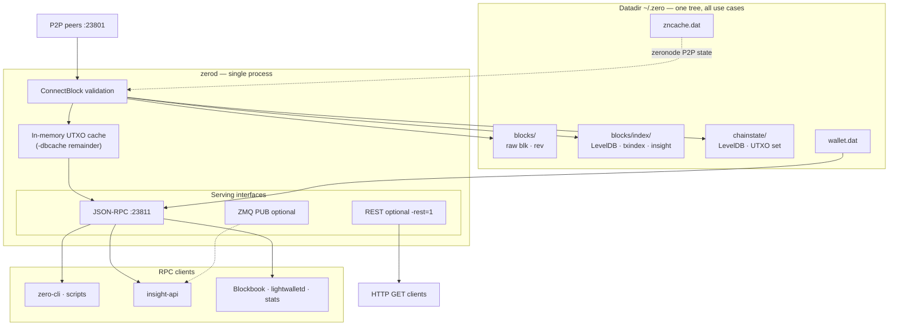
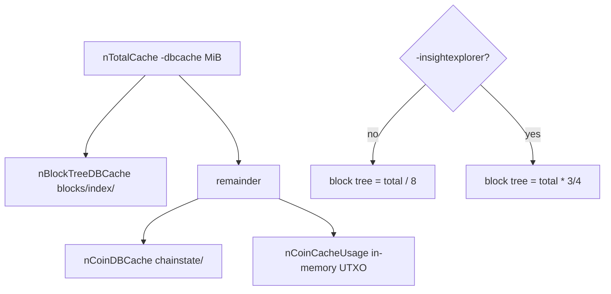
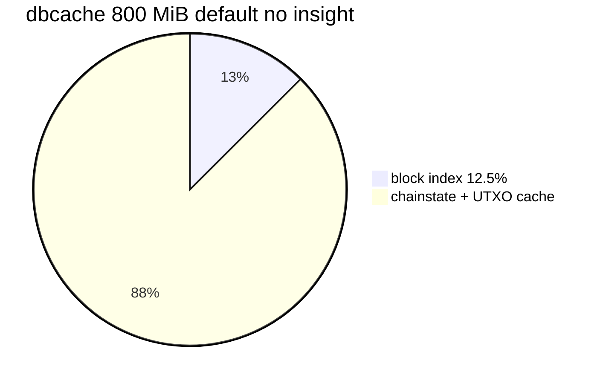
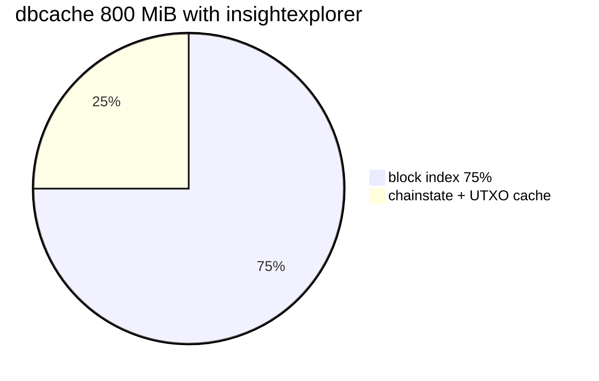
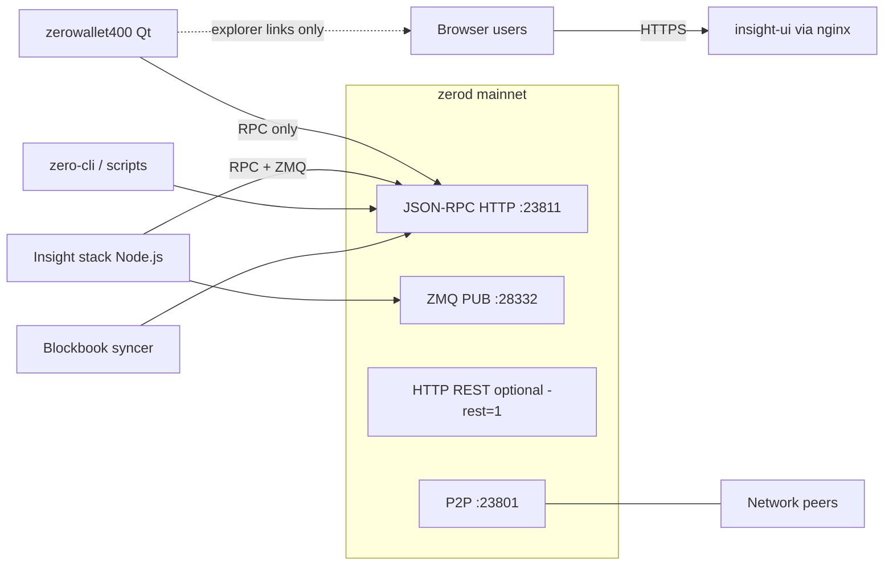

# Zero node structure

## 1. Purpose and role

**Purpose:** Explain **zerod** structure and runtime **options by use case** (validator+wallet, Insight backend, external indexer RPC feed, stats, lightwalletd, zeronode on one binary).

**Include:** Datadir and LevelDB keys; `-dbcache`; flags tied to workloads; `ConnectBlock` index path; wallet ops that hit the chain; RPC clients; **external client integration** (Insight stack, zerowallet, requirement matrices, cross-doc map); brief zeronode cache role. Occasional Zcash/Pirate notes **only** to orient on zerod today or likely direction.

**Exclude:** Ecosystem compare (**`ZKNodes.md`**); port/cherry-pick execution (**`UpdateZero.md`**); zeronode operator/dev detail (**`ZeroNodes.md`**, **`ZeroNodeDev.md`**); wallet Qt UI (**`zerowallet400/UpdateWallet.md`**); clone source survey (**`Comparison.md`**); local clone paths (**`ZKRepos.md`**); **zerocurrencycoin** org repo audit (**`Repos.md`**).

**Set rule:** **`ZeroStruct` ⊆ zerod internals + per-client requirements from the node's perspective**. No Blockbook port plan (**UpdateZero** section **4**); no cross-fork validator tables (**ZKNodes**); no GitHub org disposition (**Repos.md**).

Developer documents in **UpdateZero.md** section **1**, **Documentation map**. Regtest harness: **`TEST_ZERO.md`**.

---

## 2. Use cases on one binary

| Use case | Typical deployment | zerod role |
|----------|-------------------|------------|
| **Validator + wallet** | Desktop or server with keys | Default flags; embedded wallet; P2P **23801**; RPC **23811** |
| **Insight explorer backend** | Dedicated node, often no keys | `-experimentalfeatures`, `-insightexplorer`, `-txindex`, large `-dbcache`; addressindex RPCs |
| **External indexer RPC feed** | Blockbook or custom syncer | Synced node with **`txindex`**; `-insightexplorer` **not** required on the node |
| **Emission / dev balance audit** | Workstation or CI | `chain_stats.py --cons` (consensus math); `--dev` needs insight on dev t-addrs |
| **lightwalletd backend** | Server pair | Synced node + **`txindex`**; separate lightwalletd process (not shipped by Zero org) |
| **Zeronode** | Collateral operator | Wallet-enabled node + `zeronode.conf`; **`zncache.dat`**; spork/P2P extensions |

All use cases share one datadir, one **`ConnectBlock`** path, and one UTXO set. Optional indexes and wallet state are additional layers, not separate daemons.

### Client checklist

| Client | Needs on zerod | Chain-wide shielded view? |
|--------|----------------|---------------------------|
| zero-cli / scripts | Varies | Wallet keys only |
| zerowallet | Default flags | Own keys only |
| Insight stack | insight + experimental + txindex | t-addresses only |
| Blockbook syncer | txindex, synced | t-addresses in its DB only |
| lightwalletd | txindex, synced | Client viewing keys only |
| `chain_stats.py --dev` | insight on listed t-addrs | Those addresses only |

Explorer nodes are often **watch-only** (no spending keys) but still hold full chain + indexes. Deployment topology, ports, and operator checklists: **section 11**; Insight ops runbooks: **`~/Work/ZK/ZKs/insight/`**; wallet connect flow: **`~/Work/ZK/zerowallet400/UpdateWallet.md`**.



### Diagram roles (sections 2 and 11.1)

Two figures, different scope:

| Section | Question | Shows |
|---------|----------|-------|
| **2** (above) | How can one **`zerod`** serve every workload? | **Inside** the process: P2P, **`ConnectBlock`**, datadir, **`-dbcache`**, RPC/ZMQ/REST |
| **11.1** | How do production stacks wire in? | **Outside**: clients, ZMQ, bitcore **:3001**, browser via nginx |

The **Client checklist** table above is flags-only; **section 11** holds ports, matrices, and post-deploy smoke checks.

---

## 3. Datadir layout

Default: **`~/.zero/`** (mainnet). Testnet/regtest: subdirs or `-testnet` / `-regtest`.

| Path | Database | Contents |
|------|----------|----------|
| `blocks/blk*.dat`, `blocks/rev*.dat` | Raw files | Blocks and undo data |
| `blocks/index/` | LevelDB (`CBlockTreeDB`) | Block tree; optional txindex and insight keys |
| `chainstate/` | LevelDB (`CCoinsViewDB`) | UTXO set; Sprout/Sapling anchors; nullifiers |
| `wallet.dat` | Berkeley DB | Keys, transactions, note metadata |
| `zncache.dat` | Serialized | Zeronode broadcast cache |
| `debug.log` | Text | Log output |

### LevelDB key families in `blocks/index/`

From `src/txdb.cpp`:

| Prefix | Symbol | When present |
|--------|--------|--------------|
| `b` | `DB_BLOCK_INDEX` | Always |
| `t` | `DB_TXINDEX` | `-txindex` (default **on** in Zero: `fTxIndex = true`) |
| `d` | `DB_ADDRESSINDEX` | `-insightexplorer` |
| `u` | `DB_ADDRESSUNSPENTINDEX` | `-insightexplorer` |
| `p` | `DB_SPENTINDEX` | `-insightexplorer` |
| `T` | `DB_TIMESTAMPINDEX` | `-insightexplorer` |
| `h` | `DB_BLOCKHASHINDEX` | `-insightexplorer` |
| `F` | `DB_FLAG` | Persisted toggles (`txindex`, `insightexplorer`, `zindex`, ...) |

**vs Zcash lineage:** Same block-tree index layout as zcashd-era Insight hooks. Zero turns **`txindex` on by default** (`fTxIndex = true` in `init.cpp`), which suits Blockbook-style sync and `getrawtransaction` without an extra operator step. Upstream zcashd historically treated txindex as opt-in; verify before assuming defaults on other forks.

### Chainstate is not an address index

`chainstate/` maps **outpoint** `(txid, vout) -> scriptPubKey + amount`. No reverse map from t-address to balance.

For a **given t-address balance** on zerod you need one of:

- `-insightexplorer` indexes (written during block connect into `blocks/index/`), or
- An external indexer that scans blocks via RPC (`getblock`, `getrawtransaction`), or
- `gettxoutsetinfo` for **chain-wide transparent total only** (slow; not per-address).

Shielded value is never exposed chain-wide through addressindex RPCs (same privacy ceiling as zcashd Insight).

---

## 4. Memory: `-dbcache`

**`-dbcache=<n>`** sets total LevelDB + in-memory cache budget in **mebibytes (MiB)**. It does **not** cap wallet RAM, P2P buffers, or proof generation. Constants in `src/txdb.h`: **default 800**, **min 4**, **max 16384** (64-bit); clamped in `src/init.cpp` before split.

On startup, **`zerod` logs the split** (search `debug.log` for `Cache configuration:`):

```
* Using … MiB for block index database
* Using … MiB for chain state database
* Using … MiB for in-memory UTXO set
```

### 4.1 How the split works

Allocation order in `src/init.cpp` (~1514-1533):

1. **`nTotalCache`** = `-dbcache` (MiB) shifted to bytes, clamped to `[4, 16384]` MiB.
2. **`nBlockTreeDBCache`** (block tree LevelDB under `blocks/index/`):
   - Default: **`nTotalCache / 8`** (12.5%).
   - With **`-insightexplorer`**: **`nTotalCache * 3 / 4`** (75%) -- Bitpay/zcashd Insight hook; address-index keys live here.
3. **`nCoinDBCache`** (chainstate LevelDB under `chainstate/`): from remainder, **`min(remainder/2, remainder/4 + 8192 MiB)`** -- effectively 25-50% of what is left after the block-tree slice.
4. **`nCoinCacheUsage`**: everything left -- in-memory UTXO view cache during block connect.



| Slice | Database path | Holds |
|-------|---------------|-------|
| Block tree | `blocks/index/` | Block index; **`txindex`** keys (`t`); with insight: **`d`/`u`/`p`/`T`/`h`** address/spent/timestamp indexes (`src/txdb.cpp`) |
| Chainstate | `chainstate/` | UTXO set, anchors, nullifiers |
| In-memory UTXO | Process heap | Hot UTXO set during validation |

**`-insightexplorer` does not add a separate DB directory** -- it only changes how much of `-dbcache` is reserved for the block-tree LevelDB that already holds optional index keys.

### 4.2 Worked examples (MiB)

| `-dbcache` | `-insightexplorer` | Block tree | Chainstate DB | In-memory UTXO |
|------------|-------------------|------------|---------------|------------------|
| 800 | off | 100 | 350 | 350 |
| 800 | **on** | **600** | 100 | 100 |
| 2048 | off | 256 | 896 | 896 |
| 2048 | on | 1536 | 256 | 256 |
| **4096** | off | 512 | 1792 | 1792 |
| **4096** | **on** | **3072** | 512 | 512 |

With insight on **800 MiB**, most cache serves the block tree but chainstate and UTXO caches shrink to **100 MiB** each -- IBD and tip validation stay slow; address-index RPCs still miss RAM and hit disk on large t-address histories.

### 4.3 Recommendations by workload

| Workload | `-insightexplorer` | Suggested `-dbcache` (mainnet) | Notes |
|----------|-------------------|----------------------------------|-------|
| Validator + wallet (default) | off | **800-2048** | Default **800** is fine for desktop; raise if slow IBD or heavy wallet rescan |
| Insight explorer backend | **on** | **4096+** on hosts with **8+ GiB** RAM budget for **`zerod` alone**; **2048** practical max on a **4 GiB VPS** when bitcore-node also runs | Prod reference `dbcache=4096` in `~/Work/ZK/ZKs/insight/config/zero.conf` assumes a larger host; **`InsightInternal.md`** |
| Blockbook / external indexer | off | **2048-4096** | No insight bundle; benefit is faster **`txindex`** / chainstate during long RPC sync |
| lightwalletd backend | off | **2048+** | **`txindex`** only; no address-index RAM shift |
| Zeronode + wallet | off | **1024-2048** | Same as validator; collateral wallet + P2P; not an indexer |
| Regtest / CI | either | **512-800** | Short chain; insight tests may still want **2048+** if enabling explorer flags |

On a **4 GiB RAM VPS**, plan roughly **2048 MiB** for **`zerod`** **`-dbcache`**, **~1.4 GiB** for bitcore-node heap, and OS headroom. **`dbcache=4096`** on that class of host tends toward OOM or swap thrash (see **4.4**).

**First enable of `-insightexplorer`** (or `-zindex`) requires **`-reindex`** -- independent of `-dbcache`. Changing `-dbcache` alone does **not** require reindex; restart **`zerod`** to apply the new split.

### 4.4 Symptoms and tuning

| Symptom | Likely cause | Action |
|---------|--------------|--------|
| Slow **`getaddressbalance`** / **`getaddresstxids`** on busy t-addresses | Block-tree cache too small with insight | Raise `-dbcache` toward **4096** on **8+ GiB** hosts; on **4 GiB VPS** cap at **~2048** and accept slower index RPCs |
| Slow IBD / long sync after restart | Low chainstate or UTXO slice | Raise `-dbcache` (insight off) or accept smaller UTXO slice when insight steals 75% |
| `debug.log` shows tiny block index with insight on | `-dbcache` left at default **800** | Set **`dbcache=2048`** minimum on small VPS; **4096** only when RAM allows |
| OOM or swap thrash on small VPS | `-dbcache` too high for RAM | Lower toward **2048** on **4 GiB** hosts; leave headroom for OS + Node.js Insight stack (~1.4 GB heap) |

Insight stack RAM is **separate** from `-dbcache` (bitcore-node heap). On **4 GiB** combined Insight hosts, budget **zerod ~2048 MiB + bitcore ~1.4 GiB + OS**; on **8+ GiB** hosts, **4096** MiB **`dbcache`** is reasonable for mainnet insight.

### 4.5 Charts (default 800 MiB)





Cross-refs: Insight node flags **section 5**; client matrix **section 11.3**; public build note **`BUILD_ZERO.md`** Block explorer; prod **`dbcache`** in **`~/Work/ZK/ZKs/insight/config/zero.conf`** (4096 assumes larger RAM than a 4 GiB VPS).

---

## 5. Options by use case

### Validator + wallet (default)

| Item | zerod behavior |
|------|----------------|
| Block index | Always on |
| `txindex` | **On** by default |
| `-insightexplorer` | Off |
| `-experimentalfeatures` | Off |
| Wallet | `wallet.dat`; Sapling witnesses built on `ChainTip` |
| Zeronode | Off unless configured |

Desktop **zerowallet** embeds `zerod` and uses local RPC; it does **not** enable address indexes by default.

### Insight explorer backend

Required config:

```ini
experimentalfeatures=1
insightexplorer=1
txindex=1
dbcache=4096
```

On a **4 GiB VPS**, use **`dbcache=2048`** instead; see **section 4.3**.

| Mechanism | Detail |
|-----------|--------|
| Index bundle | `-insightexplorer` sets `fAddressIndex`, `fSpentIndex`, `fTimestampIndex`, blockhash index together (`src/main.cpp`) -- same bundled flag as zcashd Insight |
| RPC gate | Addressindex RPCs need **`fExperimentalMode && fInsightExplorer`** (`src/rpc/misc.cpp`) |
| RPC category `addressindex` | `getaddressbalance`, `getaddresstxids`, `getaddressdeltas`, `getaddressutxos`, `getaddressmempool` |
| Related RPCs | `getspentinfo`, `getblockdeltas`, `getblockhashes`; richer `getrawtransaction` when spent index active |
| Limits | Transparent **P2PKH / P2SH** only; no chain-wide z-addr search (protocol; index walks `vout` only) |
| Client | **insight-api-zero** (Node.js) calls RPC; mainnet UI [insight.zeromachine.io](https://insight.zeromachine.io/) |

**vs Pirate `pirated`:** Pirate docs often list separate `addressindex=1`, `spentindex=1`, `timestampindex=1` in config. RPC names match; zerod uses the single **`-insightexplorer`** switch.

### External indexer RPC feed (Blockbook-style)

| On zerod | Notes |
|----------|-------|
| Synced full node | Required |
| `txindex` | Required for `getrawtransaction` by txid; default **on** in Zero |
| `-insightexplorer` | **Not** required -- indexer builds its own DB |
| RPC pattern | `getblock` (verbosity 2), `getrawtransaction`, block hash walk |

Zero org Blockbook port status: **`UpdateZero.md` section 4**. How other coins attach Blockbook: **`ZKNodes.md`**.

### Emission and supply audit

| Tool | Node need |
|------|-----------|
| `contrib/stats/chain_stats.py --cons` | None for math; optional RPC for `--thru` tip height |
| `contrib/stats/chain_stats.py --dev` | `-insightexplorer` + experimental for `getaddressbalance` on dev t-addresses |
| `contrib/stats/decode_coinbase.py` | Synced node; `getblock` verbosity 2 |
| `gettxoutsetinfo` | Synced node; aggregate transparent total only |

`--cons` sums **consensus subsidy rules**, not the live UTXO set. See **`ZERO_COIN.md`**.

### lightwalletd backend

| On zerod | Notes |
|----------|-------|
| Fully synced chain | Required |
| `txindex` | Required for tx lookup delegated from gRPC server |
| `-insightexplorer` | Not required for standard compact-block path |
| Wallet keys on node | Not required on server if clients hold keys |

Zero does not ship lightwalletd; pairing is operator choice. Ecosystem compare: **`ZKNodes.md`** section **6**. Zero org repos and mobile stack: **`Repos.md`**.

### Zeronode operator

Uses wallet + P2P extensions; **`zncache.dat`** persists broadcast state. Not an address index. Operator workflow: **`ZeroNodes.md`**; wallet boundary: **`ZeroNodeDev.md`**.

### Other flags (when relevant)

| Flag | Reindex? | Use |
|------|----------|-----|
| `-zindex` | Yes | Richer shielded stats on `CBlockIndex`; not t-address search |
| `-rest=1` | No | Bitcoin-Core-heritage GET on RPC port (`src/rest.cpp`); not Insight REST |
| `-zmqpub*` | No | Block/tx notifications for custom indexers |
| `-experimentalfeatures` + `-zmergetoaddress` | No | Manual merge RPC (real on-chain txs) |
| `-consolidation=1` | No | Auto Sapling note merge on `ChainTip` |

**Obsolete in tree:** optional Qpid Proton AMQP (`src/amqp/`) -- build default **`NO_PROTON=1`**. Prefer **ZMQ** for new work.

**Experimental without insight:**

| Feature | Flags |
|---------|-------|
| `-developerencryptwallet` | `-experimentalfeatures` |
| `-developersetpoolsizezero` | `-experimentalfeatures` |
| `-paymentdisclosure` | `-experimentalfeatures` |
| `-zmergetoaddress` | `-experimentalfeatures` + `-zmergetoaddress` |

---

## 6. RPC inventory

Default mainnet RPC port **23811**. Authoritative name matrix: **`RPCs.csv`**, **`RPCs_extended.csv`** (column `zero_missing_sources`: Z=Zcash-only in Zero, P=Pirate-only, B=not in Zero).

### 6.1 CSV summary

| Metric | Count | Source |
|--------|------:|--------|
| RPC rows | **278** | **`RPCs.csv`** |
| Implemented in Zero (`zero=y`) | **172** | same |
| `addressindex` category | **5** | `getaddresstxids`, `getaddressbalance`, `getaddressdeltas`, `getaddressutxos`, `getaddressmempool` |
| `zero_exclusive` category | **7** | `zs_listtransactions`, `zs_gettransaction`, `zs_listspentbyaddress`, `zs_listreceivedbyaddress`, `zs_listsentbyaddress`, **`getalldata`**, **`getsupply`** |

### 6.2 Client-critical RPCs vs harness

Sample sets derived from **section 11** (zerowallet and Insight). "Harness" = mention in **`src/test/`** or **`qa/rpc-tests/`** (not scenario depth).

| Client sample | Listed | Harness mention | Gap |
|---------------|-------:|-----------------|-----|
| zerowallet-critical | 18 | 17 | **`zeronodestats`** -- no test file hit |
| insight-critical | 19 | 18 | **`zeronodestats`** -- no test file hit |

| Category | Harness | Depth |
|----------|---------|-------|
| **`addressindex`** (5 RPCs) | **`qa/rpc-tests/addressindex.py`** + param checks in **`src/test/rpc_tests.cpp`** | Functional index build/fetch on regtest with insight flags |
| **`zero_exclusive`** (7 RPCs) | **`src/test/rpc_zero_exclusive_tests.cpp`** only | **Param validation** (bad arg count throws; minimal happy path). **No** wallet-state, chain-state, or UI-shaped **`getalldata`** scenarios |
| **`getalldata`** | same C++ file, case **`rpc_getalldata_param_validation`** | **`getalldata 0`** returns object; **not** in **`qa/rpc-tests/`**; **not** in **`contrib/run-tests.sh --all`** as a dedicated script |

**`getalldata` gap:** Wallet depends on this RPC for primary UI refresh (**section 11.5**). Current coverage matches **`UpdateZero.md`** TST-01 (~0% scenario coverage beyond param skeleton). Adding a regtest or GTest that mines/spends and asserts expected **`getalldata`** fields would close the highest wallet risk.

Other categories (`blockchain`, `wallet`, `zeronode`, ...): see **`UpdateZero.md`** RPC coverage table and **`TEST_ZERO.md`** tier list for **`--all`** / **`--strict`** scope.

### 6.3 Cross-reference RPCs vs tests vs clients

**Goal:** For each **`zero=y`** row in **`RPCs.csv`**, know (a) whether a harness invokes it, (b) how deep the test goes, and (c) which shipped clients call it.

**Step 1 -- RPC name list.** Use **`RPCs.csv`** (`zero=y`, **172** rows). Cross-check renames against **`src/rpc/client.cpp`** (`vRPCConvertParams`) and CRPCCommand tables under **`src/rpc/`**, **`src/wallet/`**.

**Step 2 -- Test invocation scan.** For each RPC name, search:

```bash
rg -l '<rpcname>' src/test qa/rpc-tests src/wallet/gtest src/gtest --glob '*.{cpp,py}'
```

Classify hits:

| Depth | Meaning | Examples |
|-------|---------|----------|
| **none** | No harness file mentions the string | **`zeronodestats`**, many zeronode/budget RPCs (~30 with no hit) |
| **param-only** | Arg-count / type skeleton only | **`rpc_zero_exclusive_tests.cpp`**, **`rpc_zero_experimental_tests.cpp`** |
| **functional** | Regtest or GTest builds chain/wallet state and asserts fields | **`addressindex.py`**, many **`wallet*.py`**, **`rpc_wallet_tests.cpp`** |

**Caveat:** String match over-counts (comments, help text). Tier A **`--all`** pass-only scripts may **`exit 0`** without asserting the RPC under review -- see **`TEST_ZERO.md`**.

**Step 3 -- Client usage scan** (for RPCs at **none** or **param-only**):

| Client | Where to grep | Pattern |
|--------|---------------|---------|
| **zerowallet400** | `src/rpc.cpp` | `{"method", "<rpcname>"}` |
| **Insight stack** | `~/Work/ZK/ZKs/insight/error/bitcoind.js` | Method table ~line 175; `this.client.<camelCase>` |
| **Insight HTTP routes** | `error/index.js` | `/supply`, `/zeronodestats`, `/saplingblocks/...` |
| **Stats scripts** | `contrib/stats/chain_stats.py` | `rpc(cli, "<rpcname>", ...)` |
| **Blockbook / lightwalletd** | **`UpdateZero.md` section 4**, **`ZKNodes.md`** | Separate infra; not in Zero org tree |

**Step 4 -- Prioritize new tests.** Sort by: client-critical (**section 11.5**, **11.4**) AND (**none** OR **param-only**). Current top gaps:

| RPC | Test depth | Client(s) |
|-----|------------|-----------|
| **`getalldata`** | param-only | zerowallet (primary UI refresh) |
| **`getsupply`** | param-only (+ field exists) | zerowallet, Insight `/supply` |
| **`getsaplingblocks`**, **`getsaplingwitness`**, **`getsaplingwitnessatheight`** | param-only | Insight `/saplingblocks`, bitcoind.js |
| **`zeronodestats`** | **none** | zerowallet, Insight `/zeronodestats` |
| **`zs_*` exclusive (5 RPCs)** | param-only | Wallet/hidden category; lower traffic than **`getalldata`** |
| Zeronode/budget RPCs (**`startzeronode`**, **`zeronodecurrent`**, **`znbudget*`, ...**) | mostly **none** | zerowallet zeronode UI; **`UpdateZero.md`** TST-03 |

**Step 5 -- Track output.** Maintainer task: add **`tests`** and **`clients`** columns to **`RPCs_extended.csv`** (or a generated **`RPC_coverage.csv`**) via a small audit script under **`contrib/`** -- see **`TODO.md`**. Re-run when RPCs or clients change.

Test prescriptions and acceptance criteria: **`UpdateZero.md`** TST-01 (zero_exclusive scenarios), TST-03 (zeronode subcmds).

---

## 7. Block connect and index maintenance

On `ConnectBlock` with `-insightexplorer`:

1. Validate consensus (UTXO, shielded proofs, Zero coinbase split).
2. Update `chainstate/`.
3. Write address/spent keys to `blocks/index/` when `fAddressIndex` / `fSpentIndex`.
4. Record tx location when `fTxIndex`.
5. Wallet: `ChainTip`, witness cache, optional consolidation async op (**section 8**).
6. Update mempool address index for unconfirmed txs when `fAddressIndex`.

On reorg, insight code disconnects blocks and reverses index entries (covered by **`addressindex.py`** / **`TEST_ZERO.md`**).

Same connect-order heritage as zcashd; Zero adds coinbase split and zeronode hooks in validation.

---

## 8. Wallet operations that touch the chain

These run during or from **`ConnectBlock`** / wallet **`ChainTip`** handling (**section 7**), not as separate daemons.

### `z_mergetoaddress`

Experimental manual merge of transparent UTXOs and/or shielded notes. **Real signed transactions:** `AsyncRPCOperation_mergetoaddress` -> `SendTransaction` -> `CommitTransaction` -> mempool and relay (unless test mode). Flags: `-experimentalfeatures`, `-zmergetoaddress`.

### Auto Sapling consolidation

`-consolidation=1`: wallet `ChainTip` queues `AsyncRPCOperation_saplingconsolidation` (10-45 notes per address -> one self-send via `CommitConsolidationTx`). Related: `-consolidatesaplingaddress=`, `-consolidationtxfee`. zerowallet sets **`consolidation=1`** on first-run **`zero.conf`**; Insight does not use this path.

**vs Pirate:** Pirate ships manual **`consolidateaddress`** RPC and dust/cleanup modes; Zero has auto consolidation and experimental **`z_mergetoaddress`** instead. Port review: **`UpdateZero.md`** section **5**.

No automated tests in **`qa/rpc-tests/`** cover **`-consolidation`** today.

---

## 9. Zeronode and Zero-specific caches

| Component | File / flag | Role |
|-----------|-------------|------|
| Zeronode manager | `zncache.dat` | Persisted broadcast state |
| Spork | Chain + P2P | Network-wide toggles |
| Budget | Memory + disk | Proposal/finalization |
| Transaction archive | `archiverule` in block tree | Optional; toggle triggers reindex |

No Zcash mainnet equivalent; ported from TENT masternode layer. Operator workflow: **`ZeroNodes.md`**.

---

## 10. Regtest and tests

Harness tiers, **`contrib/run-tests.sh --all`** matrix (**34** invocations), insight script flags, regtest maturity **720**, and REST Bfail status: **`TEST_ZERO.md`**.

---

## 11. External clients and integration

Operator contract: ports, matrices, concerns, post-deploy smoke. Client **flags** summary is in **section 2**; Insight ops detail stays in **`~/Work/ZK/ZKs/insight/`**.

### 11.1 Client architecture



| Client | Talks to zerod? | Own HTTP API? |
|--------|-----------------|---------------|
| **zerowallet** | Yes -- embedded or external | Mobile WS **8237** (desktop only) |
| **Insight stack** | Yes -- connect mode | `/insight-api-zero/` on bitcore **3001** |
| **zero-cli** | Yes | No |
| **Blockbook** | Yes -- RPC only | Blockbook Go API (**UpdateZero.md** section **4**) |
| **Public explorer UI** | No direct | Via Insight stack |

### 11.2 Ports and paths

Datadir layout: **section 3**; implementation **`src/util.cpp`** (`GetDefaultDataDir`). Public port/datadir table: **`ZERO_COIN.md`**, **`BUILD_ZERO.md` section 3**.

| Service | Port | Set in |
|---------|------|--------|
| P2P | **23801** | `zero.conf` `port=` |
| RPC | **23811** | `zero.conf` `rpcport=` |
| ZMQ (Insight prod) | **28332** | `zmqpubrawtx` / `zmqpubhashblock` |
| bitcore-node HTTP | **3001** | `bitcore-node.json` |
| zerowallet mobile WS | **8237** | Qt settings |

macOS path mismatch: **section 11.6** concern **C-01**.

### 11.3 Requirement matrix

| Capability | Validator / zerowallet | Insight backend | Blockbook-style |
|------------|------------------------|-----------------|-----------------|
| Synced chain | Yes | Yes | Yes |
| Wallet (`wallet.dat`) | **Yes** | Usually **no** | No |
| `server=1` + RPC auth | Yes | Yes | Yes |
| `txindex=1` | Yes | Yes | Yes |
| `-experimentalfeatures` | Sometimes | **Yes** | No |
| `-insightexplorer` | **No** | **Yes** | **No** |
| `-dbcache` | Optional | **2048** on 4 GiB VPS; **4096+** on 8+ GiB hosts | Moderate (**section 4**) |
| Address-index RPCs | No | **Yes** (t-address only) | No |
| `getalldata` | **Yes** | No | No |
| ZMQ | No | **Yes** | Optional |

### 11.4 Insight stack

Transparent block explorer for mainnet ([insight.zeromachine.io](https://insight.zeromachine.io/)). Node flags: **section 5**; prod configs **`~/Work/ZK/ZKs/insight/config/`**; nginx/systemd **`InsightBlock.md`**.

Representative zerod RPC groups: chain/blocks, **`getrawtransaction`**, address-index methods (**section 6.2**), `getsupply`, `zeronodestats`, `getsaplingblocks`, `estimatefee`. Insight HTTP API catalog: **`~/Work/ZK/ZKs/insight/error/insight-api-zero/README.md`**.

### 11.5 zerowallet

Repo **`~/Work/ZK/zerowallet400`**; connect flow **`UpdateWallet.md`**. JSON-RPC only; no zerod REST; no local Insight.

Wallet-critical RPCs include **`getalldata`** (primary UI refresh), chain info RPCs, `getsupply`, send/status RPCs, **`getaddressesbyaccount [""]`** (empty account string required on Zero), zeronode RPCs. Test gap for **`getalldata`**: **section 6.2**.

Release couples embedded **`zerod`** binary to wallet tag; exercise **`getalldata`** on release smoke.

### 11.6 RPC / REST / ZMQ / notify

| Surface | Enabled by | Insight | zerowallet |
|---------|------------|---------|------------|
| JSON-RPC | `server=1` | Yes | Yes |
| zerod REST | `-rest=1` | No | No |
| Insight REST/WS | bitcore-node | Yes | Browser links only |
| ZMQ | `-zmqpub*` | Yes | No |

Shell notify (`-blocknotify`, ...) skipped unless **`ENABLE_SYSTEM_COMMAND`**; Insight uses ZMQ (**`BUILD_ZERO.md` section 4.6**).

### 11.7 Concerns

| ID | Area | Determination | Severity | Recommendation |
|----|------|---------------|----------|----------------|
| C-01 | macOS paths | **Canonical: lowercase `zero`.** **`zerod`**: `GetDefaultDataDir()` -> `~/Library/Application Support/zero/` (`src/util.cpp` lines 471-492). Public docs (**`ZERO_COIN.md`**, **`BUILD_ZERO.md`**) match. **zerowallet400 bug**: `Library/Application Support/Zero/zero.conf` (`connection.cpp` lines 539-556). Params dir is separate: `ZcashParams` (both agree). APFS often masks the case mismatch. | **Medium** | Fix wallet to use `zero/`; until then symlink or single tree on case-sensitive volumes |
| C-02 | Conf reuse | Wallet `zero.conf` lacks insight flags | **High** if reused | Never point Insight at wallet-first conf without insight bundle + reindex |
| C-03 | Shielded explorer | Addressindex RPCs index **transparent P2PKH/P2SH (t-addresses) only**; **no chain-wide z-addr search** | Info | Match peer explorer wording (see below) |
| C-04 | Insight stack EOL | Node 8 / Ubuntu 18.04 in prod survey | **Medium** | Plan upgrade per **`InsightPort.md`** |
| C-05 | Wallet / node version | Embedded `zerod` must match RPC API | **High** on release | Same release tag; smoke **`getalldata`** (harness gap **section 6.2**) |
| C-06 | REST on zerod | Optional; weak harness | **Low** | Not required for Insight or wallet |
| C-07 | `getrawtransaction` fees | Issue #70 | **Low** | **`UpdateZero.md`** issue notes |
| C-08 | Insight ops | No liveness watchdog | **Medium** | **`InsightBlock.md`** or external monitor |
| C-10 | Shell notify | PIR-01 shipped: no `::system` in default builds | Info | ZMQ used by Insight; **TST-09** for **`blocknotify`** / **`walletnotify`** gate |

**C-03 peer wording (transparent-only indexing):**

| Project | How they state the limit |
|---------|--------------------------|
| Zero Insight README | "Transparent **t-address** search via daemon addressindex RPCs; shielded z-addrs **not indexed chain-wide**" |
| **`BUILD_ZERO.md`** Block explorer | "Transparent P2PKH/P2SH addresses only; shielded payment addresses **not indexed chain-wide** (privacy design)" |
| **`ZKNodes.md`** | "No strategy exposes **chain-wide shielded z-address balances**; transparent P2PKH/P2SH only for addressindex-style APIs" |
| Zcash / Blockbook ecosystem | Indexers sync **transparent** UTXOs and outputs; shielded value visible only to wallets with viewing keys or in per-tx parsed fields, not as z-addr search |
| Modern explorer UIs (e.g. zcashexplorer-style) | Label txs shielded vs transparent; pool-level shielded **aggregates** -- not per-z-addr balance lookup |

Node-repo release gate: **`TEST_ZERO.md`** (`--strict`, `--all`); Insight/wallet smoke rows stay in **`InsightBlock.md`** / zerowallet release notes.

### 11.8 Post-deploy smoke checklist

**Purpose:** Manual operator checks after deploy or release -- **not** a test specification, not a list of new GTest/`rpc-tests` to write, and not a feature backlog. Automated gates live in **`TEST_ZERO.md`**; this catches wiring (ZMQ, nginx, sync) that CI skips.

| Check | Action | Pass |
|-------|--------|------|
| RPC alive | `zero-cli getblockchaininfo` | JSON; mainnet `verificationprogress` near 1 |
| Address index | `getaddresstxids` on a known t-address | Requires insight flags |
| ZMQ | Port **28332** listening or subscribe test | Events after block/tx |
| Insight API | `curl .../insight-api-zero/sync` | `status` synced |
| Wallet RPC | `getalldata` via wallet or CLI | Non-error JSON object |
| Testnet | `-testnet`, RPC **23812** | P2P + RPC up |

Optional: zerod REST (`-rest=1`) -- not used by Insight or zerowallet.

---

## 12. Document ownership

| Topic | Owner |
|-------|-------|
| zerod flags / `-dbcache` / client matrix | **ZeroStruct.md** |
| Build / depends | **BUILD_ZERO.md** |
| Public datadir / ports / economics | **ZERO_COIN.md** |
| Insight prod ops | **`~/Work/ZK/ZKs/insight/`** |
| Wallet Qt / connect | **zerowallet400/UpdateWallet.md** |
| Cherry-picks / Blockbook port / CSV maintenance | **UpdateZero.md** |
| Ecosystem compare | **ZKNodes.md** |
| RPC name matrix | **RPCs.csv** |
| Test harness | **TEST_ZERO.md** |

---

## 13. Related documents

| Doc | Role |
|-----|------|
| **`UpdateZero.md`** | Maintainer map, port execution, RPC coverage gaps |
| **`BUILD_ZERO.md`** | Build, explorer public flags, shell notify |
| **`ZERO_COIN.md`** | Chain reference, public ports/datadir |
| **`TEST_ZERO.md`** | Harness tiers and `--all` matrix |
| **`~/Work/ZK/ZKs/insight/`** | Insight ops and API catalog |
| **`~/Work/ZK/zerowallet400/`** | Wallet RPC and embed flow |
| **`ZeroNodes.md`**, **`ZeroNodeDev.md`** | Zeronode operator vs developer |

Public docs do not link here until **`UpdateZero.md` section 7** drafts are approved.
