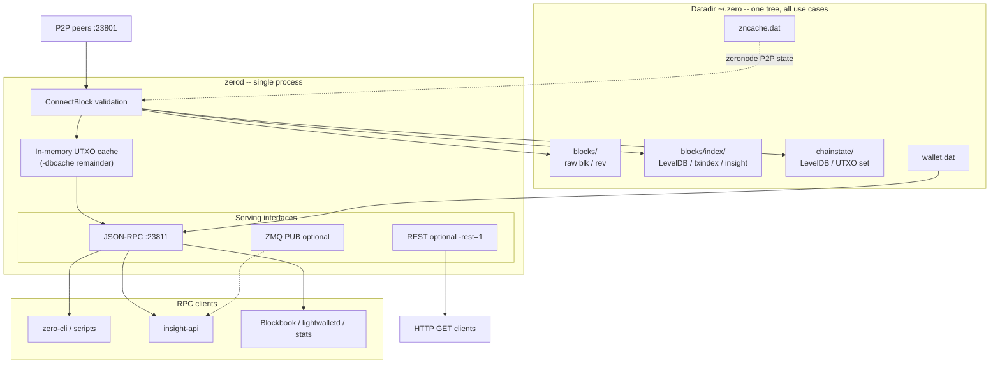
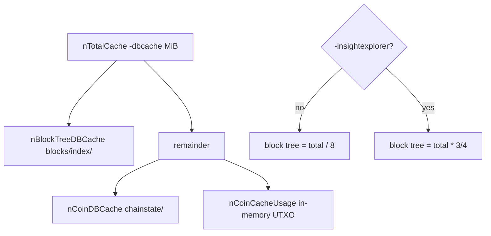
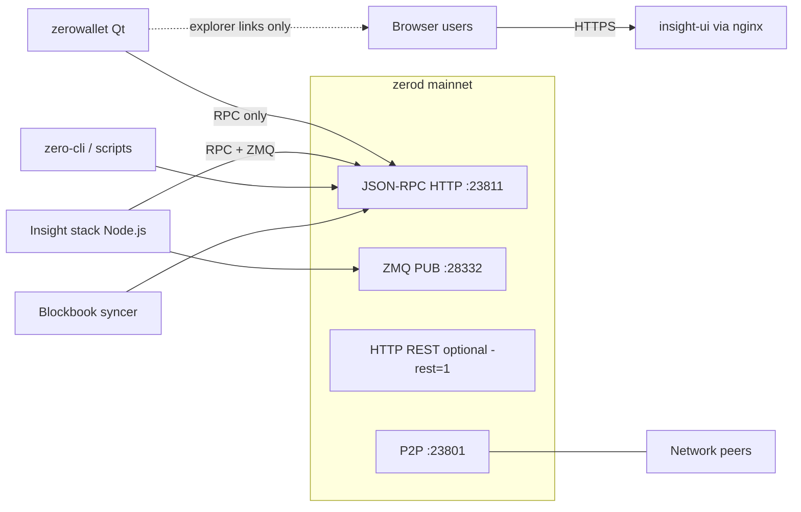

# Zero node structure

## 1. Purpose

How zerod stores and processes chain, index, and wallet data: datadir and LevelDB layout, caches and `-dbcache`, the `ConnectBlock` and wallet paths that touch them, runtime options by workload, and what each client requires the node to expose. Integration concerns carry ids **INT-NN** (section **10.7**).

---

## 2. Use cases on one binary

| Use case | Typical deployment | zerod role |
|----------|-------------------|------------|
| **Validator + wallet** | Desktop or server with keys | Default flags; embedded wallet; P2P **23801**; RPC **23811** |
| **Insight explorer backend** | Dedicated node, often no keys | `-experimentalfeatures`, `-insightexplorer`, `-txindex`, large `-dbcache`; addressindex RPCs |
| **External indexer RPC feed** | Blockbook or custom syncer | Synced node with **`txindex`**; `-insightexplorer` **not** required on the node |
| **Emission / dev balance audit** | Workstation or CI | `chain_stats.py --cons` (consensus math); `--dev` needs insight on dev t-addrs |
| **lightwalletd backend** | Server pair | Synced node + **`txindex`**; separate lightwalletd process (not shipped by Zero org) |
| **Zeronode** | Collateral operator | Wallet-enabled node + `zeronode.conf`; **`zncache.dat`**; spork/P2P extensions |

All use cases share one datadir, one **`ConnectBlock`** path, and one UTXO set. Optional indexes and wallet state are additional layers, not separate daemons.

### Client checklist

| Client | Needs on zerod | Chain-wide shielded view? |
|--------|----------------|---------------------------|
| zero-cli / scripts | Varies | Wallet keys only |
| zerowallet | Default flags | Own keys only |
| Insight stack | insight + experimental + txindex | t-addresses only |
| Blockbook syncer | txindex, synced | t-addresses in its DB only |
| lightwalletd | txindex, synced | Client viewing keys only |
| `chain_stats.py --dev` | insight on listed t-addrs | Those addresses only |

Explorer nodes are often **watch-only** (no spending keys) but still hold the full chain and indexes.


```mermaid
flowchart TB
  P2P["P2P peers :23801"] --> val

  subgraph zerod ["zerod -- single process"]
    direction TB
    val["ConnectBlock validation"]
    mem["In-memory UTXO cache<br/>(-dbcache remainder)"]
    subgraph ifaces ["Serving interfaces"]
      direction LR
      rpc["JSON-RPC :23811"]
      zmq["ZMQ PUB optional"]
      rest["REST optional -rest=1"]
    end
    val --> mem --> rpc
  end

  subgraph datadir ["Datadir ~/.zero -- one tree, all use cases"]
    direction LR
    blocks["blocks/<br/>raw blk / rev"]
    index["blocks/index/<br/>LevelDB / txindex / insight"]
    chain["chainstate/<br/>LevelDB / UTXO set"]
    wallet["wallet.dat"]
    zncache["zncache.dat"]
  end

  val --> blocks
  val --> index
  val --> chain
  wallet --> rpc
  zncache -.->|"zeronode P2P state"| val

  subgraph clients ["RPC clients"]
    direction LR
    cli["zero-cli / scripts"]
    ins["insight-api"]
    bb["Blockbook / lightwalletd / stats"]
  end

  rpc --> cli
  rpc --> ins
  rpc --> bb
  zmq -.-> ins
  rest --> http["HTTP GET clients"]
```

---

## 3. Datadir layout

Default: **`~/.zero/`** (mainnet). Testnet/regtest: subdirs or `-testnet` / `-regtest`.

| Path | Database | Contents |
|------|----------|----------|
| `blocks/blk*.dat`, `blocks/rev*.dat` | Raw files | Blocks and undo data |
| `blocks/index/` | LevelDB (`CBlockTreeDB`) | Block tree; optional txindex and insight keys |
| `chainstate/` | LevelDB (`CCoinsViewDB`) | UTXO set; Sprout/Sapling anchors; nullifiers |
| `wallet.dat` | Berkeley DB | Keys, transactions, note metadata |
| `zncache.dat` | Serialized | Zeronode broadcast cache |
| `debug.log` | Text | Log output |

### LevelDB key families in `blocks/index/`

From `src/txdb.cpp`:

| Prefix | Symbol | When present |
|--------|--------|--------------|
| `b` | `DB_BLOCK_INDEX` | Always |
| `t` | `DB_TXINDEX` | `-txindex` (default **on** in Zero: `fTxIndex = true`) |
| `d` | `DB_ADDRESSINDEX` | `-insightexplorer` |
| `u` | `DB_ADDRESSUNSPENTINDEX` | `-insightexplorer` |
| `p` | `DB_SPENTINDEX` | `-insightexplorer` |
| `T` | `DB_TIMESTAMPINDEX` | `-insightexplorer` |
| `h` | `DB_BLOCKHASHINDEX` | `-insightexplorer` |
| `F` | `DB_FLAG` | Persisted toggles (`txindex`, `insightexplorer`, `zindex`, ...) |

**vs Zcash lineage:** Same block-tree index layout as zcashd-era Insight hooks. Zero turns **`txindex` on by default** (`fTxIndex = true` in `init.cpp`), which suits Blockbook-style sync and `getrawtransaction` without an extra operator step. Upstream zcashd historically treated txindex as opt-in; verify before assuming defaults on other forks.

### Chainstate is not an address index

`chainstate/` maps **outpoint** `(txid, vout) -> scriptPubKey + amount`. No reverse map from t-address to balance.

For a **given t-address balance** on zerod you need one of:

- `-insightexplorer` indexes (written during block connect into `blocks/index/`), or
- An external indexer that scans blocks via RPC (`getblock`, `getrawtransaction`), or
- `gettxoutsetinfo` for **chain-wide transparent total only** (slow; not per-address).

Shielded value is never exposed chain-wide through addressindex RPCs (same privacy ceiling as zcashd Insight).

---

## 4. Memory: `-dbcache`

**`-dbcache=<n>`** sets total LevelDB + in-memory cache budget in **mebibytes (MiB)**. It does **not** cap wallet RAM, P2P buffers, or proof generation. Constants in `src/txdb.h`: **default 800**, **min 4**, **max 16384** (64-bit); clamped in `src/init.cpp` before split.

On startup, **`zerod` logs the split** (search `debug.log` for `Cache configuration:`):

```
* Using ... MiB for block index database
* Using ... MiB for chain state database
* Using ... MiB for in-memory UTXO set
```

### 4.1 How the split works

Allocation order in `src/init.cpp` (~1514-1533):

1. **`nTotalCache`** = `-dbcache` (MiB) shifted to bytes, clamped to `[4, 16384]` MiB.
2. **`nBlockTreeDBCache`** (block tree LevelDB under `blocks/index/`):
   - Default: **`nTotalCache / 8`** (12.5%).
   - With **`-insightexplorer`**: **`nTotalCache * 3 / 4`** (75%) -- Bitpay/zcashd Insight hook; address-index keys live here.
3. **`nCoinDBCache`** (chainstate LevelDB under `chainstate/`): from remainder, **`min(remainder/2, remainder/4 + 8192 MiB)`** -- effectively 25-50% of what is left after the block-tree slice.
4. **`nCoinCacheUsage`**: everything left -- in-memory UTXO view cache during block connect.


```mermaid
flowchart TD
  total["nTotalCache -dbcache MiB"]
  total --> block["nBlockTreeDBCache blocks/index/"]
  total --> rest["remainder"]
  rest --> chain["nCoinDBCache chainstate/"]
  rest --> utxo["nCoinCacheUsage in-memory UTXO"]
  insight{"-insightexplorer?"}
  insight -->|no| block8["block tree = total / 8"]
  insight -->|yes| block75["block tree = total * 3/4"]
```

| Slice | Database path | Holds |
|-------|---------------|-------|
| Block tree | `blocks/index/` | Block index; **`txindex`** keys (`t`); with insight: **`d`/`u`/`p`/`T`/`h`** address/spent/timestamp indexes (`src/txdb.cpp`) |
| Chainstate | `chainstate/` | UTXO set, anchors, nullifiers |
| In-memory UTXO | Process heap | Hot UTXO set during validation |

**`-insightexplorer` does not add a separate DB directory** -- it only changes how much of `-dbcache` is reserved for the block-tree LevelDB that already holds optional index keys.

### 4.2 Worked examples

| `-dbcache` | `-insightexplorer` | Block tree | Chainstate DB | In-memory UTXO |
|------------|-------------------|------------|---------------|------------------|
| 800 | off | 100 | 350 | 350 |
| 800 | **on** | **600** | 100 | 100 |
| 2048 | off | 256 | 896 | 896 |
| 2048 | on | 1536 | 256 | 256 |
| **4096** | off | 512 | 1792 | 1792 |
| **4096** | **on** | **3072** | 512 | 512 |

With insight on **800 MiB**, most cache serves the block tree but chainstate and UTXO caches shrink to **100 MiB** each -- IBD and tip validation stay slow; address-index RPCs still miss RAM and hit disk on large t-address histories.

### 4.3 Recommendations by workload

| Workload | `-insightexplorer` | Suggested `-dbcache` (MiB) | Notes |
|----------|-------------------|----------------------------|-------|
| Validator + wallet (desktop) | off | **800** (default) | Raise toward **2048** only if IBD/rescan is cache-bound |
| Insight + bitcore on **4 GiB** VPS | on | **800** (generous but feasible) | Headroom for OS + Node; indexes stay partly disk-bound |
| Insight `zerod` alone on **8 GiB** | on | **2048** | Prefer validating via startup log + tip `cache=`; **4096** is often excessive |
| Blockbook / lightwalletd | off | **1024-2048** | `txindex` path; no 75% insight steal |
| Regtest / CI | either | **512-800** | Short chain |

**Units:** MiB (`<< 20`). Default **800**, min **4**, max **16384**.

**Runtime justification:** trust the startup `Cache configuration:` lines and tip `cache=N MiB(Mtx)` more than aspirational tables. If in-memory UTXO `cache=` stays well below the allocated UTXO slice while RSS is high, the bottleneck is elsewhere (wallet, mmap, OS page cache) -- raising `dbcache` further will not help.

**75% split (code reference):** inherited Bitpay/zcashd when address indexes share `blocks/index/`. Allocation in `src/init.cpp`:

```
nBlockTreeDBCache = nTotalCache / 8;                 // default
if (GetBoolArg("-insightexplorer", false))
    nBlockTreeDBCache = nTotalCache * 3 / 4;         // 75%
```

(~1584-1594). Not tunable without a code change. Changing `-dbcache` alone does **not** require reindex. Hit/miss counters are not implemented; optional metrics / tunable split remain deferred under **OPS-CACHE-METRICS**.

**Operator approach (no code change yet):**

1. Raise **`-dbcache`** when insight is on so the remaining 25% (chainstate + UTXO) stays usable (see table above: e.g. **2048** on 8 GiB insight host).
2. Prefer **dual-phase** sync on constrained hosts: IBD / reindex with insight **off** (or `-disablewallet`), then enable insight + **`-reindex`** (or index rebuild) with a large `dbcache`.
3. Do **not** treat the 75% constant as a bug by itself -- it matches Pirate/Bitcore intent; measure tip `cache=` and address-RPC latency before changing the ratio.

**`-reindex`:** operational only -- section **11** and Insight ops docs. Not a build setting.

### 4.3.1 Measured utilization

Startup with **`insightexplorer=1`**, **`dbcache=800`** during a mainnet reindex:

```
* Using 600.0MiB for block index database   # 75%
* Using 58.0MiB for chain state database
* Using 142.0MiB for in-memory UTXO set
```

Tip **`cache=`** ~**77 MiB** (~218k coin entries) while process RSS was multi-GB (wallet + LevelDB mmap of ~4 GiB `blocks/index` + OS). So the UTXO slice was **not** saturated; wallet/`mapWallet` dominated.

### 4.3.2 Status UTXO and dbcache on a running Linux VPS

Zero has **no** `getmemoryinfo` RPC. Prefer the automation in **4.3.3** for reproducible numbers; ad-hoc checks below still work. What `getmemoryinfo` is elsewhere is in **4.3.2a**.

```bash
# Allocated split (once per start)
grep -A3 'Cache configuration:' ~/.zero/debug.log | tail -4

# Live in-memory UTXO usage + entry count (each tip update)
grep 'UpdateTip:.*cache=' ~/.zero/debug.log | tail -3

# On-disk UTXO set stats (may take a while; flushes first)
zero-cli gettxoutsetinfo
# -> height, txouts, bytes_serialized, total_amount

# Process RSS / VSZ (MiB)
pid=$(pgrep -n zerod); ps -o rss=,vsz= -p "$pid" | awk '{printf "RSS=%.1fMiB VSZ=%.1fMiB\n",$1/1024,$2/1024}'

# Datadir sizes (disk, not cache)
du -sh ~/.zero/blocks/index ~/.zero/chainstate ~/.zero/blocks 2>/dev/null
```

| Signal | How to read |
|--------|-------------|
| Startup `Using ... MiB for in-memory UTXO` | **Budget** from `-dbcache` after insight/txindex split |
| Tip `cache=XMiB(Ytx)` | **Current** coins-view usage and entry count |
| `gettxoutsetinfo.txouts` / `bytes_serialized` | **Full set** on disk (not the hot cache) |
| RSS >> UTXO budget, tip `cache=` low | Wallet / LevelDB mmap / OS -- do not raise `dbcache` blindly |
| Tip `cache=` near UTXO budget + frequent flushes | Raise `-dbcache` or reduce insight steal (code change) |

#### 4.3.2a `getmemoryinfo`

In Bitcoin Core and zcashd (4.1.0+), `getmemoryinfo` reports the **locked (mlock) memory pool** used for keys -- not process RSS, not `-dbcache`, not the UTXO cache. Zero and Pirate do not have it. Zero still uses the older `LockedPageManager` / `secure_allocator` (`src/support/pagelocker.h`), whose only statistic is `GetLockedPageCount()` (locked OS pages, not exported over RPC). Porting the RPC means porting `LockedPool` from Bitcoin/Zcash `support/` first; the Zcash `getmemoryinfo` + `RPCLockedMemoryInfo()` is the closest template. Tracked as **WAL-LOCKEDPOOL** (TODO Pending). It would not replace the **4.3.2** checks for cache sizing.

### 4.3.3 UTXO cache accounting across forks

| Project | Sizing knobs | What is counted | Reporting |
|---------|--------------|-----------------|-----------|
| **Bitcoin Core** | `-dbcache` split across block-tree / chainstate DB / coins cache; flush when `CoinsTip` usage exceeds budget | `DynamicMemoryUsage()` of in-memory coins map; entry count via `GetCacheSize()` | Flush logs often include coins count + KiB; **no** hit/miss rate RPC; `getmemoryinfo` is locked-pool only (see **4.3.2a**) |
| **Zcash / Zero / Ycash / ...** | Same Bitcoin-era split; Zero/Zcash tip line `cache=%.1fMiB(%utx)` = UTXO-view **usage** and **entry count** | Same `CCoinsViewCache` model (+ shielded anchors/nullifiers in the same cache machinery on zcashd-lineage) | **Usage only** in `UpdateTip` / verify paths; **no** hit/miss counters |
| **Pirate** | Same 75% block-tree bump when address **or** spent on; plus LevelDB **DB-knobs** (see **11.3**) | Same coins cache | Same usage-style logging |

**Implication:** you cannot size "MiB per chain UTXO" from docs alone. Raise `-dbcache` when IBD flushes constantly or tip `cache=` rides the allocated ceiling; do not raise it when RSS is high but tip `cache=` is low (wallet/mmap bound). A tunable 75% split and hit/miss counters are **OPS-CACHE-METRICS** (TODO Pending).

### 4.3.4 `getdbinfo`

**RPC `getdbinfo`:** returns `-dbcache` slice budgets, in-memory UTXO `DynamicMemoryUsage` / `GetCacheSize` / fill %, and per-DB LevelDB block-cache capacity/usage (`Cache::TotalCharge`, Zero patch -- upstream LevelDB 1.x has no `block-cache-usage` property), write-buffer budget, `leveldb.stats`, `num-files-at-level0`.

### 4.4 Symptoms and tuning

| Symptom | Likely cause | Action |
|---------|--------------|--------|
| Slow **`getaddress*`** on busy t-addrs | Cold block-tree LevelDB | Raise `dbcache` toward **2048** on 8 GiB; on 4 GiB accept disk or split hosts |
| Slow IBD with insight on | UTXO/chainstate starved by 75% | Expected tradeoff; or insight-off for pure sync then enable+reindex once |
| OOM / swap | `dbcache` + bitcore + wallet > RAM | Drop to **800**; `-disablewallet` on explorer |
| High RSS, low tip `cache=` | Wallet or mmap | Do not raise `dbcache` blindly |


---

## 5. Options by use case

### Validator with wallet

| Item | zerod behavior |
|------|----------------|
| Block index | Always on |
| `txindex` | **On** by default |
| `-insightexplorer` | Off |
| `-experimentalfeatures` | Off |
| Wallet | `wallet.dat`; Sapling witnesses built on `ChainTip` |
| Zeronode | Off unless configured |

Desktop **zerowallet** embeds `zerod` and uses local RPC; it does **not** enable address indexes by default.

### Insight explorer backend

Zero repo **`contrib/zero.conf`** is a **wallet** sample -- not Insight.

| Mechanism | Detail |
|-----------|--------|
| Index bundle | `-insightexplorer` sets `fAddressIndex`, `fSpentIndex`, `fTimestampIndex`, blockhash index together (`src/main.cpp`) -- same bundled flag as zcashd Insight |
| RPC gate | Addressindex RPCs need **`fExperimentalMode && fInsightExplorer`** (`src/rpc/misc.cpp`) |
| RPC category `addressindex` | `getaddressbalance`, `getaddresstxids`, `getaddressdeltas`, `getaddressutxos`, `getaddressmempool` |
| Related RPCs | `getspentinfo`, `getblockdeltas`, `getblockhashes`; richer `getrawtransaction` when spent index active |
| Limits | Transparent **P2PKH / P2SH** only; no chain-wide z-addr search (protocol; index walks `vout` only) |
| `-dbcache` | **section 4**; **800** on 4 GiB shared hosts; **2048** on 8 GiB `zerod`-heavy -- validate via log |
| `-reindex` | **Operational** -- CLI one-shot; never permanent conf (section **11**) |
| Wallet on explorer host | Prefer **`-disablewallet`** (no `wallet.zero`, no keypool) |
| Client | **insight-api-zero** (Node.js) calls RPC; mainnet UI [insight.zeromachine.io](https://insight.zeromachine.io/) |

**vs Pirate `pirated`:** Pirate docs often list separate `addressindex=1`, `spentindex=1`, `timestampindex=1` in config. RPC names match; zerod uses the single **`-insightexplorer`** switch.

### External indexer RPC feed

| On zerod | Notes |
|----------|-------|
| Synced full node | Required |
| `txindex` | Required for `getrawtransaction` by txid; default **on** in Zero |
| `-insightexplorer` | **Not** required -- indexer builds its own DB |
| RPC pattern | `getblock` (verbosity 2), `getrawtransaction`, block hash walk |

### Emission and supply audit

| Tool | Node need |
|------|-----------|
| `contrib/stats/chain_stats.py --cons` | None for math; optional RPC for `--thru` tip height |
| `contrib/stats/chain_stats.py --dev` | `-insightexplorer` + experimental for `getaddressbalance` on dev t-addresses |
| `contrib/stats/decode_coinbase.py` | Synced node; `getblock` verbosity 2 |
| `gettxoutsetinfo` | Synced node; aggregate transparent total only |

`--cons` sums **consensus subsidy rules**, not the live UTXO set.

### lightwalletd backend

| On zerod | Notes |
|----------|-------|
| Fully synced chain | Required |
| `txindex` | Required for tx lookup delegated from gRPC server |
| `-insightexplorer` | Not required for standard compact-block path |
| Wallet keys on node | Not required on server if clients hold keys |

Zero does not ship lightwalletd; pairing is the operator's choice.

### Zeronode operator

Uses the wallet and P2P extensions; **`zncache.dat`** persists broadcast state. Not an address index.

### Other flags

| Flag | Reindex? | Use |
|------|----------|-----|
| `-zindex` | Yes | Richer shielded stats on `CBlockIndex`; not t-address search |
| `-rest=1` | No | Bitcoin-Core-heritage GET on RPC port (`src/rest.cpp`); not Insight REST |
| `-zmqpub*` | No | Block/tx notifications for custom indexers |
| `-experimentalfeatures` + `-zmergetoaddress` | No | Manual merge RPC (real on-chain txs) |
| `-consolidation=1` | No | Auto Sapling note merge on `ChainTip` |

**Experimental without insight:**

| Feature | Flags |
|---------|-------|
| `-developerencryptwallet` | `-experimentalfeatures` |
| `-developersetpoolsizezero` | `-experimentalfeatures` |
| `-paymentdisclosure` | `-experimentalfeatures` |
| `-zmergetoaddress` | `-experimentalfeatures` + `-zmergetoaddress` |

---

## 6. RPC inventory

Default mainnet RPC port **23811**. Authoritative name matrix: **`RPCs.csv`**, **`RPCs_extended.csv`** (column `zero_missing_sources`: Z=Zcash-only in Zero, P=Pirate-only, B=not in Zero).

### 6.1 RPC categories

`RPCs.csv` lists every RPC across Zero, Zcash, and Pirate; column `zero` marks those implemented in Zero. Two categories matter for clients:

| Category | RPCs |
|----------|------|
| `addressindex` | `getaddresstxids`, `getaddressbalance`, `getaddressdeltas`, `getaddressutxos`, `getaddressmempool` |
| `zero_exclusive` | `zs_listtransactions`, `zs_gettransaction`, `zs_listspentbyaddress`, `zs_listreceivedbyaddress`, `zs_listsentbyaddress`, **`getalldata`**, **`getsupply`** |

### 6.2 Client-critical RPCs vs harness

Sample sets derived from section **10** (zerowallet and Insight). "Harness" = mention in **`src/test/`** or **`qa/rpc-tests/`** (not scenario depth).

Every zerowallet-critical and Insight-critical RPC in section **10** is now mentioned by at least one harness file; the remaining gaps are depth, below.

| Category | Harness | Depth |
|----------|---------|-------|
| **`addressindex`** (5 RPCs) | **`qa/rpc-tests/addressindex.py`** + param checks in **`src/test/rpc_tests.cpp`** | Functional index build/fetch on regtest with insight flags |
| **`zero_exclusive`** (7 RPCs) | **`src/test/rpc_zero_exclusive_tests.cpp`** + scenario for getalldata | `getalldata`: gates plus populated-wallet History via **`getalldata_scenario.py`** (Ext). `zs_*` / `getsupply`: param-only (TST-01) |
| Zeronode / budget RPCs | **`rpc_zeronode_tests.cpp`**, **`rpc_zeronode_budget_tests.cpp`** | Arity and error paths (ZN-01 phase A) |

#### `getalldata` -- structure and algorithms

**Role:** Kitchen-sink wallet refresh RPC used by Zerowallet tip/history. Not a consensus path.

**Param shape**

| Arg | Meaning | Implementation notes |
|-----|---------|----------------------|
| 1 datatype | 0 = balances+txs, 1 = balances, 2 = txs (+ chain fields) | Section gates on `params[0]` |
| 2 transactiontype | 0=10y, 1=1d, 2=7d, 3=30d, 4=90d, 5=365d, other=10y | Day window for History; omitted -> 7 days |
| 3 transactioncount | max History rows | `params.size() >= 3`; `<= 0` -> 200 |
| 4 watchonly | bool | only when `params.size() == 4` |

**Data / indexes touched**

| Structure | Use in `getalldata` |
|-----------|---------------------|
| `mapWallet` / ordered wallet view | Balance walk; History membership; unconfirmed |
| `mapArcTxs` | Archived tx points merged into sort key `(height, nIndex)` |
| `mapBlockIndex` / `chainActive` | Day cutoff, depth, tip fields |
| Sapling IVK/OVK vectors | Decrypt for arc-tx JSON |
| Soft coalesce state | In-flight + last-success time (`-rpcdatacontinue`) |

**Algorithm outline (History path)**

1. Optional soft gate (**-34**) before heavy work.
2. Build address balances when datatype in {0,1}.
3. When datatype in {0,2}: day cutoff -> filter archive + wallet txs **before** sort-map insert; count sort-key collisions between archive and wallet; decrypt/emit newest-first until `nCount`; reverse to oldest-first for JSON field `listtransactions`.

**Open concerns**

| Concern | Structure impact | Direction |
|---------|------------------|-----------|
| Tip poll CPU on large `mapWallet` | Full History decrypt + JSON each tick | Datatype split and cache (WAL-GETALLDATA-W5 / W6) |
| Balance-walk Base58 cost | `addressBalances` keyed by `EncodeDestination` / `EncodePaymentAddress` strings; every credited vout re-encodes | Key by destination, encode once at JSON emit (**WAL-GETALLDATA-ADDRKEY**, below) |
| Duplicate day / count parsing | Drift between emit and early filter | WAL-GETALLDATA-HELPERS |
| `wtxOrdered` vs getalldata | Orthogonal: insert-time order vs RPC sort map | section **11.4** |

**Address keying vs Base58 encoding**

On a wallet with about 800k transactions and Zerowallet attached, profiling tip `getalldata` showed hot stacks in `EncodeBase58Check` / `EncodeBase58`. Cause is **call volume**: the balance walk keys `map<string, balancestruct> addressBalances` with freshly encoded address strings per unspent output, so the same founders P2SH id is Base58-encoded hundreds of thousands of times.

Transparent destinations already carry fixed-size ids:

| Type | Derivation | Size |
|------|------------|------|
| `CKeyID` | `Hash160(serialized pubkey)` = RIPEMD160(SHA256(pubkey)); or the 20-byte push from P2PKH | 20 bytes |
| `CScriptID` | `Hash160(redeemScript)`; or the 20-byte push from P2SH | 20 bytes |

`EncodeDestination` only prefixes version + `EncodeBase58Check`. It is display formatting, not a better map key.

| Possibility | Verdict |
|-------------|---------|
| Key balances by `CTxDestination` / payment-address bytes; `Encode*` once when building JSON | **Preferred** -- exact, drops almost all Base58 from the credit loop |
| Per-RPC memo `destination -> string` | Acceptable interim if string keys kept |
| Rewrite / micro-opt `EncodeBase58` / `EncodeBase58Check` | **Weak** -- constant-factor on the wrong axis while O(UTXO) encodes remain |
| Truncate a hash to 8 bytes as the map key | **Reject** -- collision merges two addresses into one balance bucket |

Shielded entries in the same map need a parallel typed key or tagged binary id (Sapling/Sprout payment-address bytes), not Base58/`zs` strings, if the balance map is unified. Orthogonal to W5/W6 (fewer/cheaper tip polls) and W1 (fewer wallet passes); do after or beside those if tip CPU remains Base58-dominated in samples.

Task id: **WAL-GETALLDATA-ADDRKEY** (node-side fix; the finding lives only here).

**Dispatch gates (server):** warmup; witness rebuild; `initWitnessesBuilt` for `getalldata`/`z_sendmany`; HTTP work-queue full -> 503.

**Impl refs:** `src/wallet/rpczerowallet.cpp`; client convert `src/rpc/client.cpp`; shared emit helpers `getRpcArcTx*` (also `zs_*`).

### 6.3 Cross-reference RPCs vs tests vs clients

**Goal:** For each registered CRPCCommand (and **`RPCs.csv`** `zero=y`), know (a) whether a harness invokes it, (b) how deep the test goes, and (c) which shipped clients call it.

**Step 1 -- RPC name list.** Prefer the CRPCCommand tables under **`src/rpc/`** and **`src/wallet/`**. Cross-check **`RPCs.csv`** (`zero=y`) and **`src/rpc/client.cpp`** (`vRPCConvertParams`); expect small drift.

**Step 2 -- Test invocation scan.** For each RPC name, search:

```bash
rg -l '<rpcname>' src/test qa/rpc-tests src/wallet/gtest src/gtest --glob '*.{cpp,py}'
```

Classify hits:

| Depth | Meaning | Examples |
|-------|---------|----------|
| **none** | No harness file mentions the string | Covered only by the probe below |
| **param-only** | Arg-count / type skeleton only | **`rpc_zero_exclusive_tests.cpp`**, **`rpc_zero_experimental_tests.cpp`** |
| **functional** | Regtest or GTest builds chain/wallet state and asserts fields | **`addressindex.py`**, many **`wallet*.py`**, **`rpc_wallet_tests.cpp`** |

**Caveat:** String match over-counts (comments, help text). Tier pass scripts may mention an RPC without asserting it.

**Uncovered-name probe:** **`qa/rpc-tests/rpc_coverage_probe.py`** (Ext pass) string-scans the harness, then invokes every RPC with no harness mention (empty args, or `help` for destructive ones) and checks that each is recognized, responds, and does not crash. `ZERO_RPC_PROBE_ALL=1` probes every registered name. Run: `./qa/pull-tester/rpc-tests.sh rpc_coverage_probe`.

**What `--all` is not:** `./contrib/run-tests.sh --all` = pass-only C++ filters + **`rpc-tests.sh -all`** (Tier **A + B pass + E pass**). It does **not** run Bfail/Efail, does **not** fuzz args, and does **not** guarantee every RPC was called -- only that those scripts passed. The coverage probe closes the "never mentioned" gap for recognize/respond/crash only.

**Step 3 -- Client usage scan** (for RPCs at **none** or **param-only**):

| Client | Where to grep | Pattern |
|--------|---------------|---------|
| **zerowallet** | `src/rpc.cpp` | `{"method", "<rpcname>"}` |
| **Insight stack** | bitcore-node-zero `bitcoind.js` | Method table; `this.client.<camelCase>` |
| **Insight HTTP routes** | insight-api-zero `index.js` | `/supply`, `/zeronodestats`, `/saplingblocks/...` |
| **Stats scripts** | `contrib/stats/chain_stats.py` | `rpc(cli, "<rpcname>", ...)` |

**Step 4 -- Prioritize new tests.** Sort by client-critical (sections **10.4**, **10.5**) AND depth **none** or **param-only**. Current top gaps:

| RPC | Test depth | Client(s) |
|-----|------------|-----------|
| **`getsupply`** | param-only (+ field exists) | zerowallet, Insight `/supply` |
| **`getsaplingblocks`**, **`getsaplingwitness`**, **`getsaplingwitnessatheight`** | param-only | Insight `/saplingblocks`, bitcoind.js |
| **`zs_*` exclusive (5 RPCs)** | param-only | Wallet/hidden category |
| `zeronodestats` | Boost keys only | zerowallet, Insight `/zeronodestats` |

**Step 5 -- Track output.** Open: add **`tests`** and **`clients`** columns to **`RPCs_extended.csv`** (or a generated **`RPC_coverage.csv`**) with a small audit script under **`contrib/`**. Re-run when RPCs or clients change.

---

## 7. Block connect and index maintenance

On `ConnectBlock` with `-insightexplorer`:

1. Validate consensus (UTXO, shielded proofs, Zero coinbase split).
2. Update `chainstate/`.
3. Write address/spent keys to `blocks/index/` when `fAddressIndex` / `fSpentIndex`.
4. Record tx location when `fTxIndex`.
5. Wallet: `ChainTip`, witness cache, optional consolidation async op (**section 8**).
6. Update mempool address index for unconfirmed txs when `fAddressIndex`.

On reorg, insight code disconnects blocks and reverses index entries (covered by `addressindex.py`).

Same connect-order heritage as zcashd; Zero adds coinbase split and zeronode hooks in validation.

---

## 8. Wallet operations that touch the chain

These run during or from **`ConnectBlock`** / wallet **`ChainTip`** handling (**section 7**), not as separate daemons.

### `z_mergetoaddress`

Experimental manual merge of transparent UTXOs and/or shielded notes. **Real signed transactions:** `AsyncRPCOperation_mergetoaddress` -> `SendTransaction` -> `CommitTransaction` -> mempool and relay (unless test mode). Flags: `-experimentalfeatures`, `-zmergetoaddress`.

### Auto Sapling consolidation

`-consolidation=1`: wallet `ChainTip` queues `AsyncRPCOperation_saplingconsolidation` (10-45 notes per address -> one self-send via `CommitConsolidationTx`). Related: `-consolidatesaplingaddress=`, `-consolidationtxfee`. zerowallet sets **`consolidation=1`** on first-run **`zero.conf`**; Insight does not use this path.

**vs Pirate:** Pirate ships manual **`consolidateaddress`** RPC and dust/cleanup modes; Zero has auto consolidation and experimental **`z_mergetoaddress`** instead.

No automated tests in **`qa/rpc-tests/`** cover **`-consolidation`** today.

---

## 9. Zeronode and Zero-specific caches

| Component | File / flag | Role |
|-----------|-------------|------|
| Zeronode manager | `zncache.dat` | Persisted broadcast state |
| Spork | Chain + P2P | Network-wide toggles |
| Budget | Memory + disk | Proposal/finalization |
| Transaction archive | `archiverule` in block tree | Optional; toggle triggers reindex |

No Zcash equivalent; ported from the TENT masternode layer.

---

## 10. External clients and integration

Operator contract: ports, requirement matrices, integration concerns, and post-deploy checks. Insight host operation is covered by the Insight runbooks.

### 10.1 Client architecture


```mermaid
flowchart LR
  subgraph zerod ["zerod mainnet"]
    RPC["JSON-RPC HTTP :23811"]
    ZMQ["ZMQ PUB :28332"]
    REST["HTTP REST optional -rest=1"]
    P2P["P2P :23801"]
  end
  W["zerowallet Qt"] -->|RPC only| RPC
  INS["Insight stack Node.js"] -->|RPC + ZMQ| RPC
  INS --> ZMQ
  CLI["zero-cli / scripts"] --> RPC
  BB["Blockbook syncer"] --> RPC
  BROWSER["Browser users"] -->|HTTPS| INSUI["insight-ui via nginx"]
  W -.->|explorer links only| BROWSER
  P2P --- NET["Network peers"]
```

| Client | Talks to zerod? | Own HTTP API? |
|--------|-----------------|---------------|
| **zerowallet** | Yes -- embedded or external | Mobile WS **8237** (desktop only) |
| **Insight stack** | Yes -- connect mode | `/insight-api-zero/` on bitcore **3001** |
| **zero-cli** | Yes | No |
| **Blockbook** | Yes -- RPC only | Blockbook Go API |
| **Public explorer UI** | No direct | Via Insight stack |

### 10.2 Ports and paths

| Service | Port | Set in |
|---------|------|--------|
| P2P | **23801** | `zero.conf` `port=` |
| RPC | **23811** | `zero.conf` `rpcport=` |
| ZMQ (Insight prod) | **28332** | `zmqpubrawtx` / `zmqpubhashblock` |
| bitcore-node HTTP | **3001** | `bitcore-node.json` |
| zerowallet mobile WS | **8237** | Qt settings |

macOS path mismatch: **INT-01** (section **10.7**).

### 10.3 Requirement matrix

| Capability | Validator / zerowallet | Insight backend | Blockbook-style |
|------------|------------------------|-----------------|-----------------|
| Synced chain | Yes | Yes | Yes |
| Wallet (`wallet.dat`) | **Yes** | Usually **no** | No |
| `server=1` + RPC auth | Yes | Yes | Yes |
| `txindex=1` | Yes | Yes | Yes |
| `-experimentalfeatures` | Sometimes | **Yes** | No |
| `-insightexplorer` | **No** | **Yes** | **No** |
| `-dbcache` | Optional | **800** on 4 GiB shared hosts; **2048** on 8 GiB (**section 4.3**) | Moderate (**section 4**) |
| Address-index RPCs | No | **Yes** (t-address only) | No |
| `getalldata` | **Yes** | No | No |
| ZMQ | No | **Yes** | Optional |

### 10.4 Insight stack

Transparent block explorer for mainnet ([insight.zeromachine.io](https://insight.zeromachine.io/)); node flags in section **5**.

Representative zerod RPC groups: chain/blocks, **`getrawtransaction`**, address-index methods (**section 6.2**), `getsupply`, `zeronodestats`, `getsaplingblocks`, `estimatefee`.

### 10.5 zerowallet

JSON-RPC only; no zerod REST; no local Insight.

Wallet-critical RPCs include **`getalldata`** (primary UI refresh), chain info RPCs, `getsupply`, send/status RPCs, **`getaddressesbyaccount [""]`** (empty account string required on Zero), zeronode RPCs. Structure notes: **section 6.2**. Open poll/cache tasks: **TODO** WAL-GETALLDATA-*. PirateOcean does not use this RPC (in-process wallet models).

Release couples embedded **`zerod`** binary to wallet tag; exercise **`getalldata`** on release smoke.

**Attach vs launch.** The wallet may spawn `zerod`, attach to an already-running node, or the operator starts `zerod` first. RPC creds and `rpcport` must match that datadir's `zero.conf` (mainnet default **23811**). Path case: **INT-01**.

### 10.6 RPC / REST / ZMQ

| Surface | Enabled by | Insight | zerowallet |
|---------|------------|---------|------------|
| JSON-RPC | `server=1` | Yes | Yes |
| zerod REST | `-rest=1` | No | No |
| Insight REST/WS | bitcore-node | Yes | Browser links only |
| ZMQ | `-zmqpub*` | Yes (block/tx events) | No |

Insight must use **ZMQ** or RPC polling, not **`-blocknotify`** / **`-walletnotify`** (inert in default builds, which omit `ENABLE_SYSTEM_COMMAND`).

### 10.7 Integration concerns

| ID | Area | Determination | Severity | Recommendation |
|----|------|---------------|----------|----------------|
| INT-01 | macOS paths | **Canonical: lowercase `zero`.** **`zerod`**: `GetDefaultDataDir()` -> `~/Library/Application Support/zero/` (`src/util.cpp`). **zerowallet bug**: it writes `Library/Application Support/Zero/zero.conf` (zerowallet `src/connection.cpp`). Params dir is separate: `ZcashParams` (both agree). APFS often masks the case mismatch. | **Medium** | Fix wallet to use `zero/`; until then symlink or single tree on case-sensitive volumes |
| INT-02 | Conf reuse | Wallet `zero.conf` lacks insight flags; **`reindex=1` left in conf** wipes indexes every restart | **High** | Separate explorer conf; one-shot CLI `-reindex` only (section **11**) |
| INT-03 | Shielded explorer | Addressindex RPCs index **transparent P2PKH/P2SH (t-addresses) only**; **no chain-wide z-addr search** | Info | Match peer explorer wording (see below) |
| INT-04 | Insight stack EOL | Node 8 / Ubuntu 18.04 in prod survey | **Medium** | Plan upgrade per **`InsightPort.md`** |
| INT-05 | Wallet / node version | Embedded `zerod` must match RPC API | **High** on release | Same release tag; smoke **`getalldata`** (harness gap **section 6.2**) |
| INT-06 | REST on zerod | Optional; weak harness | **Low** | Not required for Insight or wallet |
| INT-07 | `getrawtransaction` fees | Issue #70; `size` already returned and tested | **Low** | Transparent-only `fee` with `txindex` |
| INT-08 | Insight ops | No liveness watchdog | **Medium** | **`InsightBlock.md`** or external monitor |

**INT-03 peer wording (transparent-only indexing):**

| Project | How they state the limit |
|---------|--------------------------|
| Zero Insight README | "Transparent **t-address** search via daemon addressindex RPCs; shielded z-addrs **not indexed chain-wide**" |
| **`BUILD_ZERO.md`** section **4.6.2** | "Transparent P2PKH/P2SH addresses only; shielded payment addresses **not indexed chain-wide** (privacy design)" |
| **`Comparison.md`** section **12** | "No strategy exposes **chain-wide shielded z-address balances**; transparent P2PKH/P2SH only for addressindex-style APIs" |
| Zcash / Blockbook ecosystem | Indexers sync **transparent** UTXOs and outputs; shielded value visible only to wallets with viewing keys or in per-tx parsed fields, not as z-addr search |
| Modern explorer UIs (e.g. zcashexplorer-style) | Label txs shielded vs transparent; pool-level shielded **aggregates** -- not per-z-addr balance lookup |


### 10.8 Post-deploy smoke checklist

Manual checks after a deploy or release. They catch wiring (ZMQ, nginx, sync) that automated tests skip; they are not a test specification.

| Check | Action | Pass |
|-------|--------|------|
| RPC alive | `zero-cli getblockchaininfo` | JSON; mainnet `verificationprogress` near 1 |
| Address index | `getaddresstxids` on a known t-address | Requires insight flags |
| ZMQ | Port **28332** listening or subscribe test | Events after block/tx |
| Insight API | `curl .../insight-api-zero/sync` | `status` synced |
| Wallet RPC | `getalldata` via wallet or CLI | Non-error JSON object |
| Wallet attach | GUI or CLI against an already-running `zerod` using that datadir `zero.conf` | Same RPC as OPS-ATTACH |
| Release artifact | `sha256` (+ signature once REL-01 is done) of the binary under test | Unsigned CI is not a release |
| Testnet | `-testnet`, RPC **23812** | P2P + RPC up |

Optional: zerod REST (`-rest=1`) -- not used by Insight or zerowallet.

---

## 11. Operator paths: indexes, reindex, UTXO discovery

Two audiences (do not conflate):

| Audience | Needs | Doc home |
|----------|-------|----------|
| **Block explorer admin** | Insight flags, `-reindex` CLI, `-disablewallet`, `dbcache`, Cloudflare/nginx, bitcore | This section; host steps in the Insight runbook |
| **Desktop / end-user** | Synced node or embedded zerod, wallet keys, no insight | Insight **off** |

| Role | Host | Wallet | Indexes | Goal |
|------|------|--------|---------|------|
| **A. Explorer** | VPS | **`-disablewallet`** | insight + txindex | Address RPCs / Insight UI |
| **B. Spend wallet** | Desktop / private | Keys | insight usually off | Send / shield |
| **C. Discovery** | A or public Insight HTTPS | None | insight on A | UTXO lists for B (`rescan=false`) |

### 11.1 Flags

```text
experimentalfeatures=1   # RPC gate for insight address RPCs (NOT a DB_FLAG)
insightexplorer=1        # address+spent+timestamp indexes in blocks/index/
txindex=1                # txid -> file position (Zero default ON -- keep stable)
# reindex -- OPERATIONAL, CLI only:  zerod -reindex
# NEVER: reindex=1 in zero.conf
```

| Flag | Role | Toggle cost |
|------|------|-------------|
| `experimentalfeatures` | Unlock experimental RPCs | Restart only (not persisted in `DB_FLAG`) |
| `insightexplorer` | Build insight LevelDB keys | **Reindex** if conf != stored `DB_FLAG` |
| `txindex` | Full tx lookup | **Reindex** if conf != stored `DB_FLAG` |
| **`-reindex` (CLI)** | One-shot wipe + rebuild | This process only |
| **`reindex=1` (conf)** | Same wipe every startup while present | **Footgun** -- see below |

#### CLI `-reindex` versus `reindex=1` in conf

Both set the same `GetBoolArg("-reindex")` / `fReindex` path. Prefer **CLI**:

| | `zerod -reindex` | `reindex=1` in `zero.conf` |
|--|------------------|----------------------------|
| Lifetime | One process | Sticky until edited out |
| After `Reindexing finished` | Next start is normal | **Wipes again** on every restart |
| Intent | Explicit operator action | Easy to forget after first enable |
| Automation | systemd `ExecStart` one-shot or manual | Conf drift across hosts |

There is **no** good reason to prefer conf for a finished insight host. Conf is only accidentally useful as a "stuck on" hammer -- and that is exactly the leftover-wipe bug the OPS-REINDEX remainder should block (zerod warns today; refuse unless `-reindexforce`, or apply once then ignore).

#### `DB_FLAG`

Stored in `blocks/index/` as LevelDB key `('F', name)` -> `'1'` / `'0'` (`CBlockTreeDB::WriteFlag` / `ReadFlag` in `txdb.cpp`). Compared at startup in `init.cpp` **only when `fReindex` is not already set**.

| `name` | Runtime source | Typical insight host |
|--------|----------------|----------------------|
| `txindex` | `fTxIndex` (Zero default **true**) | true |
| `insightexplorer` | `-insightexplorer` / conf | true |
| `zindex` | `-zindex` | false unless set |
| `prunedblockfiles` | prune mode | false |
| `archiverule` | archive setting | match runtime |

**Not a `DB_FLAG`:** `experimentalfeatures` -- RPC gate only.

#### `DB_FLAG` mismatch handling

**Today (`init.cpp`) -- coupled steps:**

1. `desired =` runtime (conf / hardcoded defaults).  
2. `stored = ReadFlag(name)`.  
3. If `stored != desired`: **`WriteFlag(name, desired)` immediately**, log `Reindex source: DB_FLAG mismatch (...)`, set `fReindex = true`.  
4. Open block-tree + chainstate **with wipe** -> destroy indexes/UTXO set, set `'R'`, replay `blk*.dat` (resume uses `L`/`H` if an interrupted rebuild left `'R'` without wiping again).

So mismatch always **updates the flag to match conf first**, then rebuilds so on-disk indexes match the new mode. Commenting `insightexplorer` off -> desired false, stored true -> wipe to a **non-insight** index. Turning it back on -> another wipe to rebuild insight keys.

**How to decouple (OPS-REINDEX remainder):** treat the steps as independent gates:

| Step | Coupled today | Decoupled target |
|------|---------------|------------------|
| **Detect** | Same `if` as write+wipe | Compare only; log stored vs desired |
| **Decide** | Always wipe | Require operator intent (`-reindexforce` or confirm); else **abort start** or keep old flags |
| **Persist flag** | Write before wipe | Write only when wipe is accepted (or write-after-rebuild) |
| **Wipe + rebuild** | Automatic | Only after decide=yes |

Until decoupled, **leave insight/`txindex` flags stable** after a good build. Telemetry already names the mismatch source so logs show why a wipe started.

**`txindex` default.** Bitcoin and Zcash default `txindex` off. Zero and Pirate made the same change, forcing `fTxIndex = true` and hid `-txindex` from help, with no recorded rationale. **OPS-TXINDEX-DEFAULT** (postponed): whether returning to opt-in is safe; needs disk/ops evidence and a client impact review.

**`txindex` impact:** extra LevelDB keys on connect; enables arbitrary `getrawtransaction`. Keep **on** unless a documented disk-constrained validator policy says otherwise.

### 11.2 `-reindex` procedure

```bash
# Conf: insight flags set and stable, NO reindex=
zerod -reindex -daemon
# Optional: -disablewallet on explorer / fat-wallet hosts
# Wait for "Reindexing finished"; never add reindex= to conf
```

| Event | Indexes/chainstate | Wallet |
|-------|--------------------|--------|
| CLI `-reindex` (one start) | **Wiped**, rebuild from `blk*` | Kept |
| `reindex=1` left in conf | Wipe **every** restart | Kept |
| `DB_FLAG` mismatch (today) | Same wipe as `-reindex` | Kept |
| Interrupt mid-reindex | `'R'` set; `L`/`H` progress markers written; **resume not consumed yet** | Kept |
| Clean finish | `'R'` erased; `L`/`H` left as last completed file/tip | Kept |

**Sticky conf `reindex=`** logs a loud `InitWarning` plus `LogPrintf` recommending one-shot CLI `-reindex` (typically with `-disablewallet`). Refusing sticky conf or an unforced `DB_FLAG` mismatch (`-reindexforce`) is the OPS-REINDEX remainder (TODO Pending).

#### Progress markers and resume

**Write path:** after each `blk#####.dat` in `ThreadImport`:

| Key | Char | Value |
|-----|------|--------|
| `DB_REINDEX_FLAG` | `'R'` | Present while reindex in progress; erased at `Reindexing finished` |
| `DB_REINDEX_LASTFILE` | `'L'` | Last **completed** blk file number |
| `DB_REINDEX_LASTBLOCK` | `'H'` | `chainActive.Height()` after that file |

Log: `Reindex progress: lastfile=... lastblock=...`. Tests: `src/test/reindex_tests.cpp` (markers, `'R'`, `ReindexResumeStartFile`, DB_FLAG insight/txindex). Do **not** clear `L`/`H` at finish -- they mean "caught up to blocks present then," not a permanent tip claim.

**Consume path:** on startup, if `'R'` is set (DBs not wiped), `ThreadImport` starts at `ReindexResumeStartFile(L, blk_count)` (= `L+1` when valid). Fresh `-reindex` / `DB_FLAG` wipe clears `blocks/index/`, so `L` is absent and import starts at file 0.

**Telemetry:** `Reindex source:` lines name the trigger: `-reindex argument`, `DB_FLAG mismatch (...)`, `resume (DB_REINDEX_FLAG present)`, or `legacy blk hardlink upgrade`.

**`L` / `H` absent or out of range:**

| Condition | Response |
|-----------|----------|
| `'R'` set, **`L` missing** | Start at file **0** |
| `'R'` set, **`H` missing** | File-based resume from `L`; log tip when `H` present |
| **`L` >=** blk file count or **`L` < 0** | Start at **0** (out of range) |
| **`H` vs tip disagree** | Log; continue from file cursor (`L`) |
| **`'R'` clear** but `L`/`H` present | Historical only -- do not resume |
| **No `'R'`**, operator passes `-reindex` | Wipe + full rebuild; markers rewritten as rebuild proceeds |

#### 11.2.1 Skip wallet vs skip chain

| Feature | Skips | Builds insight/txindex? | Notes |
|---------|-------|-------------------------|-------|
| **Skip wallet below H** | `SyncTransaction` / `AddToWallet` / `IsMine` for blocks `< H` | Yes | Fat wallet reindex CPU; explorer hosts prefer `-disablewallet` instead |
| **Skip chain connect below H** | Validation / UTXO below H | No for those heights | Needs chainstate already at H (snapshot/bootstrap); out of scope |

**Decision (OPS-REINDEX remainder):** implement skip-wallet only; skip-chain is out of scope until the snapshot story is solid.

### 11.3 Pirate index and DB options

Pirate exposes LevelDB tuning as options; Zero hardcodes it.

| Option | Pirate | Zero today | Notes |
|--------|--------|------------|-------|
| Index enable | Separate `-addressindex` / `-spentindex` / `-timestampindex` | Bundled `-insightexplorer` (+ experimental gate) | Flag surface differs; both fill `blocks/index/` keys |
| Cache bump | **75%** of `-dbcache` if address **or** spent on | **75%** if insight on | Same Bitpay-style idea |
| `-txindex` | Forced on (Cryptoforge 2020) | Forced on (same-day Zero) | See **OPS-TXINDEX-DEFAULT** |
| **DB-knobs** | `-dbmaxopenfiles` (default **1000**), `-dbcompression` (default **true**) | Hardcoded in [`src/dbwrapper.cpp`](src/dbwrapper.cpp): `max_open_files = 256`, `compression = kNoCompression` | Pirate knobs apply to **`CBlockTreeDB` only**; Zero's value applies to all `CDBWrapper` DBs |
| Wallet `nTimeSmart` | Pirate: `= blocktime` | Clamp via incremental `wtxOrdered` | Wallet CPU; not a DB option -- **11.4.1** |

#### What the DB-knobs regulate

Both map to LevelDB `Options` on the **block-tree** DB (`blocks/index/`), wired in Pirate [`dbwrapper.cpp`](https://github.com/PirateNetwork/pirate/blob/master/src/dbwrapper.cpp) / [`init.cpp`](https://github.com/PirateNetwork/pirate/blob/master/src/init.cpp) (`AttemptDatabaseOpen` comments: compression and max open files for **block tree db**).

| Knob | LevelDB field | Effect |
|------|---------------|--------|
| `-dbmaxopenfiles` | `options.max_open_files` | Cap on SST / table files kept open (FDs). Higher reduces open/close churn on a **large** `blocks/index/` (insight/addressindex). Too high pressures `ulimit -n`. Bitcoin-era default **64**; Zero **256**; Pirate **1000** on block-tree only. |
| `-dbcompression` | `options.compression` | **true** -> Snappy (`kSnappyCompression`); **false** -> `kNoCompression`. Compresses on-disk blocks: less disk / more CPU on read-write. |

They do **not** change which indexes exist, the 75% `dbcache` split, or in-memory UTXO size.

**Decision (OPS-PIRATE-DB):** `max_open_files = 256`. Snappy compression, per-DB knobs, and 1000 open files stay optional until measured on an insight host (FD count with `lsof`, `iostat`, address-RPC latency). A low cap causes open/close thrashing, not an FD leak; diagnose real leaks (sockets, ZMQ, peers) by `lsof` growth while idle.

### 11.4 `mapWallet` vs address index

| | `mapWallet` | Insight index |
|--|-------------|---------------|
| Store | BDB `wallet.zero` | LevelDB `blocks/index/` |
| Filled by | `IsMine` | Every transparent output |
| Pain | `OrderedTxItems` O(n) | Large address RPC / cold cache |

#### 11.4.1 `nTimeSmart` -- where, how set, how read

**Field:** `CWalletTx::nTimeSmart` ([`src/wallet/wallet.h`](src/wallet/wallet.h) ~449). Persisted in wallet BDB as mapValue key **`timesmart`** on serialize; loaded back into the field ([`wallet.h`](src/wallet/wallet.h) ~565-590).

**Set (Zero, new insert path):** in [`AddToWallet`](src/wallet/wallet.cpp) (~2034-2072):

1. Default `nTimeSmart = nTimeReceived` (wall clock when first seen).
2. If the tx has a known `hashBlock`, walk **`OrderedTxItems()`** (full `mapWallet` rebuild) newest-first; take latest prior smart/received time within +5 minutes of now; then  
   `nTimeSmart = max(latestEntry, min(blocktime, latestNow))`.

**Pirate shortcut:** skip the OrderedTxItems walk; set `nTimeSmart` (and often `nTimeReceived`) to **block time** only ([`pirate/.../wallet.cpp`](https://github.com/PirateNetwork/pirate/blob/master/src/wallet/wallet.cpp) ~3464; commit above).

**Zcash / Bitcoin incremental path:** same clamp formula, but walk persistent [`wtxOrdered`](https://github.com/zcash/zcash/blob/master/src/wallet/wallet.cpp) instead of rebuilding ([insert ~3329](https://github.com/zcash/zcash/blob/master/src/wallet/wallet.cpp), smart-time ~3341).

**Retrieved:**

| API | Behavior |
|-----|----------|
| `CWalletTx::GetTxTime()` | [`wallet.cpp`](src/wallet/wallet.cpp) ~2999: return `nTimeSmart` if non-zero, else `nTimeReceived` |
| Wallet JSON (`listtransactions`, etc.) | `"time"` <- `GetTxTime()`; `"timereceived"` <- `nTimeReceived` ([`rpcwallet.cpp`](src/wallet/rpcwallet.cpp) ~104-105) |
| Direct | No separate RPC field named `timesmart` in normal list output (value is folded into `"time"`) |

So UI/RPC "transaction time" is the smart time when present; the expensive Zero path exists only to compute that field on insert.

#### 11.4.2 `wtxOrdered` in Zero

Bitcoin and Zcash keep the wallet's ordered tx view in memory (`wtxOrdered`) instead of rebuilding it. Bitcoin #13825 and zcashd 4.5.0 later removed accounts, leaving `wtxOrdered` as `multimap<int64_t, CWalletTx*>`. Zero now maintains `wtxOrdered` incrementally with `TxPair`, because it still has accounting entries (`laccentries`); `OrderedTxItems()` returns that structure instead of rebuilding from all of `mapWallet`. Every erase and reorder site (`EraseFromWallet`, delete + reorder helpers) must keep `wtxOrdered` in sync; GTest `WalletTests.WtxOrderedConsistentAfterErase` checks `wtxOrdered` matches `mapWallet` after deletes.

Pirate took a different shortcut: skip the walk and set `nTimeSmart = nTimeReceived = blocktime`. That is O(1) but loses arrival-time meaning; keep it only as an emergency alternate. PirateOcean (pirate-qt) still rebuilds.

**Remaining gap:** matching Zcash's pointer-only type requires removing the account RPCs (`getaccount`, `listaccounts`, `move`, `sendfrom`, ...). That has a business layer (clients, docs, Zerowallet) and a code-risk layer (BDB `acentry`, account filters, reorder, RPC table): **WAL-RPC-ACCOUNTS**.

`wtxOrdered` does not change which txs are in the wallet, consensus, LevelDB indexes, or the `GetTxTime` clamp formula; it only changes how prior entries are found for the clamp.

#### Relation to `txindex` and insight

`txindex` is a **block-tree LevelDB** feature (`DB_TXINDEX` / key prefix `t` in `blocks/index/`): txid -> disk position for arbitrary `getrawtransaction`. Zero and Pirate force **`fTxIndex = true`** (**OPS-TXINDEX-DEFAULT**). Insight address/spent indexes are **additional** keys in the same DB, gated by `-insightexplorer`.

| | `txindex` / insight | `wtxOrdered` / `OrderedTxItems` |
|--|---------------------|----------------------------------|
| Store | LevelDB `blocks/index/` | BDB `wallet.zero` + RAM over `mapWallet` |
| Filled by | Every connected tx (txid index); every transparent output (insight) | Wallet `IsMine` / accounting only |
| Cost class | Disk + ConnectBlock index writes; large explorer reindex | CPU on wallet insert/list when `mapWallet` is huge |
| Ops lever | Conf flags + reindex; **OPS-TXINDEX-DEFAULT** / **OPS-PIRATE-DB** | Code port; no conf flag |
| Fixes fat-wallet insert CPU? | **No** | **Yes** |
| Needed for transparent UTXO-by-address extract? | Insight `getaddressutxos` / addressindex (txindex usually co-required on explorers) | **No** -- prefer `-disablewallet` on explorers |

**Value of default-on `txindex`:** cheap arbitrary tx lookup for Blockbook, lightwalletd, explorers, and fee-display paths that resolve inputs. **Do not** conflate "reindex is slow" with "wallet OrderedTxItems is slow": isolate by measuring with wallet empty / `-disablewallet` vs large wallet + indexes off.

The incremental `wtxOrdered` does not change the case for keeping or reverting default `txindex`. **OPS-TXINDEX-DEFAULT** stays a separate disk/ops product decision.

#### 11.4.3 Validating `wtxOrdered` changes

When touching insert, erase, or reorder: check insert N / `GetTxTime` / accounting / `listtransactions`; microbench 10k-50k owned txs before and after; keep `WtxOrderedConsistentAfterErase` green.

#### 11.4.4 `GetTxTime` / times

| Tree | Insert | Notes |
|------|--------|-------|
| Bitcoin / Zcash | Clamp via `wtxOrdered`; received = first seen | `"time"` vs `"timereceived"` |
| Zero | Same clamp via incremental `wtxOrdered` | |
| TENT / PirateOcean | Same clamp, O(n) rebuild | High CPU on fat wallets |
| Pirate daemon | Both <- blocktime | Fast insert; loses arrival-time meaning |

Consensus-neutral. CPU save from Pirate shortcut = skipping OrderedTxItems, not the integer write.

### 11.5 Empty wallet vs `-disablewallet`

Prefer **`-disablewallet`** on explorer hosts; dedicated datadir (desktop wallet must not share it).

### 11.6 UTXO discovery

1. Explorer node RPCs / SSH (`getaddressutxos` with `-insightexplorer`; prefer `-disablewallet`).
2. Public Insight HTTPS (CF -> nginx -> Node) -- expected public API; **not** public **zerod RPC**. Large `/addrs/.../utxo` may **413**; use local RPC for full dumps.
3. Slim wallet + `importprivkey ... false`.
4. Height walk + `gettxout`.
5. REST `/rest/getutxos`.

### 11.7 Bootstrap and state snapshots -- generate / install

**Audience:** zerod maintainer / ops with a trusted peer. Not an unsigned public end-user product.

#### A. `bootstrap.dat`

**Generate** (synced node with RPC):

```bash
cd contrib/linearize
cp example-linearize.cfg linearize.cfg
# Edit: rpcuser/rpcpassword/host/port, input=<datadir>/blocks, output=bootstrap.dat,
#       max_height (optional), netmagic / genesis from chainparams
./linearize-hashes.py linearize.cfg > hashlist.txt
./linearize-data.py linearize.cfg
# Produces bootstrap.dat (+ optional bootstrap.dat.rev for some configs)
```

**Install:**

```bash
# Stop zerod. Empty or new datadir preferred for first import.
cp bootstrap.dat "$DATADIR/"
# Start zerod (no -reindex). ThreadImport loads bootstrap.dat then renames to bootstrap.dat.old
zerod -daemon
# Confirm tip height; keep bootstrap.dat.old until validated
```

**Bounds:** Rebuilds chainstate by connecting blocks (CPU). Does **not** copy insight indexes. Wallet still rescans unless `-disablewallet` / empty wallet.

#### B. Trusted LevelDB and blocks copy

Stop source and destination nodes. Copy only what you intend to skip rebuilding:

| Copy into `$DATADIR/` | Skips | Risk |
|----------------------|-------|------|
| `blocks/blk*` (+ `rev*`) | Re-download | Must match network magic |
| `chainstate/` | UTXO rebuild | Tip hash must match blocks; same binary major |
| `blocks/index/` | Block tree + txindex + insight rebuild | Same index flags (`insightexplorer`/`txindex`) as source |

```bash
# Example: full state transplant (same Zero version, same insight/txindex flags)
rsync -aH --delete "$SRC/blocks/" "$DST/blocks/"
rsync -aH --delete "$SRC/chainstate/" "$DST/chainstate/"
# Do NOT copy wallet.zero unless intentional
```

Start destination **without** `-reindex`. Verify `getblockchaininfo` / `gettxoutsetinfo` against source tip. No unsigned public snapshots for end users.


**Height bounds:** Zero has no `-stopatheight` (**OPS-AT-HEIGHT**); use linearize `max_height` or truncated blk files.

### 11.8 Founders designs A / B / Z

**Status today (mainnet):** Coinbase founders output is **7.5%** of `GetBlockSubsidy` from **fee-start** through last founders height. Payee is selected by height from **`vFoundersRewardAddress`** (10 slots). Script path **`GetFoundersRewardScriptAtHeight`** requires a **P2SH** destination (`CScriptID`); mainnet entries are **2-of-3 multisig** P2SH (`t3...`). Rotation interval is roughly `lastFRHeight / N` blocks per slot (`GetFoundersRewardAddressAtHeight`). RPC surface today: **`zeronodestats.chainStats.developmentfee`**; mining RPCs use **founders** / **foundersreward** (see **DOC-FR-NAMING**). Explorer nodes should use `-disablewallet` when only address-index UTXO RPCs are needed.

Changing **updates** (how often / which slot receives) vs **type** (what script/key scheme is paid) are separate consensus decisions:

| Id | Change | What moves | Why consider | Cost / risk |
|----|--------|------------|--------------|-------------|
| **FR-ROTATE** (A) | More frequent rotation among existing (or more) P2SH slots | `addressChangeInterval` / list length in `chainparams`; still P2SH 2-of-3 | Smaller per-address UTXO piles; key ceremony reuse; ops can empty a slot before next window | Soft consensus if addresses stay valid; large UTXO count still accumulates inside a window unless spend policy changes |
| **FR-TADDR** (B) | Pay a **plain t-addr** (P2PKH) instead of 2-of-3 P2SH | Replace `assert(CScriptID)` + script build; new addresses; custody model | Simpler single-key spend / lower signing friction; easier wallet tooling | **Hard consensus** + key migration; loses multisig quorum; anyone with that key spends all future coinbases to that addr |
| **FR-Z** (Z) | Coinbase founders output to a **Sapling z-addr** (shielded) | Coinbase rules, miners, Insight (transparent-only indexes), wallet, proving | Privacy for development fee; no transparent UTXO dust on explorers | **Hard consensus**; miner/template + validation; Insight addressindex does not cover z; ops extraction path changes entirely |

**Not the same as wallet "accounts":** Obsolete RPC account labels (**WAL-RPC-ACCOUNTS**) are unrelated to founders **type**. Changing founders type does not require dropping account RPCs.

**Product order if pursued:** decide custody (2-of-3 vs single t vs z) first, then rotation cadence, then implementation + activation height. Not scheduled; needs consensus review before code.


---

